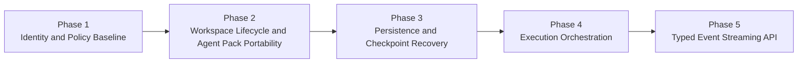
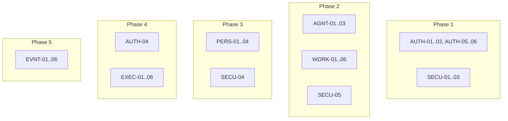

# Roadmap: Picoclaw Multi-Tenant OSS Runtime

**Depth:** standard
**Created:** 2026-02-23

## Overview

This roadmap is derived directly from the v1 requirements for a self-hosted, user-centric multi-tenant Picoclaw runtime. Phases are ordered by dependency so each phase unlocks a complete, testable user-facing capability and de-risks the next stage. Coverage is strict: every v1 requirement maps to exactly one phase, including the OSS workflow from template docs/files to agent pack registration and profile-portable execution.

Commercial invariant for v1: define templates -> create agent pack -> infrastructure handles scale.

## Phase Structure

| Phase | Goal | Dependencies | Requirements |
|------|------|--------------|--------------|
| 1 - Identity and Policy Baseline | Users can authenticate requests safely and execute only within authorized, policy-constrained boundaries. | None | AUTH-01, AUTH-02, AUTH-03, AUTH-05, AUTH-06, SECU-01, SECU-02, SECU-03 |
| 2 - Workspace Lifecycle and Agent Pack Portability | Each user gets a durable workspace and can move from template scaffold to registered agent pack that runs in local Docker Compose and BYOC profiles without manual infra wiring. | Phase 1 | AGNT-01, AGNT-02, AGNT-03, WORK-01, WORK-02, WORK-03, WORK-04, WORK-05, WORK-06, SECU-05 | Complete | 2026-02-25 |
| 3 - Persistence and Checkpoint Recovery | Runtime state is durably stored and recoverable through milestone checkpoints with immutable audit history. | Phase 2 | PERS-01, PERS-02, PERS-03, PERS-04, SECU-04 |
| 4 - Execution Orchestration and Fairness | Runs execute reliably under retries/cancellation while preserving ordering per workspace and fairness across users. | Phase 1, Phase 2, Phase 3 | AUTH-04, EXEC-01, EXEC-02, EXEC-03, EXEC-04, EXEC-05, EXEC-06 |
| 5 - Typed Event Streaming API | Clients can consume real-time typed runtime events and fetch final run outputs in Picoclaw-aligned contracts. | Phase 3, Phase 4 | EVNT-01, EVNT-02, EVNT-03, EVNT-04, EVNT-05, EVNT-06 |

## Phase Details

### Phase 1: Identity and Policy Baseline

**Goal:** Users can authenticate requests safely and execute only within authorized, policy-constrained boundaries.

**Dependencies:** None

**Requirements:** AUTH-01, AUTH-02, AUTH-03, AUTH-05, AUTH-06, SECU-01, SECU-02, SECU-03

**Success Criteria (observable):**
1. A user can call the API with a personal API key and receive authorized responses only for valid credentials.
2. A user or operator can rotate or revoke an API key, and revoked keys fail subsequent requests.
3. A user can read/write only resources in their own workspace and cannot access another user's workspace data.
4. An operator can assign owner/member role behavior and observe access differences in API outcomes.
5. Requests without explicit user identity are assigned a random guest identity and execute in guest mode without persistent storage.
6. Runtime runs enforce default-deny network egress, tool allowlists, and scoped secret injection per run context.

**Plans:** 9 plans

Plans:
- [x] 01-01-PLAN.md — Bootstrap FastAPI/DB foundation and RLS-ready schema baseline.
- [x] 01-02-PLAN.md — Implement personal API key authentication with rotate/revoke lifecycle.
- [x] 01-03-PLAN.md — Enforce workspace isolation and owner/member authorization behavior.
- [x] 01-04-PLAN.md — Implement guest identity mode and default-deny runtime policy controls.
- [x] 01-05-PLAN.md — Validate Phase 1 with acceptance and security regression suites.
- [x] 01-06-PLAN.md — Close RLS context propagation gap identified by verification.
- [x] 01-07-PLAN.md — Close membership-backed role resolution gap identified by verification.
- [x] 01-08-PLAN.md — Close runtime policy enforcement and structured denial gap.
- [x] 01-09-PLAN.md — Close member workspace resource mutation authorization gap.

### Phase 2: Workspace Lifecycle and Agent Pack Portability

**Goal:** Each user gets a durable workspace and can move from template scaffold to registered agent pack that runs in local Docker Compose and BYOC profiles without manual infra wiring.

**Dependencies:** Phase 1

**Requirements:** AGNT-01, AGNT-02, AGNT-03, WORK-01, WORK-02, WORK-03, WORK-04, WORK-05, WORK-06, SECU-05

**Success Criteria (observable):**
1. A user sees continuity across sessions because the same persistent workspace is reused.
2. A user can bootstrap a new agent workspace from filesystem templates (`AGENT.md`, `SOUL.md`, `IDENTITY.md`, `skills/`) and register that folder as an agent pack without manual infrastructure wiring.
3. The same registered agent pack runs with equivalent semantics in local Docker Compose and BYOC profiles (for example Postgres, queue, and S3-compatible dependencies), with Daytona Cloud as the recommended fast-path BYOC runtime for v1.
4. A request routes to an already active healthy sandbox when one exists for that workspace, or hydrates/creates a sandbox with workspace attached when none exists.
5. Concurrent write attempts for the same workspace are serialized, unhealthy sandboxes are excluded from routing, idle sandboxes auto-stop by TTL, and policy/isolation boundary tests pass in CI.

**Plans:** 12 plans

Plans:
- [x] 02-01-PLAN.md — Add Phase 2 schema foundation for leases, sandboxes, and path-linked agent packs.
- [x] 02-02-PLAN.md — Implement provider adapter abstraction for local compose and Daytona parity semantics.
- [x] 02-03-PLAN.md — Build workspace lifecycle services for durable reuse, lease serialization, and health-aware routing.
- [x] 02-04-PLAN.md — Implement template scaffold, validation checklist, and path-linked pack registration with stale detection.
- [x] 02-05-PLAN.md — Expose Phase 2 API routes and lock behavior with acceptance and security regression suites.
- [x] 02-06-PLAN.md — Close workspace route UUID ownership normalization and resolve endpoint auth contract gaps.
- [x] 02-07-PLAN.md — Fix scaffold absolute-path handling and pack/provider portability contract mismatches.
- [x] 02-08-PLAN.md — Re-green Phase 2 acceptance plus SECU-05 suites and capture final gap-closure evidence.
- [x] 02-09-PLAN.md — Wire run-to-provider `agent_pack_id` propagation with fail-closed validation before provisioning.
- [x] 02-10-PLAN.md — Implement provider pack-binding parity and close UAT Test 4 with end-to-end acceptance coverage.
- [x] 02-11-PLAN.md — Replace Daytona simulated adapter behavior with real API-backed lifecycle interactions.
- [x] 02-12-PLAN.md — Add acceptance/security evidence for Daytona API-backed routing and fail-closed semantics.
- [x] 02-13-PLAN.md — Close transaction durability gap with request-scoped boundaries.
- [x] 02-14-PLAN.md — Close UAT Test 4 gap with fail-fast routing and pack-specific error semantics.
- [x] 02-15-PLAN.md — Close UAT Test 7 gap with bounded lease contention handling.
- [x] 02-16-PLAN.md — Close UAT Test 9 gap with idle TTL enforcement and observability.
- [x] 02-17-PLAN.md — Close Truth 11 gap with profile parity verification (valid pack never returns 400 in daytona).

### Phase 2.1: Bridge Agent Pack Sandbox to Picoclaw Runtime (INSERTED)

**Goal:** Urgent bridge work from sandbox-mounted agent packs to in-sandbox Picoclaw runtime invocation and request execution.

**Depends on:** Phase 2

**Plans:** 4 plans

Plans:
- [x] 2.1-01-PLAN.md — Build the Picoclaw HTTP bridge client with health-first bearer auth and typed timeout/retry failures.
- [x] 2.1-02-PLAN.md — Provision sandbox bridge runtime surface with per-sandbox config generation, snapshot materialization, and stale detection metadata.
- [x] 2.1-03-PLAN.md — Wire `/runs` to execute through the bridge with workspace+pack session scoping, final output response, and integration evidence.

**Details:**
To be added during planning.

### Phase 3: Persistence and Checkpoint Recovery

**Goal:** Runtime state is durably stored and recoverable through milestone checkpoints with immutable audit history.

**Dependencies:** Phase 2

**Requirements:** PERS-01, PERS-02, PERS-03, PERS-04, SECU-04

**Success Criteria (observable):**
1. Run/session metadata and runtime events are queryable from Postgres after execution.
2. Workspace checkpoints are written to S3-compatible storage at configured milestone boundaries.
3. The system exposes checkpoint manifest/version and a clear active revision pointer for each workspace.
4. Cold-start restore hydrates a workspace from its latest checkpoint and resumes expected state.
5. Audit events are append-only and immutable once recorded.

**Plans:** 6 plans (5 + 1 gap closure)

Plans:
- [x] 03-01-PLAN.md — Add Phase 3 persistence schema and immutable audit enforcement.
- [x] 03-02-PLAN.md — Build checkpoint archive/object-storage primitives and configuration.
- [x] 03-03-PLAN.md — Wire run/session/event persistence and milestone checkpoint writes.
- [x] 03-04-PLAN.md — Implement cold-start restore with fallback and queued/restoring handling.
- [x] 03-05-PLAN.md — Expose persistence/query APIs and operator pointer-control security checks.
- [x] 03-UAT-GAPS-PLAN.md — Close UAT blocker: add gateway_url column to sandbox_instances.

### Phase 03.4: Picoclaw bridge gateway audit and Zeroclaw migration (INSERTED)

**Goal:** Audit the current Picoclaw bridge gateway path in real Daytona sandboxes to determine whether it meets the minimum bar for Minerva's full run experience; if it does not, migrate the runtime gateway integration to Zeroclaw with big-bang cutover and same-phase Picoclaw removal.
**Depends on:** Phase 3
**Plans:** 5/5 plans complete

Plans:
- [x] 03.4-01-picoclaw-gateway-audit-harness-PLAN.md — Build an automated Picoclaw gateway audit harness (Daytona + direct URL modes).
- [ ] 03.4-02-daytona-picoclaw-audit-evidence-report-PLAN.md — Run the audit in Daytona (when configured) and produce a written evidence report with verdict.
- [ ] 03.4-03-zeroclaw-spec-intake-and-decision-gate-PLAN.md — Gate migration on audit verdict and capture Zeroclaw contract in a validated in-repo spec.
- [ ] 03.4-04-implement-zeroclaw-integration-and-cutover-PLAN.md — Implement Zeroclaw integration and big-bang cutover (conditional on audit/spec).
- [ ] 03.4-05-remove-picoclaw-integration-and-rename-config-PLAN.md — Delete Picoclaw artifacts and rename config/env/docs to Zeroclaw (conditional on migration).

### Phase 3.1: Make Daytona Production-Ready for Picoclaw Gateway Execution (INSERTED)

**Goal:** Daytona-backed `/runs` execution is production-hardened with authoritative gateway resolution, per-sandbox bridge token rotation, identity-first readiness, and bounded reprovision/hydration recovery while preserving orchestrator control-plane authority.

**Depends on:** Phase 3

**Plans:** 3 plans

Plans:
- [x] 03.1-01-PLAN.md — Add sandbox persistence contract for authoritative gateway metadata, bridge token rotation, and readiness state.
- [x] 03.1-02-PLAN.md — Harden Daytona provisioning and orchestrator layered readiness with bounded reprovision and async hydration.
- [x] 03.1-03-PLAN.md — Harden `/runs` bridge path for sandbox-scoped token auth and bounded endpoint recovery fail-fast semantics.
- [x] 03.1-04-PLAN.md — Add deterministic Daytona base-image guardrails with strict contract validation and preflight tooling.

**Details:**
[To be added during planning]

### Phase 3.2: OSS Agent Server MVP (INSERTED)

**Goal:** End-to-end OSS flow: template agent pack to deployed multi-tenant agent server with sandbox routing, ready for developers who bring their own infrastructure (Postgres, S3/Minio, Daytona, LLM key/endpoints).

**Depends on:** Phase 3.1

**Plans:** 8 plans (4 foundation + 4 gap closure)

Plans:
- [x] 03.2-01-PLAN.md — Package `minerva` CLI entrypoint with preflight + migrate/serve gates.
- [x] 03.2-02-PLAN.md — Implement `minerva snapshot build` (Daytona snapshot via declarative Image builder).
- [x] 03.2-03-PLAN.md — Sync agent pack to Daytona volume-per-digest and mount in sandboxes with real file-API identity checks.
- [x] 03.2-04-PLAN.md — Add OSS `/runs` SSE API with X-User-ID passthrough identity, per-user queue, and ops endpoints.
- [x] 03.2-05-PLAN.md — Verification and gap analysis for OSS Agent Server MVP.
- [x] 03.2-06-PLAN.md — Close GAP-01: Environment Contract Alignment (.env.example sync).
- [x] 03.2-07-PLAN.md — Close GAP-02: Idempotent Snapshot Build (get-before-create pattern).
- [ ] 03.2-08-PLAN.md — Close GAP-03 and GAP-04: Volume mount wiring and config file API.

**Details:**
- Foundation plans (01-04) delivered CLI entrypoint, snapshot build, pack volume sync, and OSS runs API
- Gap closure plans (05-08) address verification findings: env contract, idempotent snapshots, volume wiring
- GAP-02 closed: Snapshot build now idempotent with explicit reuse semantics

### Phase 3.3: Close pack-mount isolation and identity-collision gaps (INSERTED)

**Goal:** Fix two structural issues that break multi-tenant safety: identity collision between developer and end-user identities sharing the `users` table, and mount isolation where static pack files and dynamic runtime data share the same volume mount path.
**Depends on:** Phase 3.2
**Requirements:** AUTH-03, AGNT-02, AGNT-03
**Plans:** 6 plans

Plans:
- [x] 03.3-01-PLAN.md — Decouple end-user identity with external_identities table, MINERVA_WORKSPACE_ID resolution, and preflight validation.
- [x] 03.3-02-PLAN.md — Implement mount isolation in Daytona provider with symlink-based workspace/pack separation.
- [x] 03.3-03-PLAN.md — Wire bridge sender_id/session_id forwarding and implement local_compose isolation parity.
- [x] 03.3-04-PLAN.md — Wire workspace-config preflight into serve startup with fail-closed behavior.
- [x] 03.3-05-PLAN.md — Enforce pack mount read-only contract with Daytona VolumeMount and provider parity.
- [x] 03.3-06-PLAN.md — Plumb external_user_id end-to-end from OSS principal through routing to sandbox persistence.

### Phase 4: Execution Orchestration and Fairness

**Goal:** Runs execute reliably under retries/cancellation while preserving ordering per workspace and fairness across users.

**Dependencies:** Phase 1, Phase 2, Phase 3

**Requirements:** AUTH-04, EXEC-01, EXEC-02, EXEC-03, EXEC-04, EXEC-05, EXEC-06

**Success Criteria (observable):**
1. Requests for the same workspace run in order without overtaking.
2. Requests for different users run in parallel without cross-user blocking.
3. Retried client requests with the same idempotency key do not create duplicate run side effects.
4. Transient failures retry with bounded backoff, and exhausted retries move jobs to dead-letter state.
5. A user or operator can cancel an active run, and per-user queue/concurrency caps prevent noisy-neighbor starvation.

### Phase 5: Typed Event Streaming API

**Goal:** Clients can consume real-time typed runtime events and fetch final run outputs in Picoclaw-aligned contracts.

**Dependencies:** Phase 3, Phase 4

**Requirements:** EVNT-01, EVNT-02, EVNT-03, EVNT-04, EVNT-05, EVNT-06

**Success Criteria (observable):**
1. A client can subscribe to an active run over SSE and receive ordered runtime updates.
2. A client can subscribe to the same run over WebSocket with equivalent event semantics.
3. Streams emit the typed event envelope (`message`, `tool_call`, `tool_result`, `ui_patch`, `state_update`, `error`).
4. Streams emit run lifecycle states (`queued`, `running`, `cancelled`, `completed`, `failed`).
5. After completion, a client can fetch final transcript and artifact snapshot using Picoclaw-aligned event contracts.

## Requirement Coverage

**v1 requirements:** 36
**Mapped:** 36
**Unmapped:** 0

## Progress

| Phase | Status | Completion |
|------|--------|------------|
| 01 - Identity and Policy Baseline | Complete | 100% |
| 02 - Workspace Lifecycle and Agent Pack Portability | Complete | 100% |
| 02.1 - Bridge Agent Pack Sandbox to Picoclaw Runtime | Complete | 100% |
| 03 - Persistence and Checkpoint Recovery | Complete | 100% |
| 03.1 - Make Daytona Production-Ready for Picoclaw Gateway Execution | Complete | 100% |
| 03.2 - OSS Agent Server MVP | Complete | 100% |
| 03.3 - Close pack-mount isolation and identity-collision gaps | 2/3 | Complete    | 2026-03-02 | 04 - Execution Orchestration and Fairness | Not Started | 0% |
| 05 - Typed Event Streaming API | Not Started | 0% |

**Overall Progress:** 71%
