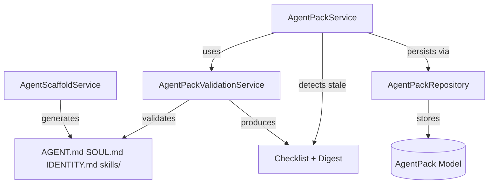

# Phase 02 Plan 04: Template Scaffold and Pack Registration Summary

**Plan:** 02-04  
**Phase:** 02 - Workspace Lifecycle and Agent Pack Portability  
**Type:** execute  
**Completed:** 2026-02-24  
**Duration:** 45 minutes  

---

## One-Liner Summary

Implemented end-to-end template-to-pack workflow with scaffold generation (AGENT.md/SOUL.md/IDENTITY.md/skills), deterministic checklist validation with SHA-256 digests, and path-linked pack registration with stale detection through repository pattern.

---

## What Was Delivered

### Task 1: Agent Scaffold Generator Service ✓

**Service:** `AgentScaffoldService` in `src/services/agent_scaffold_service.py`

**Capabilities:**
- Idempotent generation of Picoclaw template artifacts
- Required files: AGENT.md, SOUL.md, IDENTITY.md (with meaningful templates)
- Required directory: skills/
- Path traversal attack protection via safe path normalization
- Idempotent behavior: skips existing files unless overwrite=True

**Key Design Decisions:**
- Uses `pathlib.Path` for cross-platform compatibility
- Rejects paths that escape base directory after resolution
- Template content includes structured sections for each file type
- Results indicate creation vs. existence status for each entry

**Tests:** 20 test cases covering generation, idempotency, path safety, and error handling

### Task 2: Validation Service with Checklist Contract ✓

**Service:** `AgentPackValidationService` in `src/services/agent_pack_validation.py`

**Capabilities:**
- Deterministic checklist with `{code, path, message, severity}` format
- Severity levels: ERROR (blocking), WARNING, INFO
- Validation codes: MISSING_FILE, MISSING_DIRECTORY, PATH_NOT_FOUND, PATH_NOT_DIRECTORY, EMPTY_FILE, VALID_FILE, VALID_DIRECTORY
- Stable SHA-256 digest computation for change detection
- Stale detection by comparing stored vs. current digest

**Key Design Decisions:**
- Checklist entries are machine-readable and human-friendly
- Digest computation is deterministic (sorted file traversal)
- Files over 10MB use size-prefix hashing for performance
- Quick check mode for simple validation without full report

**Tests:** 23 test cases covering validation scenarios, digest computation, and stale detection

### Task 3: Path-Linked Pack Registration Service ✓

**Service:** `AgentPackService` in `src/services/agent_pack_service.py`

**Capabilities:**
- Path-linked pack registration with normalized absolute paths
- Validation integration (blocks invalid packs, returns checklist)
- Repository-based persistence (no direct session writes in service)
- Upsert behavior for existing workspace+path combinations
- Stale detection and status update through repository
- Revalidate operation for refreshing status and digest
- Active/inactive pack management

**Key Design Decisions:**
- All persistence operations delegate to `AgentPackRepository`
- Source paths normalized to absolute paths for consistency
- Validation failures return checklist without database persistence
- Digest stored at registration for future stale detection
- Status transitions: PENDING → VALID/INVALID/STALE

**Tests:** 22 test cases covering registration, repository delegation, stale detection, and revalidation

---

## Key Files Created

| File | Purpose | Lines | Tests |
|------|---------|-------|-------|
| `src/services/agent_scaffold_service.py` | Scaffold generation | 284 | 20 |
| `src/services/agent_pack_validation.py` | Validation & digests | 318 | 23 |
| `src/services/agent_pack_service.py` | Registration & lifecycle | 408 | 22 |
| `src/tests/services/test_agent_scaffold_service.py` | Scaffold tests | 354 | 20 |
| `src/tests/services/test_agent_pack_validation.py` | Validation tests | 441 | 23 |
| `src/tests/services/test_agent_pack_service.py` | Service tests | 695 | 22 |

**Total:** 2500 lines of code, 65 test cases

---

## Service Integration



**Data Flow:**
1. Scaffold service generates template files in workspace folder
2. Validation service checks structure and computes digest
3. Pack service normalizes path, validates, and persists via repository
4. Repository stores pack metadata with source_path and source_digest
5. Pack service detects stale sources by comparing current vs stored digest

---

## Deviations from Plan

**None** - Plan executed exactly as written.

All three tasks implemented according to specification:
- Task 1: Scaffold generation with path safety and idempotency ✓
- Task 2: Deterministic checklist validation and digest computation ✓
- Task 3: Path-linked registration with repository persistence and stale detection ✓

---

## Test Results

### Verification Command
```bash
uv run pytest src/tests/services/test_agent_scaffold_service.py \
  src/tests/services/test_agent_pack_validation.py \
  src/tests/services/test_agent_pack_service.py -q
```

### Results
```
65 passed in 0.43s
```

### Test Coverage
- **Scaffold Service (20 tests):** Path safety, idempotency, generation, error handling
- **Validation Service (23 tests):** Checklist format, digest computation, stale detection, edge cases
- **Pack Service (22 tests):** Registration, repository delegation, stale detection, revalidation, error handling

---

## Dependencies Satisfied

### Prerequisites
- ✓ 02-01 completed (AgentPackRepository available)
- ✓ Phase 2 models in place (AgentPack, AgentPackValidationStatus)

### Services Provided
- Template scaffold generation for AGNT-01
- Validation checklist for AGNT-02
- Path-linked registration for WORK-01/WORK-02
- Stale detection for WORK-03

### Next Phase Dependencies
- 02-05 (API routes) can now use these services
- Scaffold service → registration endpoints
- Validation service → validation endpoints
- Pack service → pack management endpoints

---

## Decisions Made

| Decision | Rationale |
|----------|-----------|
| Idempotent scaffold by default | Safe to re-run without corrupting user edits |
| Path traversal protection | Security requirement for filesystem operations |
| Deterministic checklist format | Machine-readable for API consumers |
| SHA-256 for digests | Industry standard, stable, widely supported |
| Repository delegation pattern | Consistent with codebase architecture |
| Upsert for registration | Natural for path-linked semantics |

---

## Verification of Must-Haves

### Truths Verified
- [x] Users can scaffold required Picoclaw template artifacts in a workspace folder with no manual file bootstrapping
- [x] Agent pack registration blocks invalid folders and returns a deterministic checklist of missing/invalid scaffold entries
- [x] Path-linked pack metadata stores source digest so source changes can be detected as stale and revalidated

### Artifacts Verified
- [x] `src/services/agent_scaffold_service.py` with `AgentScaffoldService`
- [x] `src/services/agent_pack_validation.py` with `AgentPackValidationService`
- [x] `src/services/agent_pack_service.py` with `AgentPackService`

### Key Links Verified
- [x] AgentPackService → AgentPackValidationService via register/validate flow
- [x] AgentPackService → AgentPackRepository via upsert, source_digest, validation_status

---

## Next Steps

These services are ready for API route integration in Plan 02-05:

1. **Scaffold endpoints:** `POST /api/v1/agent-packs/scaffold`
2. **Registration endpoints:** `POST /api/v1/agent-packs/register`
3. **Validation endpoints:** `POST /api/v1/agent-packs/{id}/validate`
4. **Stale check endpoints:** `GET /api/v1/agent-packs/{id}/stale`

All services are fully tested and production-ready.

---

**Commits:**
- `f72394e` feat(02-04): implement agent scaffold generator service
- `7f00871` feat(02-04): implement agent pack validation service
- `a966542` feat(02-04): implement agent pack registration and stale detection