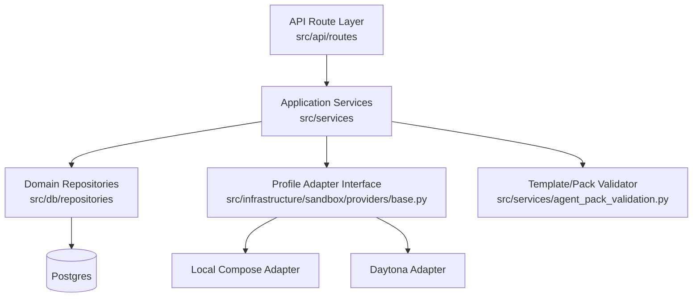
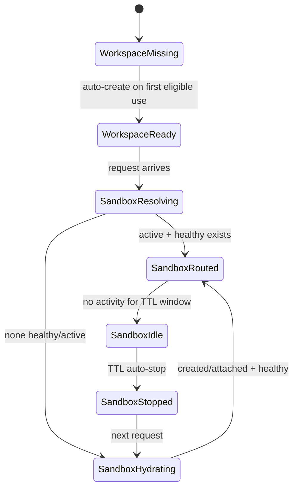
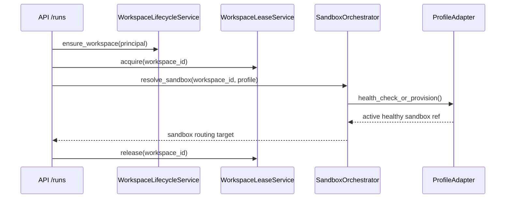
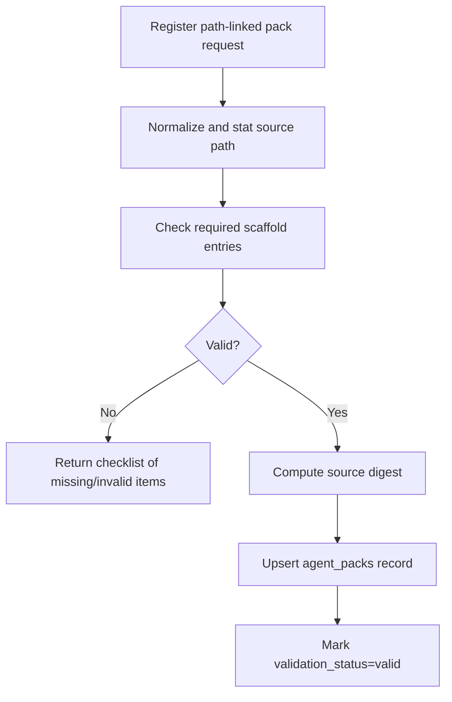

# Phase 2: Workspace Lifecycle and Agent Pack Portability - Research

**Researched:** 2026-02-24
**Phase scope:** AGNT-01, AGNT-02, AGNT-03, WORK-01, WORK-02, WORK-03, WORK-04, WORK-05, WORK-06, SECU-05
**Planning intent:** Define an implementation-ready slice plan for this repo (FastAPI + SQLAlchemy + Alembic) without introducing cross-phase scope.

## Summary

Phase 1 is complete and gives a strong policy/auth baseline, but Phase 2 domain objects and lifecycle services do not exist yet. The current code has authentication, workspace isolation, and run policy enforcement, but no durable workspace lifecycle orchestration, no sandbox state model, and no agent pack registration flow.

The implementation direction for this repo should be a control-plane layer that owns (1) workspace bootstrap/lookup, (2) sandbox selection/provisioning, (3) lease serialization for same-workspace writes, and (4) path-linked agent pack registration/validation. This should be built as explicit services in `src/services/` with adapter abstractions in `src/infrastructure/` for profile portability (local compose vs Daytona BYOC).

The planner should split work by vertical slices: data model + migration, service orchestration, API surfaces, profile adapters, then SECU-05 tests. Keep semantics identical across profiles and push profile-specific mechanics behind adapter interfaces.

**Primary recommendation:** Plan Phase 2 as a control-plane first implementation with strict adapter boundaries and DB-backed lifecycle state, then validate with isolation/concurrency/health regression tests before expanding runtime execution complexity.

## 1) Current codebase baseline relevant to Phase 2

### Implemented baseline (Phase 1 assets we can build on)

- API app and routing are established: `src/main.py`, `src/api/router.py`.
- AuthN/AuthZ and workspace boundary enforcement are in place and tested.
- Runtime policy enforcement exists in `src/services/run_service.py` and `/api/v1/runs` route surface exists in `src/api/routes/runs.py`.
- Existing DB entities: `users`, `workspaces`, `memberships`, `api_keys`, `workspace_resources` in `src/db/models.py`.
- Strong test baseline exists under `src/tests/` for policy/isolation behavior.

### Missing for Phase 2

- No workspace lifecycle state model (auto-create/reuse, continuity metadata).
- No sandbox instance model (health/state/profile/last activity/TTL info).
- No lease/lock entity for same-workspace writer serialization.
- No agent pack registration model (path-linked source metadata, validation status).
- No profile adapter layer for local compose vs Daytona.
- No APIs for scaffold/registration/workspace lifecycle control.

### Practical implication for planning

Phase 2 must introduce new control-plane modules and migrations before substantial API behavior can be completed.

## 2) Proposed architecture and module boundaries for Phase 2

### Control-plane architecture (repo-specific)



### Module boundaries

- `src/services/workspace_lifecycle_service.py`
  - Resolve durable workspace for principal (auto-create on first eligible use).
  - Select active healthy sandbox or trigger hydrate/create.
- `src/services/sandbox_orchestrator_service.py`
  - State transitions for sandbox records.
  - Adapter calls for provision/start/stop/health.
- `src/services/workspace_lease_service.py`
  - Acquire/renew/release lease for same-workspace writer path.
- `src/services/agent_pack_service.py`
  - Register/update path-linked pack metadata and source digest.
- `src/services/agent_pack_validation.py`
  - Validate required scaffold (`AGENT.md`, `SOUL.md`, `IDENTITY.md`, `skills/`) and produce checklist.
- `src/infrastructure/sandbox/providers/`
  - `base.py`: adapter protocol used by services.
  - `local_compose.py`: local profile mechanics.
  - `daytona.py`: BYOC mechanics (Daytona cloud/self-host via config).

### Keep out of Phase 2

- Queue fairness/retry/dead-letter orchestration (Phase 4).
- Full checkpoint persistence/restore flows (Phase 3), except minimal hooks for workspace attach/hydrate trigger semantics.

## 3) Data model and migration plan (ORM/Alembic-oriented)

Use SQLAlchemy models + Alembic migrations only (no raw SQL migration flow outside Alembic scripts).

### New tables (proposed)

1. `workspace_leases`
   - `id`, `workspace_id` (unique active lease key), `holder_run_id`, `holder_identity`, `acquired_at`, `expires_at`, `released_at`, `version`.
2. `sandbox_instances`
   - `id`, `workspace_id`, `profile` (`local_compose` | `daytona`), `provider_ref`, `state`, `health_status`, `last_health_at`, `last_activity_at`, `idle_ttl_seconds`, `created_at`, `updated_at`, `stopped_at`.
3. `agent_packs`
   - `id`, `workspace_id`, `name`, `source_path`, `source_digest`, `is_active`, `last_validated_at`, `validation_status`, `validation_report_json`, `created_at`, `updated_at`.
4. `agent_pack_revisions` (optional but recommended)
   - `id`, `agent_pack_id`, `source_digest`, `detected_at`, `change_summary_json`.

### Model updates

- `workspaces`: add lifecycle metadata fields if needed (`continuity_state`, `last_attached_sandbox_id`) only if planner decides benefits outweigh join complexity.
- Keep existing isolation model unchanged; all new rows are workspace-scoped.

### Migration sequencing (planner-ready)

```mermaid
flowchart LR
  M1[Add sandbox_instances + workspace_leases] --> M2[Add agent_packs (+ revisions)]
  M2 --> M3[Add indexes/constraints for routing + leasing]
```

- M1: create core lifecycle tables and foreign keys.
- M2: create registration tables and validation columns.
- M3: add uniqueness/indexes for fast routing and lock safety.

### Recommended indexes/constraints

- `sandbox_instances(workspace_id, state, health_status)` for routing.
- Partial uniqueness to prevent duplicate active sandbox per `(workspace_id, profile)` if chosen.
- `workspace_leases(workspace_id)` unique active lease strategy.
- `agent_packs(workspace_id, source_path)` unique path-linked registration.

## 4) API surface and workflow/state-machine for workspace + sandbox lifecycle

### Proposed Phase 2 API additions

- `POST /api/v1/workspaces/bootstrap`
  - Ensures durable workspace exists for authenticated principal.
- `POST /api/v1/agent-packs/register`
  - Register path-linked pack; returns validation checklist or success.
- `POST /api/v1/agent-packs/{pack_id}/validate`
  - Re-run scaffold validation and refresh status.
- `POST /api/v1/workspaces/{workspace_id}/sandbox/resolve`
  - Resolve active healthy sandbox or create/hydrate.
- `POST /api/v1/workspaces/{workspace_id}/sandbox/stop-idle`
  - Administrative/worker endpoint for TTL enforcement (or internal service call only).

### Workspace + sandbox state machine



### Request workflow (routing semantics)



## 5) Portability profile strategy (local compose vs BYOC/Daytona adapters)

### Contract-first adapter interface

Use one service-facing adapter contract:

- `ensure_workspace_attached(workspace_id, pack_ref)`
- `get_active_sandbox(workspace_id)`
- `provision_sandbox(workspace_id, config)`
- `get_health(sandbox_ref)`
- `stop_sandbox(sandbox_ref)`

### Profile mapping strategy

- Local profile (`local_compose`): use local runtime resources; keep user-level behavior same.
- BYOC profile (`daytona`): support Daytona Cloud first, with endpoint/token-driven self-host compatibility.
- API responses must expose semantic state (`ready`, `hydrating`, `unhealthy`, `stopped`) independent of provider internals.

### Planning guardrails

- No profile-specific branching in route handlers.
- Route handlers call services; services call adapter interface only.
- Profile selection should be config-driven (`settings`) and workspace/profile record driven.

## 6) Concurrency/lease strategy and failure modes

### Lease strategy for WORK-04

- Use DB-backed lease with transactional acquire/release.
- Enforce one active writer per workspace during resolve/create/hydrate path.
- Lease expiration (`expires_at`) is mandatory to prevent dead writer lock.

### Recommended locking mechanics

- Primary: row-level lease record with unique active workspace key.
- Secondary hardening (optional): Postgres advisory lock keyed by workspace UUID hash during critical section.

### Failure modes and handling

- Crash after acquire, before release -> recovered by lease expiration.
- Double acquire race -> one succeeds, other gets retryable busy/conflict.
- Long-running attach exceeding lease TTL -> periodic renewal heartbeat.
- Provider timeout during provision -> mark sandbox record transitional/failed and release lease deterministically.

### Planner task split suggestion

1. Implement lease table + repository APIs.
2. Implement acquire/release + renewal logic.
3. Integrate lease into resolve/create path and add race-condition tests.

## 7) Health checks, routing decisions, and idle TTL policy

### Routing decision order

1. List candidate sandboxes for `(workspace_id, selected_profile)`.
2. Filter to `state=active`.
3. Run/refresh health check.
4. Route only to healthy candidate.
5. If none healthy, mark unhealthy candidates excluded and provision/hydrate replacement.

### Idle TTL policy (WORK-06)

- Single platform default TTL in Phase 2 (aligned with context decision).
- Track `last_activity_at` on routed usage.
- Background sweeper or scheduled task stops sandboxes idle beyond TTL.

### Operational policy for Phase 2

- Health check failures are fail-closed for routing.
- Do not auto-route to unknown health state.
- Stop action should be idempotent (safe to call repeatedly).

## 8) Template scaffold + registration validation workflow

### Required scaffold contract

- Required files/folder at pack root:
  - `AGENT.md`
  - `SOUL.md`
  - `IDENTITY.md`
  - `skills/` directory

### Validation workflow



### Auto-detection of pack updates

- Store `source_digest` at registration/validation time.
- On run/resolve path, compare current digest to stored digest.
- If changed, mark pack as `stale` then revalidate lazily or eagerly (planner choice; recommend lazy revalidate on first use for Phase 2 speed).

### Checklist response shape (planner target)

- Deterministic machine-readable list:
  - `code` (e.g., `missing_file`, `invalid_directory`)
  - `path`
  - `message`
  - `severity` (`error` blocks registration in Phase 2)

## 9) SECU-05 automated policy/isolation test strategy

Extend current test style (`src/tests/authorization`, `src/tests/integration`, `src/tests/services`) rather than introducing a new testing framework.

### Required new test suites

1. `src/tests/services/test_workspace_lease_service.py`
   - same-workspace concurrent acquire serializes
   - expired lease recovery
2. `src/tests/services/test_sandbox_routing_service.py`
   - unhealthy excluded from routing
   - healthy active preferred over create
3. `src/tests/services/test_agent_pack_validation.py`
   - checklist for missing scaffold entries
   - valid scaffold passes and persists metadata
4. `src/tests/integration/test_phase2_acceptance.py`
   - durable workspace continuity across requests
   - local vs daytona adapter semantic parity assertions
5. `src/tests/integration/test_phase2_security_regressions.py`
   - no cross-workspace lease hijack
   - no cross-workspace sandbox routing
   - no pack registration against unauthorized workspace path context

### Key regression assertions

- Workspace A requests must never route to sandbox owned by Workspace B.
- Lease lock must prevent simultaneous writer execution path for same workspace.
- Health failure must block route, not degrade to unknown target.
- Validation failures must block registration with clear checklist.

## 10) Risks, open questions, and concrete planning recommendations

### Risks

- **R1: Adapter leakage risk** - profile-specific logic can spread into routes/services; mitigated by strict adapter contract.
- **R2: Lease deadlock/stall risk** - bad expiration/renewal handling can block workspace; mitigated with TTL + deterministic release.
- **R3: Health flapping risk** - unstable health checks may thrash provisioning; mitigated with short cooldown/backoff policy.
- **R4: File path trust risk** - path-linked registration can open traversal/ownership ambiguity; mitigated by path normalization and workspace-level authorization checks.

### Open questions to settle during planning

1. Should stale pack digest force blocking revalidation or allow one best-effort run with warning?
2. Should Phase 2 allow one active sandbox per workspace per profile, or strictly one total active sandbox across profiles?
3. For local compose profile, what is minimal viable sandbox abstraction in v1 (container-per-workspace vs logical session over shared runtime)?

### Concrete recommendations for executable PLAN.md slices

1. **Plan A (Data foundation):** add models + Alembic migrations (`sandbox_instances`, `workspace_leases`, `agent_packs`) and repository APIs.
2. **Plan B (Lifecycle services):** implement workspace bootstrap + sandbox resolve/routing with lease integration.
3. **Plan C (Profile adapters):** implement `base` adapter + `local_compose` + `daytona` minimal operations with semantic parity tests.
4. **Plan D (Pack workflow):** implement scaffold validation + path-linked registration + digest-based stale detection.
5. **Plan E (SECU-05):** add integration/security regression suites and gate completion on deterministic pass in CI.

## Sources and confidence notes

### Repo-primary (HIGH confidence)

- `src/db/models.py` (current schema baseline)
- `src/api/routes/runs.py` (existing run API + placeholder nature)
- `src/services/run_service.py` (policy execution baseline)
- `docker-compose.yml` (current local infra baseline)
- `src/tests/integration/test_phase1_acceptance.py` (acceptance test style and structure)
- `src/tests/authorization/test_workspace_isolation.py` (boundary regression style)
- `.planning/phases/02-workspace-lifecycle-and-agent-pack-portability/02-CONTEXT.md` (locked decisions)

### External references used in prior collection (MEDIUM confidence unless revalidated in implementation phase)

- Daytona docs (sandbox lifecycle/config/deployment)
- Docker Compose docs (profiles, healthcheck dependencies)
- PostgreSQL docs (advisory locks, `FOR UPDATE`, upsert patterns)

## Planning validity window

This research is implementation-oriented for current repo state and should remain valid through initial Phase 2 planning. Revalidate external provider API specifics at implementation start.
