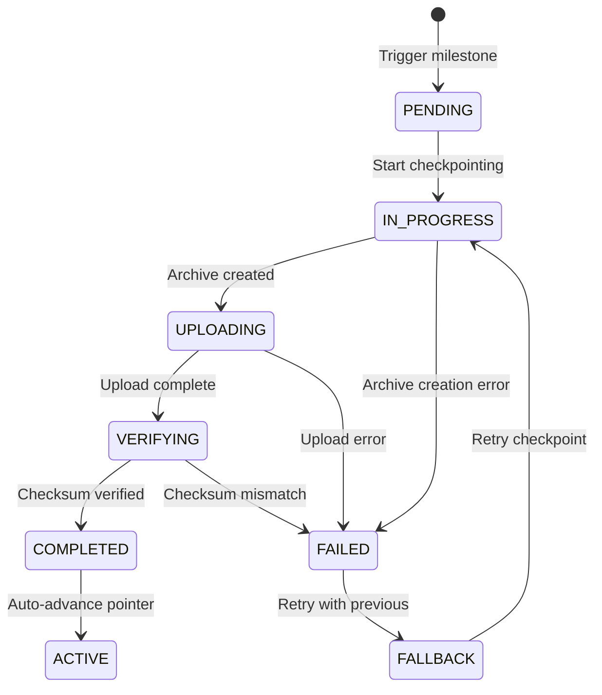
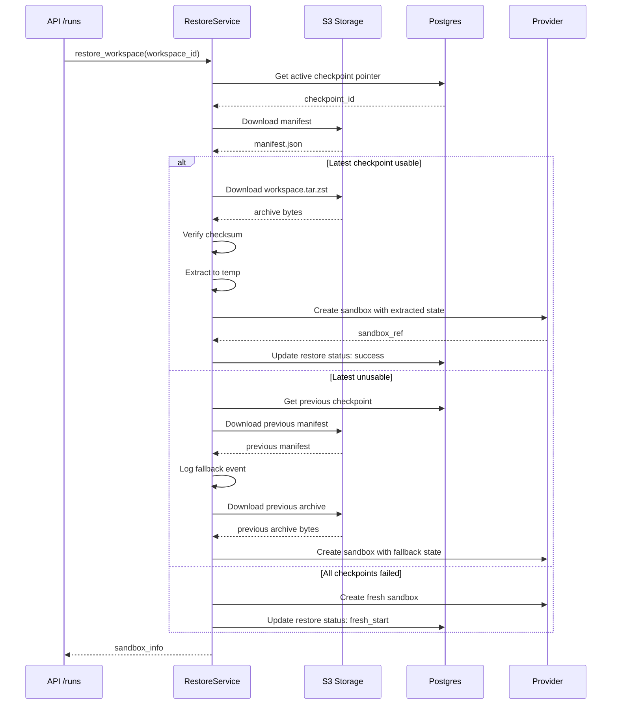

# Phase 3: Persistence and Checkpoint Recovery - Research

**Researched:** 2026-02-26
**Domain:** Postgres event sourcing, S3 checkpoint storage, cold-start restore, audit logging
**Confidence:** HIGH for core stack, MEDIUM for specific checkpoint patterns (based on web research)

## Summary

Phase 3 implements durable persistence for the Picoclaw runtime: Postgres stores runtime events and run/session metadata, while S3-compatible object storage handles workspace checkpoints with milestone-based triggering. The architecture separates **dynamic memory/session state** (checkpointed) from **static identity files** (always mounted fresh), enabling fast cold-start restore while maintaining the Picoclaw filesystem-centric model.

The checkpoint system must support:
1. **Milestone-triggered snapshots** (hybrid policy: milestone + safety checkpoints)
2. **Manifest/version tracking** with active revision pointer
3. **Cold-start restore** with fallback to previous valid checkpoint
4. **Immutable audit history** for compliance

**Primary recommendation:** Use `boto3` + `s3fs` for S3-compatible storage (MinIO for local, AWS S3/DigitalOcean Spaces for production), implement checkpoint manifests as JSON documents in S3 with metadata tracked in Postgres, and use Postgres LISTEN/NOTIFY or polling for event streaming.

## Standard Stack

### Core Persistence

| Library | Version | Purpose | Why Standard |
|---------|---------|---------|--------------|
| SQLAlchemy | 2.0+ | ORM for Postgres event/metadata storage | Existing codebase standard |
| Alembic | Latest | Database migrations | Existing codebase standard |
| boto3 | 1.34+ | S3 API client for checkpoint storage | AWS SDK, works with MinIO/DigitalOcean/any S3-compatible |
| s3fs | 2024.1+ | Pythonic filesystem interface over S3 | Simpler than raw boto3 for file operations |
| python-tarfile | Stdlib | Archive creation for workspace state | Built-in, handles large files |
| gzip/zstd | Stdlib | Compression for checkpoint archives | zstd preferred for speed/size tradeoff |

### Supporting Libraries

| Library | Version | Purpose | When to Use |
|---------|---------|---------|-------------|
| MinIO | Latest | Local S3-compatible storage for dev | Docker Compose local profile |
| aiofiles | 24.1+ | Async file operations for checkpoint I/O | When checkpoint operations must not block event loop |
| asyncpg | 0.29+ | Async Postgres driver (if needed) | Alternative to psycopg for high-throughput event streaming |

### Installation

```bash
# Core dependencies
pip install boto3 s3fs "sqlalchemy[asyncio]>=2.0" alembic

# Optional for local development
pip install minio  # Python SDK for MinIO-specific features

# Compression (choose one)
pip install zstandard  # Faster than gzip, better compression
# OR use stdlib gzip for simplicity
```

### Docker Compose Addition (MinIO for local S3)

```yaml
services:
  minio:
    image: quay.io/minio/minio:latest
    container_name: picoclaw-minio
    command: server /data --console-address ":9001"
    environment:
      MINIO_ROOT_USER: minioadmin
      MINIO_ROOT_PASSWORD: minioadmin
    ports:
      - "9000:9000"
      - "9001:9001"
    volumes:
      - minio_data:/data
    healthcheck:
      test: ["CMD", "curl", "-f", "http://localhost:9000/minio/health/live"]
      interval: 5s
      timeout: 5s
      retries: 5

volumes:
  minio_data:
```

## Architecture Patterns

### 1. Checkpoint Storage Structure

**Recommended S3 Key Layout:**

```
s3://checkpoints-bucket/
  workspaces/
    {workspace_id}/
      checkpoints/
        {checkpoint_id}/
          manifest.json       # Checkpoint metadata
          workspace.tar.zst   # Compressed workspace state
          memory/             # Optional: memory/session data
            session_state.json
            conversation_history.json
      manifests/
        active.json           # Points to latest successful checkpoint
        history.jsonl         # Append-only checkpoint history
```

**Checkpoint Manifest Schema (JSON):**

```json
{
  "checkpoint_id": "uuid",
  "workspace_id": "uuid",
  "created_at": "2026-02-26T12:00:00Z",
  "trigger": "milestone|interval|manual",
  "parent_checkpoint_id": "uuid|null",
  "files": {
    "workspace_archive": {
      "key": "workspaces/{workspace_id}/checkpoints/{checkpoint_id}/workspace.tar.zst",
      "size_bytes": 1048576,
      "checksum": "sha256:abc123...",
      "compression": "zstd"
    }
  },
  "metadata": {
    "checkpoint_version": "1.0",
    "runtime_version": "picoclaw-x.y.z",
    "sandbox_profile": "local_compose|daytona",
    "session_state_version": "1"
  },
  "status": "pending|in_progress|completed|failed",
  "completed_at": "2026-02-26T12:00:05Z"
}
```

**Active Revision Pointer (separate JSON file):**

```json
{
  "workspace_id": "uuid",
  "active_checkpoint_id": "uuid",
  "updated_at": "2026-02-26T12:00:05Z",
  "updated_by": "system|operator:{user_id}",
  "reason": "auto_advance|operator_override"
}
```

### 2. Checkpoint Lifecycle State Machine



### 3. Cold-Start Restore Flow



### 4. Postgres Event Table Schema

**Runtime Events Table (append-only):**

```sql
CREATE TABLE runtime_events (
    id BIGSERIAL PRIMARY KEY,
    run_id UUID NOT NULL,
    workspace_id UUID REFERENCES workspaces(id),
    
    -- Event classification
    event_type VARCHAR(50) NOT NULL,  -- 'message', 'tool_call', 'tool_result', 'ui_patch', 'state_update', 'error', 'lifecycle'
    event_subtype VARCHAR(50),        -- 'queued', 'running', 'cancelled', 'completed', 'failed' for lifecycle
    
    -- Event content (JSONB for flexibility)
    payload JSONB NOT NULL,
    
    -- Temporal ordering (critical for replay)
    sequence_number BIGINT NOT NULL,  -- Per-run monotonic sequence
    created_at TIMESTAMPTZ NOT NULL DEFAULT NOW(),
    
    -- Source attribution
    actor_type VARCHAR(20),           -- 'user', 'system', 'agent'
    actor_id UUID,
    
    -- Immutable constraint via application code + RLS
    -- No UPDATE/DELETE allowed on this table
);

-- Indexes for query patterns
CREATE INDEX idx_runtime_events_run_id_seq 
    ON runtime_events(run_id, sequence_number);
CREATE INDEX idx_runtime_events_workspace_time 
    ON runtime_events(workspace_id, created_at DESC);
CREATE INDEX idx_runtime_events_type_time 
    ON runtime_events(event_type, created_at DESC);

-- Partition by time for retention management
CREATE TABLE runtime_events_2026_02 PARTITION OF runtime_events
    FOR VALUES FROM ('2026-02-01') TO ('2026-03-01');
```

**Run Session Metadata Table:**

```sql
CREATE TABLE run_sessions (
    id UUID PRIMARY KEY DEFAULT gen_random_uuid(),
    workspace_id UUID REFERENCES workspaces(id) NOT NULL,
    user_id UUID REFERENCES users(id) NOT NULL,
    
    -- Run lifecycle
    status VARCHAR(20) NOT NULL,  -- 'queued', 'running', 'completed', 'failed', 'cancelled'
    started_at TIMESTAMPTZ,
    completed_at TIMESTAMPTZ,
    
    -- Checkpoint reference (if run triggered checkpoint)
    checkpoint_id UUID,
    
    -- Summary statistics
    event_count INTEGER DEFAULT 0,
    error_count INTEGER DEFAULT 0,
    
    -- Guest mode flag
    is_guest BOOLEAN DEFAULT FALSE,
    
    created_at TIMESTAMPTZ NOT NULL DEFAULT NOW(),
    updated_at TIMESTAMPTZ NOT NULL DEFAULT NOW()
);

CREATE INDEX idx_run_sessions_workspace_time 
    ON run_sessions(workspace_id, created_at DESC);
```

**Checkpoint Registry Table:**

```sql
CREATE TABLE workspace_checkpoints (
    id UUID PRIMARY KEY DEFAULT gen_random_uuid(),
    workspace_id UUID REFERENCES workspaces(id) NOT NULL,
    
    -- Checkpoint identification
    checkpoint_version INTEGER NOT NULL DEFAULT 1,
    parent_checkpoint_id UUID REFERENCES workspace_checkpoints(id),
    
    -- Storage location
    s3_bucket VARCHAR(255) NOT NULL,
    s3_prefix VARCHAR(512) NOT NULL,
    manifest_key VARCHAR(512) NOT NULL,
    archive_key VARCHAR(512) NOT NULL,
    archive_size_bytes BIGINT,
    archive_checksum VARCHAR(64),
    
    -- Status
    status VARCHAR(20) NOT NULL DEFAULT 'pending',  -- 'pending', 'in_progress', 'completed', 'failed', 'corrupted'
    
    -- Trigger info
    trigger_type VARCHAR(20),  -- 'milestone', 'interval', 'manual'
    trigger_run_id UUID REFERENCES run_sessions(id),
    
    -- Timestamps
    started_at TIMESTAMPTZ NOT NULL DEFAULT NOW(),
    completed_at TIMESTAMPTZ,
    
    -- Verification
    verified_at TIMESTAMPTZ,
    verification_status VARCHAR(20),
    
    created_at TIMESTAMPTZ NOT NULL DEFAULT NOW()
);

-- Active checkpoint pointer (unique per workspace)
CREATE TABLE workspace_active_checkpoint (
    workspace_id UUID PRIMARY KEY REFERENCES workspaces(id),
    checkpoint_id UUID REFERENCES workspace_checkpoints(id),
    updated_at TIMESTAMPTZ NOT NULL DEFAULT NOW(),
    updated_by VARCHAR(100),  -- 'system:auto_advance' or 'operator:{user_id}'
    reason TEXT
);
```

**Audit Events Table (immutable, append-only):**

```sql
CREATE TABLE audit_events (
    id BIGSERIAL PRIMARY KEY,
    
    -- Event classification
    event_type VARCHAR(50) NOT NULL,  -- 'checkpoint_created', 'checkpoint_failed', 'restore_started', 'restore_completed', 'restore_failed', 'pointer_changed'
    
    -- Resource identification
    workspace_id UUID,
    run_id UUID,
    checkpoint_id UUID,
    
    -- Actor identification
    actor_type VARCHAR(20) NOT NULL,  -- 'system', 'operator', 'user'
    actor_id UUID,
    
    -- Event details
    payload JSONB NOT NULL,
    reason TEXT,
    
    -- Immutable timestamp
    created_at TIMESTAMPTZ NOT NULL DEFAULT NOW(),
    
    -- Tamper-evident (optional): store hash chain
    previous_hash VARCHAR(64),
    event_hash VARCHAR(64) GENERATED ALWAYS AS (
        encode(digest(
            event_type || '|' || 
            COALESCE(workspace_id::text, '') || '|' || 
            COALESCE(actor_id::text, '') || '|' || 
            payload::text || '|' || 
            created_at::text,
            'sha256'
        ), 'hex')
    ) STORED
);

-- Enable pgcrypto extension for hashing
CREATE EXTENSION IF NOT EXISTS pgcrypto;

-- Indexes
CREATE INDEX idx_audit_events_workspace_time 
    ON audit_events(workspace_id, created_at DESC);
CREATE INDEX idx_audit_events_type_time 
    ON audit_events(event_type, created_at DESC);

-- Prevent updates/deletes via trigger
CREATE OR REPLACE FUNCTION prevent_audit_modification()
RETURNS TRIGGER AS $$
BEGIN
    RAISE EXCEPTION 'Audit events are immutable and cannot be modified';
END;
$$ LANGUAGE plpgsql;

CREATE TRIGGER audit_events_immutable
    BEFORE UPDATE OR DELETE ON audit_events
    FOR EACH ROW EXECUTE FUNCTION prevent_audit_modification();
```

### 5. S3 Multipart Upload Pattern (for large checkpoints)

```python
# Checkpoint upload with multipart for large archives
import boto3
from boto3.s3.transfer import TransferConfig
import hashlib
import tempfile
import tarfile
import os

class CheckpointUploader:
    """Handles checkpoint uploads to S3 with multipart for large files."""
    
    def __init__(self, bucket: str, s3_client=None):
        self.bucket = bucket
        self.s3 = s3_client or boto3.client('s3')
        self.transfer_config = TransferConfig(
            multipart_threshold=100 * 1024 * 1024,  # 100MB threshold
            multipart_chunksize=64 * 1024 * 1024,   # 64MB chunks
            max_concurrency=10,
            use_threads=True
        )
    
    async def upload_checkpoint(
        self,
        workspace_id: str,
        checkpoint_id: str,
        source_dir: str,
        metadata: dict
    ) -> dict:
        """Upload workspace checkpoint to S3.
        
        Returns manifest dict with S3 locations and checksums.
        """
        prefix = f"workspaces/{workspace_id}/checkpoints/{checkpoint_id}"
        
        # Create compressed archive
        archive_path = await self._create_archive(source_dir, checkpoint_id)
        
        try:
            # Calculate checksum before upload
            checksum = self._calculate_checksum(archive_path)
            
            # Upload archive with multipart
            archive_key = f"{prefix}/workspace.tar.zst"
            self.s3.upload_file(
                archive_path,
                self.bucket,
                archive_key,
                Config=self.transfer_config,
                ExtraArgs={
                    'Metadata': {
                        'checksum-sha256': checksum,
                        'workspace-id': workspace_id,
                        'checkpoint-id': checkpoint_id,
                    }
                }
            )
            
            # Create and upload manifest
            manifest = {
                'checkpoint_id': checkpoint_id,
                'workspace_id': workspace_id,
                'created_at': datetime.utcnow().isoformat(),
                'files': {
                    'workspace_archive': {
                        'key': archive_key,
                        'size_bytes': os.path.getsize(archive_path),
                        'checksum': f"sha256:{checksum}",
                        'compression': 'zstd'
                    }
                },
                'metadata': metadata,
                'status': 'completed'
            }
            
            manifest_key = f"{prefix}/manifest.json"
            self.s3.put_object(
                Bucket=self.bucket,
                Key=manifest_key,
                Body=json.dumps(manifest, indent=2).encode(),
                ContentType='application/json'
            )
            
            return manifest
            
        finally:
            # Cleanup temp file
            if os.path.exists(archive_path):
                os.remove(archive_path)
    
    def _calculate_checksum(self, file_path: str) -> str:
        """Calculate SHA-256 checksum of file."""
        sha256 = hashlib.sha256()
        with open(file_path, 'rb') as f:
            for chunk in iter(lambda: f.read(8192), b''):
                sha256.update(chunk)
        return sha256.hexdigest()
```

### 6. Cold-Start Restore Service Pattern

```python
class CheckpointRestoreService:
    """Handles workspace restoration from checkpoints."""
    
    def __init__(
        self,
        s3_client,
        checkpoint_repo: CheckpointRepository,
        audit_service: AuditService,
        provider: SandboxProvider
    ):
        self.s3 = s3_client
        self.repo = checkpoint_repo
        self.audit = audit_service
        self.provider = provider
    
    async def restore_workspace(
        self,
        workspace_id: str,
        target_checkpoint_id: str = None
    ) -> RestoreResult:
        """Restore workspace from checkpoint.
        
        If target_checkpoint_id is None, uses active pointer.
        Falls back to previous checkpoint if latest fails.
        """
        # Audit: restore started
        await self.audit.log_restore_started(workspace_id)
        
        checkpoint = await self._resolve_checkpoint(
            workspace_id, target_checkpoint_id
        )
        
        if not checkpoint:
            # No checkpoint available - fresh start
            return await self._create_fresh_sandbox(workspace_id)
        
        try:
            # Attempt restore
            return await self._restore_from_checkpoint(workspace_id, checkpoint)
        except CheckpointError:
            # Try fallback to previous checkpoint
            previous = await self.repo.get_previous_checkpoint(
                workspace_id, checkpoint.id
            )
            if previous:
                await self.audit.log_checkpoint_fallback(
                    workspace_id, checkpoint.id, previous.id
                )
                return await self._restore_from_checkpoint(workspace_id, previous)
            else:
                # No fallback - retry once then fresh start
                return await self._retry_or_fresh_start(workspace_id)
    
    async def _restore_from_checkpoint(
        self,
        workspace_id: str,
        checkpoint: WorkspaceCheckpoint
    ) -> RestoreResult:
        """Download and restore checkpoint to sandbox."""
        # Download archive
        response = self.s3.get_object(
            Bucket=checkpoint.s3_bucket,
            Key=checkpoint.archive_key
        )
        archive_bytes = response['Body'].read()
        
        # Verify checksum
        actual_checksum = hashlib.sha256(archive_bytes).hexdigest()
        if actual_checksum != checkpoint.archive_checksum:
            raise CheckpointError("Checksum verification failed")
        
        # Extract to temp directory
        with tempfile.TemporaryDirectory() as temp_dir:
            await self._extract_archive(archive_bytes, temp_dir)
            
            # Provision sandbox with extracted state
            config = SandboxConfig(
                workspace_id=workspace_id,
                checkpoint_path=temp_dir,
                restore_from_checkpoint=True
            )
            
            sandbox = await self.provider.provision_sandbox(config)
            
            # Audit: restore completed
            await self.audit.log_restore_completed(
                workspace_id, checkpoint.id
            )
            
            return RestoreResult(
                success=True,
                sandbox=sandbox,
                checkpoint_id=checkpoint.id
            )
```

## Don't Hand-Roll

| Problem | Don't Build | Use Instead | Why |
|---------|-------------|-------------|-----|
| S3-compatible storage client | Custom HTTP client | boto3 + s3fs | Full S3 API support, multipart uploads, retry logic, works with MinIO/DigitalOcean/AWS |
| Checkpoint archive format | Custom serialization | tar.zst/tar.gz | Standard format, preserves file permissions, streaming extraction, built-in checksums |
| Event streaming from Postgres | Custom polling | LISTEN/NOTIFY or asyncpg | Native pub/sub, no polling overhead, lower latency |
| Audit log immutability | Application-level enforcement | Postgres triggers + RLS | Database-enforced, can't be bypassed |
| Checkpoint checksums | Custom hash protocol | SHA-256 in manifest | Standard, verified by S3 on upload/download |
| Large file uploads | Single PUT request | S3 multipart upload | Resumable, parallelizable, handles network interruptions |

### Key Insight: Checkpoint Scope Separation

**Don't checkpoint static files.** Per Phase 3 context decisions:
- **Checkpoint scope:** Memory/session state only (dynamic)
- **Mount scope:** `AGENT.md`, `SOUL.md`, `IDENTITY.md`, `skills/` (static, always mounted fresh)

This enables fast checkpoint/restore cycles (smaller archives) and ensures identity files are always current.

## Common Pitfalls

### Pitfall 1: S3 Eventual Consistency on Read-After-Write

**What goes wrong:** After uploading a checkpoint manifest, an immediate read returns 404 or stale data.

**Why it happens:** Some S3-compatible storage (especially MinIO in distributed mode) has eventual consistency for LIST operations.

**How to avoid:** 
- Use `HEAD` request on specific key instead of LIST operations
- Include version ID in checkpoint references
- Verify upload with `ETag` before marking checkpoint complete

```python
# Good: verify specific key exists
self.s3.head_object(Bucket=bucket, Key=manifest_key)

# Avoid: listing and searching
response = self.s3.list_objects_v2(Bucket=bucket, Prefix=prefix)
# May not include recently uploaded object
```

### Pitfall 2: Corrupted Checksums from Streaming

**What goes wrong:** Checksum verification fails despite successful upload.

**Why it happens:** Calculating checksum on a stream without proper buffering, or compressing after checksumming.

**How to avoid:**
- Calculate checksum on final compressed archive, not source files
- Use `shutil.copyfileobj` with proper buffering
- Verify immediately after upload with `head_object`

```python
# Calculate on compressed file
with open(archive_path, 'rb') as f:
    checksum = hashlib.sha256(f.read()).hexdigest()

# Verify after upload
response = self.s3.head_object(Bucket=bucket, Key=key)
assert response['Metadata']['checksum-sha256'] == checksum
```

### Pitfall 3: Checkpoint/Restore Race Conditions

**What goes wrong:** Two concurrent restore operations create duplicate sandboxes.

**Why it happens:** Check-then-act race when multiple requests arrive during cold-start.

**How to avoid:**
- Use workspace lease (from Phase 2) during restore
- Mark workspace as `RESTORING` state in database
- Queue run requests with `restoring` status instead of allowing concurrent restores

```python
async def restore_with_lease(workspace_id: str):
    lease = await lease_service.acquire(workspace_id, run_id)
    try:
        # Set restoring state
        await repo.set_workspace_state(workspace_id, 'restoring')
        return await restore_workspace(workspace_id)
    finally:
        await repo.set_workspace_state(workspace_id, 'ready')
        await lease_service.release(lease)
```

### Pitfall 4: Orphaned S3 Objects on Failed Checkpoints

**What goes wrong:** Failed checkpoint uploads leave partial objects in S3, consuming storage.

**Why it happens:** Multipart uploads not aborted on failure, or manifests not cleaned up.

**How to avoid:**
- Use S3 lifecycle policies for incomplete multipart uploads
- Implement cleanup job for checkpoints stuck in `in_progress` > threshold
- Track multipart upload IDs and abort on failure

```python
# Cleanup incomplete multipart uploads
s3.abort_multipart_upload(
    Bucket=bucket,
    Key=key,
    UploadId=upload_id
)
```

### Pitfall 5: Audit Log Injection

**What goes wrong:** Audit log entries contain unsanitized user input, leading to log forging.

**Why it happens:** Directly interpolating user-provided data into audit payloads.

**How to avoid:**
- Validate and sanitize all payload fields
- Use JSONB for structured storage
- Include actor authentication in audit events (not just claimed identity)

```python
# Sanitize audit payload
payload = {
    'workspace_id': str(workspace_id),  # Validate UUID format
    'action': action,  # Whitelist allowed actions
    'metadata': sanitize_json(metadata)  # Recursive sanitization
}
```

## Code Examples

### 1. MinIO Configuration for Local Development

```python
# settings.py additions for Phase 3
class Settings(BaseSettings):
    # ... existing settings ...
    
    # S3/Checkpoint Configuration
    CHECKPOINT_STORAGE_TYPE: str = "s3"  # 's3' or 'filesystem'
    CHECKPOINT_S3_BUCKET: str = "picoclaw-checkpoints"
    CHECKPOINT_S3_PREFIX: str = "workspaces"
    CHECKPOINT_S3_ENDPOINT: str = "http://localhost:9000"  # MinIO
    CHECKPOINT_S3_ACCESS_KEY: str = "minioadmin"
    CHECKPOINT_S3_SECRET_KEY: str = "minioadmin"
    CHECKPOINT_S3_REGION: str = "us-east-1"
    
    # Checkpoint Policy
    CHECKPOINT_INTERVAL_SECONDS: int = 300  # Safety checkpoint every 5 min
    CHECKPOINT_MILESTONES: list[str] = ["run_complete", "session_end", "manual"]
    
    def get_s3_client(self):
        """Get S3 client configured for checkpoint storage."""
        return boto3.client(
            's3',
            endpoint_url=self.CHECKPOINT_S3_ENDPOINT,
            aws_access_key_id=self.CHECKPOINT_S3_ACCESS_KEY,
            aws_secret_access_key=self.CHECKPOINT_S3_SECRET_KEY,
            region_name=self.CHECKPOINT_S3_REGION
        )
```

### 2. Event Streaming with Postgres LISTEN/NOTIFY

```python
import asyncio
import asyncpg

class PostgresEventStreamer:
    """Stream runtime events using Postgres LISTEN/NOTIFY."""
    
    def __init__(self, dsn: str):
        self.dsn = dsn
        self.listeners = []
    
    async def start(self):
        """Start listening for runtime events."""
        self.conn = await asyncpg.connect(self.dsn)
        await self.conn.add_listener('runtime_events', self._on_event)
    
    def _on_event(self, connection, pid, channel, payload):
        """Handle incoming event notification."""
        event = json.loads(payload)
        for listener in self.listeners:
            asyncio.create_task(listener(event))
    
    def add_listener(self, callback):
        self.listeners.append(callback)
    
    async def publish_event(self, event: dict):
        """Publish event via NOTIFY."""
        payload = json.dumps(event)
        await self.conn.execute(
            "SELECT pg_notify('runtime_events', $1)",
            payload
        )

# Trigger function to emit NOTIFY on INSERT
CREATE_EVENT_NOTIFY_TRIGGER = """
CREATE OR REPLACE FUNCTION notify_runtime_event()
RETURNS TRIGGER AS $$
BEGIN
    PERFORM pg_notify(
        'runtime_events',
        json_build_object(
            'id', NEW.id,
            'run_id', NEW.run_id,
            'event_type', NEW.event_type,
            'payload', NEW.payload,
            'created_at', NEW.created_at
        )::text
    );
    RETURN NEW;
END;
$$ LANGUAGE plpgsql;

CREATE TRIGGER runtime_event_notification
    AFTER INSERT ON runtime_events
    FOR EACH ROW EXECUTE FUNCTION notify_runtime_event();
"""
```

### 3. Checkpoint Manifest Repository

```python
class CheckpointManifestRepository:
    """Repository for checkpoint manifest CRUD operations."""
    
    def __init__(self, session: Session, s3_client):
        self.session = session
        self.s3 = s3_client
        self.bucket = settings.CHECKPOINT_S3_BUCKET
    
    def create_manifest(
        self,
        workspace_id: UUID,
        checkpoint_id: UUID,
        trigger_type: str,
        metadata: dict
    ) -> CheckpointManifest:
        """Create new checkpoint manifest record."""
        manifest = CheckpointManifest(
            id=checkpoint_id,
            workspace_id=workspace_id,
            trigger_type=trigger_type,
            status='pending',
            s3_bucket=self.bucket,
            s3_prefix=f"workspaces/{workspace_id}/checkpoints/{checkpoint_id}",
            metadata=metadata
        )
        self.session.add(manifest)
        self.session.flush()
        return manifest
    
    def get_active_checkpoint(self, workspace_id: UUID) -> Optional[CheckpointManifest]:
        """Get currently active checkpoint for workspace."""
        active = self.session.query(WorkspaceActiveCheckpoint).filter_by(
            workspace_id=workspace_id
        ).first()
        
        if not active or not active.checkpoint_id:
            return None
            
        return self.session.query(CheckpointManifest).filter_by(
            id=active.checkpoint_id
        ).first()
    
    def update_active_pointer(
        self,
        workspace_id: UUID,
        checkpoint_id: UUID,
        updated_by: str,
        reason: str
    ):
        """Update active checkpoint pointer."""
        active = self.session.query(WorkspaceActiveCheckpoint).filter_by(
            workspace_id=workspace_id
        ).first()
        
        if not active:
            active = WorkspaceActiveCheckpoint(workspace_id=workspace_id)
            self.session.add(active)
        
        active.checkpoint_id = checkpoint_id
        active.updated_at = datetime.utcnow()
        active.updated_by = updated_by
        active.reason = reason
    
    def get_previous_checkpoint(
        self,
        workspace_id: UUID,
        current_checkpoint_id: UUID
    ) -> Optional[CheckpointManifest]:
        """Get checkpoint prior to current one."""
        current = self.session.query(CheckpointManifest).filter_by(
            id=current_checkpoint_id
        ).first()
        
        if not current or not current.parent_checkpoint_id:
            return None
            
        return self.session.query(CheckpointManifest).filter_by(
            id=current.parent_checkpoint_id
        ).first()
```

## State of the Art

| Old Approach | Current Approach | When Changed | Impact |
|--------------|------------------|--------------|--------|
| Full VM snapshots | Container state + volume snapshots | 2024 | Smaller checkpoints, faster restore |
| Periodic full snapshots | Incremental + milestone checkpoints | 2024-2025 | Reduced storage, bounded recovery time |
| NFS/SAN for checkpoint storage | S3-compatible object storage | 2024 | Cost-effective, unlimited scale |
| gzip compression | zstd compression | 2024 | 2-3x faster compression, similar ratio |
| Custom wire protocols | S3 API standard | 2023-2024 | Vendor interoperability |

**Deprecated/outdated:**
- **tar.gz without checksums:** Use zstd + SHA-256 manifests
- **NFS mount checkpoints:** Use S3 multipart uploads for reliability
- **In-band checkpoint metadata:** Use separate manifest.json + database registry

## Open Questions

### 1. Checkpoint Size Limits
- **What we know:** Current S3-compatible storage supports 5TB objects via multipart
- **What's unclear:** Maximum practical workspace size for sub-30s checkpoint/restore
- **Recommendation:** Set soft limit at 10GB workspace state; warn at 5GB

### 2. Checkpoint Verification Strategy
- **What we know:** Checksum verification on download catches corruption
- **What's unclear:** Whether to implement background integrity scans
- **Recommendation:** Verify on restore, with optional weekly background scan

### 3. Cross-Region Checkpoint Replication
- **What we know:** Not required in Phase 3 (operator discretion)
- **What's unclear:** Whether to architect for future multi-region
- **Recommendation:** Include region field in manifest, but single-region implementation

### 4. Event Streaming Scalability
- **What we know:** LISTEN/NOTIFY works well for moderate throughput
- **What's unclear:** Breakpoint where dedicated message queue needed
- **Recommendation:** LISTEN/NOTIFY for v1, document Kafka/RabbitMQ migration path

## Sources

### Primary (HIGH confidence)
- `src/db/models.py` - Current Phase 2 schema baseline
- `src/services/run_service.py` - Checkpoint persistence guards
- `src/infrastructure/sandbox/providers/base.py` - Provider checkpoint interface
- `docker-compose.yml` - Infrastructure baseline
- `src/config/settings.py` - Configuration patterns

### Secondary (MEDIUM confidence)
- [PostgreSQL LISTEN/NOTIFY docs](https://www.postgresql.org/docs/current/sql-notify.html) - Official documentation
- [boto3 S3 documentation](https://boto3.amazonaws.com/v1/documentation/api/latest/reference/services/s3.html) - AWS SDK reference
- [MinIO Python SDK](https://github.com/minio/minio-py) - MinIO client reference
- [S3 multipart upload guide](https://docs.aws.amazon.com/AmazonS3/latest/userguide/mpuoverview.html) - AWS best practices

### Tertiary (LOW confidence - marked for validation)
- Web search results on checkpoint patterns (2025) - Community patterns, verify before implementation
- Medium articles on Postgres event sourcing - Opinion pieces, cross-reference with official docs

## Metadata

**Confidence breakdown:**
- Standard stack: HIGH - boto3/s3fs are established standards
- Checkpoint patterns: MEDIUM - Based on research, verify with MinIO testing
- Postgres schemas: HIGH - Based on existing codebase patterns
- S3 patterns: MEDIUM-HIGH - boto3 API is stable

**Research date:** 2026-02-26
**Valid until:** 2026-03-26 (revalidate if MinIO/boto3 major versions change)
