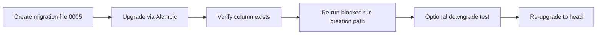

# Phase 3 UAT Gap Fix Plan: `sandbox_instances.gateway_url`

## Quick Outcome

Add a single Alembic migration that safely introduces a nullable `gateway_url` column (`VARCHAR(512)`) to `sandbox_instances`, with reversible downgrade support, then verify schema + run flow unblocking.



## 1) Migration Filename and Location

- File: `src/db/migrations/versions/0005_add_gateway_url_to_sandbox_instances.py`
- Revision strategy: `revision = "0005"`, `down_revision = "0004"`
- Why this shape is production-safe: adding a nullable column without default avoids full-table rewrite risk and preserves existing rows.

## 2) Complete Migration Code (Upgrade + Downgrade)

Use this full file content:

```python
"""Add gateway_url column to sandbox_instances

Revision ID: 0005
Revises: 0004
Create Date: 2026-02-26

Fixes schema drift where ORM expects sandbox_instances.gateway_url
but database schema is missing the column.
"""

from typing import Sequence, Union

from alembic import op
import sqlalchemy as sa


# revision identifiers, used by Alembic.
revision: str = "0005"
down_revision: Union[str, None] = "0004"
branch_labels: Union[str, Sequence[str], None] = None
depends_on: Union[str, Sequence[str], None] = None


def upgrade() -> None:
    """Add nullable gateway_url column to sandbox_instances."""

    bind = op.get_bind()
    inspector = sa.inspect(bind)
    existing_columns = {
        column["name"] for column in inspector.get_columns("sandbox_instances")
    }

    if "gateway_url" not in existing_columns:
        op.add_column(
            "sandbox_instances",
            sa.Column("gateway_url", sa.String(length=512), nullable=True),
        )


def downgrade() -> None:
    """Remove gateway_url column from sandbox_instances."""

    bind = op.get_bind()
    inspector = sa.inspect(bind)
    existing_columns = {
        column["name"] for column in inspector.get_columns("sandbox_instances")
    }

    if "gateway_url" in existing_columns:
        op.drop_column("sandbox_instances", "gateway_url")
```

## 3) Rollback / Downgrade Operation

- Downgrade command: `uv run alembic downgrade -1`
- Expected result: migration `0005` is reverted and `sandbox_instances.gateway_url` is removed.
- Re-apply command: `uv run alembic upgrade head`

## 4) Verification Steps

### Schema Verification

1. Apply migration:
   - `uv run alembic upgrade head`
2. Verify column exists:
   - `uv run python -c "from sqlalchemy import create_engine, inspect; from src.config.settings import settings; i=inspect(create_engine(settings.DATABASE_URL)); print([c['name'] for c in i.get_columns('sandbox_instances') if c['name']=='gateway_url'])"`
3. Expected output contains `gateway_url`.

### Functional Unblock Verification

1. Re-run Phase 3 UAT test 1 (run creation persistence path).
2. Confirm run creation no longer fails with `column sandbox_instances.gateway_url does not exist`.
3. Re-run blocked checkpoint/restore UAT tests (3, 5, 6, 8, 9, 10, 11) to confirm they are unblocked by successful run creation.

### Safety / Reversibility Verification

1. Run downgrade once: `uv run alembic downgrade -1`
2. Confirm column is removed.
3. Re-upgrade: `uv run alembic upgrade head`
4. Confirm service returns to expected schema state.

## Done Criteria

- `sandbox_instances` has nullable `gateway_url VARCHAR(512)` in DB schema.
- Alembic migration history is linear (`0004 -> 0005`).
- Upgrade and downgrade both execute cleanly.
- Phase 3 UAT run creation path is unblocked, allowing the 8 blocked tests to proceed.
