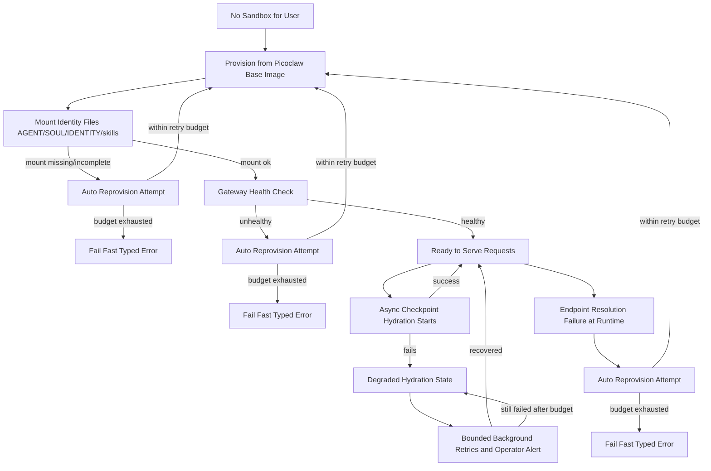

# Phase 03.1: Make Daytona Production-Ready for Picoclaw Gateway Execution - Research

**Researched:** 2026-02-26
**Domain:** Daytona Platform Integration, Sandbox Lifecycle Management, Gateway Production Readiness
**Confidence:** HIGH

## Summary

This phase hardens Daytona-backed Picoclaw gateway execution for production reliability, security, and operational consistency. The research covers Daytona SDK capabilities, production patterns for sandbox lifecycle management, identity mounting strategies, checkpoint hydration workflows, and failover mechanisms.

**Key architectural decisions locked by context:**
- Use Daytona-native primitives (registry images → volumes → snapshots) in that priority order
- Per-sandbox bearer tokens with 30-second grace period on rotation
- Gateway health as primary readiness gate, checkpoint hydration async and non-blocking
- Bounded auto-reprovision (3 attempts recommended) before fail-fast typed errors
- Orchestrator as smart proxy—clients never call Daytona endpoints directly

**Primary recommendation:** Implement a layered readiness system: identity mount completeness (hard gate) → gateway health (ready gate) → async checkpoint hydration (best-effort background), with bounded retry loops for transient failures at each layer.

---

## Standard Stack

### Core Daytona Platform
| Component | Version/Capability | Purpose | Why Standard |
|-----------|-------------------|---------|--------------|
| Daytona Async Python SDK | 0.23.0+ | Sandbox lifecycle management | Official SDK with full async support, automatic resource cleanup via context managers |
| AsyncDaytona | Core class | Connection management | Handles auth, session pooling, and OpenTelemetry tracing |
| AsyncSandbox | Instance class | Per-sandbox operations | File system, process execution, lifecycle control |

### Sandbox Creation Methods (Priority Order per Context)
| Method | Use Case | SDK Class | Notes |
|--------|----------|-----------|-------|
| **Docker Registry Image** (Primary) | Production rollout with Picoclaw-ready base image | `CreateSandboxFromImageParams` | Locked decision: Use this first for Phase 3.1 |
| **Volumes** | Shared/reusable content, large file mounts | `VolumeMount` via `CreateSandboxFromSnapshotParams` | FUSE-based, S3-backed, cross-sandbox sharing |
| **Snapshots** | Pre-built templates with dependencies | `CreateSandboxFromSnapshotParams` | Deferred until image-based flow is stable |

### Supporting Services
| Library | Purpose | Integration Point |
|---------|---------|-------------------|
| `httpx` | Bridge HTTP client | `PicoclawBridgeService` → gateway `/health` and `/bridge/execute` |
| `secrets` | Per-sandbox token generation | `SandboxOrchestratorService._generate_runtime_bridge_config()` |
| `asyncio` | Concurrent hydration | Background checkpoint restore while serving requests |

### Installation
```bash
# Daytona SDK already in project
pip install daytona>=0.23.0
```

---

## Architecture Patterns

### Recommended Sandbox Lifecycle Flow



### Pattern 1: Identity-First Readiness Gate

**What:** Verify identity file completeness before marking sandbox ready

**When to use:** All sandbox provisions—this is a hard requirement per context

**Implementation:**
```python
# Source: 3.1-CONTEXT.md / AGENTS.md invariants
# Identity files mounted at sandbox creation via Daytona volumes or file upload
REQUIRED_IDENTITY_FILES = [
    "AGENT.md",
    "SOUL.md", 
    "IDENTITY.md",
]
REQUIRED_IDENTITY_DIRS = ["skills/"]

async def verify_identity_mount(sandbox: AsyncSandbox) -> IdentityVerificationResult:
    """Verify all required identity files are present and readable."""
    missing = []
    
    for file in REQUIRED_IDENTITY_FILES:
        try:
            await sandbox.fs.get_file_info(f"/workspace/{file}")
        except DaytonaError:
            missing.append(file)
    
    for dir in REQUIRED_IDENTITY_DIRS:
        try:
            entries = await sandbox.fs.list_directory(f"/workspace/{dir}")
            if not entries:
                missing.append(f"{dir} (empty)")
        except DaytonaError:
            missing.append(dir)
    
    return IdentityVerificationResult(
        complete=len(missing) == 0,
        missing=missing,
    )
```

### Pattern 2: Async Checkpoint Hydration

**What:** Trigger checkpoint restore in background after gateway health passes

**When to use:** When sandbox reaches "ready" state but checkpoint data exists

**Implementation:**
```python
# Source: CheckpointRestoreService pattern + 3.1-CONTEXT requirements
async def hydrate_checkpoint_async(
    workspace_id: UUID,
    sandbox: AsyncSandbox,
    checkpoint_service: CheckpointRestoreService,
):
    """Hydrate checkpoint asynchronously without blocking request serving."""
    try:
        result = await checkpoint_service.restore_workspace(
            workspace_id=workspace_id,
            attempt_restore=True,
        )
        
        if result.outcome in (RestoreOutcome.SUCCESS, RestoreOutcome.FALLBACK_SUCCESS):
            # Write restored session state to sandbox workspace
            if result.restored_data:
                await write_session_state_to_sandbox(sandbox, result.restored_data)
            await mark_sandbox_fully_hydrated(workspace_id)
        else:
            # Mark degraded, start background retry loop
            await mark_sandbox_hydration_degraded(workspace_id, result.error_message)
            asyncio.create_task(background_hydration_retry(workspace_id, sandbox))
            
    except Exception as e:
        await mark_sandbox_hydration_degraded(workspace_id, str(e))
        asyncio.create_task(background_hydration_retry(workspace_id, sandbox))

async def background_hydration_retry(
    workspace_id: UUID, 
    sandbox: AsyncSandbox,
    max_retries: int = 3,
    base_delay: float = 5.0,
):
    """Bounded retry loop for hydration failures."""
    for attempt in range(max_retries):
        await asyncio.sleep(base_delay * (2 ** attempt))  # Exponential backoff
        
        try:
            result = await checkpoint_service.restore_workspace(workspace_id)
            if result.outcome in (RestoreOutcome.SUCCESS, RestoreOutcome.FALLBACK_SUCCESS):
                await write_session_state_to_sandbox(sandbox, result.restored_data)
                await mark_sandbox_fully_hydrated(workspace_id)
                return
        except Exception:
            continue
    
    # Exhausted retries - emit operator alert
    await emit_operator_alert(
        f"Checkpoint hydration failed after {max_retries} retries",
        workspace_id=workspace_id,
    )
```

### Pattern 3: Bounded Auto-Reprovision

**What:** Automatic reprovision on identity/health/endpoint failures with retry budget

**When to use:** Hard failure detection (missing identity, unhealthy gateway, endpoint unreachable)

**Implementation:**
```python
# Source: 3.1-CONTEXT.md decisions
REPROVISION_RETRY_BUDGET = 3  # OpenCode's discretion: 3 attempts
REPROVISION_BACKOFF_BASE = 2.0  # seconds

async def provision_with_retry_budget(
    workspace_id: UUID,
    config: SandboxConfig,
    budget: int = REPROVISION_RETRY_BUDGET,
) -> SandboxRoutingResult:
    """Provision sandbox with bounded retry on failure."""
    for attempt in range(budget):
        try:
            result = await provision_and_verify(workspace_id, config)
            if result.success:
                return result
                
            # Verify identity mount completeness
            if not result.identity_verification.complete:
                if attempt < budget - 1:
                    await asyncio.sleep(REPROVISION_BACKOFF_BASE * (attempt + 1))
                    continue  # Retry provision
                else:
                    # Budget exhausted - fail fast
                    return SandboxRoutingResult(
                        success=False,
                        result=RoutingResult.PROVISION_FAILED,
                        error_message=f"Identity mount incomplete after {budget} attempts",
                        remediation="Contact support - persistent identity mount failure",
                    )
                    
        except Exception as e:
            if attempt < budget - 1:
                await asyncio.sleep(REPROVISION_BACKOFF_BASE * (attempt + 1))
                continue
            raise
```

### Pattern 4: Per-Sandbox Token Rotation with Grace Period

**What:** Generate unique bearer tokens per sandbox, rotate on reprovision with overlap

**When to use:** All bridge authentication per locked decision

**Implementation:**
```python
# Source: 3.1-CONTEXT.md Bridge authentication scope
import secrets
from datetime import datetime, timedelta

class BridgeTokenManager:
    """Manage per-sandbox bearer tokens with graceful rotation."""
    
    GRACE_PERIOD_SECONDS = 30  # Locked decision
    
    def generate_token(self) -> str:
        """Generate cryptographically secure bearer token."""
        return secrets.token_urlsafe(32)
    
    async def rotate_token(
        self,
        sandbox_id: str,
        workspace_id: UUID,
    ) -> TokenRotationResult:
        """Rotate token with grace period for in-flight requests."""
        old_token = await get_current_token(sandbox_id)
        new_token = self.generate_token()
        
        # Store new token as primary
        await store_token(sandbox_id, new_token, is_primary=True)
        
        # Mark old token as grace-period valid
        if old_token:
            grace_expires = datetime.utcnow() + timedelta(seconds=self.GRACE_PERIOD_SECONDS)
            await mark_token_grace_period(old_token, grace_expires)
        
        # Schedule old token invalidation
        asyncio.create_task(self._invalidate_after_grace(old_token, self.GRACE_PERIOD_SECONDS))
        
        return TokenRotationResult(
            new_token=new_token,
            old_token_valid_until=grace_expires,
        )
```

### Pattern 5: Smart Proxy Gateway Resolution

**What:** Orchestrator resolves gateway endpoint, never expose Daytona URLs to clients

**When to use:** All `/runs` execution per locked decision

**Implementation:**
```python
# Source: 3.1-CONTEXT.md Gateway routing model
class GatewayResolutionService:
    """Resolve Picoclaw gateway endpoint for sandbox."""
    
    async def resolve_gateway_url(
        self,
        sandbox_info: SandboxInfo,
    ) -> Optional[str]:
        """Resolve authoritative gateway URL for Daytona sandbox."""
        if sandbox_info.ref.profile == SandboxProfile.DAYTONA:
            # Extract from Daytona sandbox info
            # Daytona sandboxes have preview URLs or direct access patterns
            daytona_sandbox = await self._get_daytona_sandbox(sandbox_info.ref.provider_ref)
            
            # Use preview URL or construct from sandbox ID
            # Pattern: https://{sandbox-id}.daytona.app or similar
            if hasattr(daytona_sandbox, 'preview_urls') and daytona_sandbox.preview_urls:
                return daytona_sandbox.preview_urls[0]
            
            # Fallback: construct from sandbox metadata
            return f"https://{sandbox_info.ref.provider_ref}.daytona.app"
        
        return None
```

### Anti-Patterns to Avoid

- **Don't expose Daytona sandbox URLs to clients** → Always route through orchestrator `/runs`
- **Don't wait for checkpoint hydration before serving** → Async hydration, degraded mode acceptable
- **Don't use global/shared bridge tokens** → Per-sandbox tokens with rotation
- **Don't infinite retry on provision failure** → Bounded retry budget (3 attempts)
- **Don't mount identity files post-creation** → Must be at sandbox creation time
- **Don't use synchronous checkpoint restore** → Background async with retry

---

## Don't Hand-Roll

| Problem | Don't Build | Use Instead | Why |
|---------|-------------|-------------|-----|
| Sandbox lifecycle | Custom container orchestration | Daytona SDK `create/get/stop/delete` | Handles warm pools, auto-stop, resource limits |
| Identity file mounting | Post-creation file copy | Daytona `volumes` or `env_vars` + `fs.upload_file` | Atomic at creation, no race conditions |
| Gateway health checks | Simple HTTP ping | `PicoclawBridgeService.poll_health()` with retry | Already implements backoff, typed errors, fail-closed |
| Token generation | `random()` or UUIDs | `secrets.token_urlsafe(32)` | Cryptographically secure, URL-safe |
| Checkpoint storage | Custom S3 client | `S3CheckpointStore` from Phase 3 | Deterministic keys, manifest integrity, already tested |
| File system mounts in sandbox | NFS/EFS | Daytona Volumes | FUSE-based, S3-backed, managed by Daytona |

---

## Common Pitfalls

### Pitfall 1: Daytona Auto-Stop Interfering with Long Runs

**What goes wrong:** Daytona sandboxes auto-stop after 15 minutes of inactivity by default. Long-running inference or processing gets interrupted.

**Why it happens:** Daytona activity timer resets only on:
- Preview URL network requests
- Active SSH connections  
- Daytona Toolbox SDK API calls

Background processes (e.g., `npm run dev`, LLM inference) do NOT reset the timer.

**How to avoid:** Set `auto_stop_interval=0` when creating Picoclaw sandboxes:
```python
params = CreateSandboxFromImageParams(
    image="picoclaw-base:latest",
    auto_stop_interval=0,  # Run indefinitely
    env_vars={"PICOCLAW_GATEWAY_PORT": "18790"},
)
```

**Warning signs:** Sandbox stops mid-request, "Sandbox not found" errors after 15min idle.

### Pitfall 2: Volume Mount Path Collisions

**What goes wrong:** Identity files conflict with volume mounts or system paths.

**Why it happens:** Daytona volumes have path restrictions:
- Must be absolute paths starting with `/`
- Cannot be `/` or system dirs (`/proc`, `/sys`, `/dev`, etc.)
- No relative path components (`/../`, `/./`)

**How to avoid:** 
- Mount identity files to `/workspace/identity/` or similar
- Mount volumes to `/workspace/data/`, `/workspace/packs/`
- Keep separation: static identity (mounted RO) vs dynamic data (volume RW)

### Pitfall 3: Gateway URL Generation Drift

**What goes wrong:** Different code paths generate different gateway URLs for same sandbox.

**Why it happens:** Inconsistent URL construction between create/get/health check paths.

**How to avoid:** 
- Single source of truth: `GatewayResolutionService`
- Store resolved URL in `SandboxInstance.gateway_url` at provision time
- Update on reprovision, never derive on-the-fly in execution path

### Pitfall 4: Bridge Token Mismatch on Reprovision

**What goes wrong:** Old token rejected after reprovision, grace period not respected.

**Why it happens:** Token rotation logic missing or grace period too short for in-flight requests.

**How to avoid:**
- Always implement 30-second grace period per locked decision
- Store token metadata with expiration timestamp
- Validate against both primary and grace-period tokens

### Pitfall 5: Async Hydration Blocking Request Path

**What goes wrong:** Checkpoint restore runs synchronously, blocking first request for seconds/minutes.

**Why it happens:** Confusion about "ready" vs "fully hydrated" states.

**How to avoid:**
- Clear state machine: CREATING → HEALTHY (ready for requests) → HYDRATING → ACTIVE
- Return sandbox to routing pool at HEALTHY state
- Run hydration in background task, update to ACTIVE when complete

---

## Code Examples

### Complete Sandbox Provision with All Gates

```python
# Source: Daytona SDK + 3.1 requirements
from daytona import AsyncDaytona, DaytonaConfig, CreateSandboxFromImageParams
from daytona.common.volumes import VolumeMount

async def provision_picoclaw_sandbox(
    workspace_id: UUID,
    base_image: str = "picoclaw/runtime:latest",
    identity_volume_id: Optional[str] = None,
) -> SandboxProvisioningResult:
    """Production-ready sandbox provision with all readiness gates."""
    
    config = DaytonaConfig(
        api_key=os.environ["DAYTONA_API_KEY"],
        target=os.environ.get("DAYTONA_TARGET", "us"),
    )
    
    async with AsyncDaytona(config=config) as daytona:
        # 1. Create from base image with Picoclaw runtime
        volumes = []
        if identity_volume_id:
            volumes.append(VolumeMount(
                volume_id=identity_volume_id,
                mount_path="/workspace/identity",
            ))
        
        sandbox = await daytona.create(
            CreateSandboxFromImageParams(
                image=base_image,
                name=f"picoclaw-{workspace_id}",
                auto_stop_interval=0,  # Prevent auto-stop
                volumes=volumes,
                env_vars={
                    "PICOCLAW_WORKSPACE_ID": str(workspace_id),
                },
                labels={
                    "workspace_id": str(workspace_id),
                    "type": "picoclaw_gateway",
                },
            ),
            timeout=120,
        )
        
        # 2. Verify identity mount completeness (hard gate)
        identity_check = await verify_identity_mount(sandbox)
        if not identity_check.complete:
            await daytona.delete(sandbox)
            raise IdentityMountError(f"Missing: {identity_check.missing}")
        
        # 3. Generate per-sandbox bridge token
        bridge_token = generate_bridge_token()
        await configure_picoclaw_gateway(sandbox, bridge_token)
        
        # 4. Health check (ready gate)
        health = await poll_gateway_health(sandbox, timeout=30)
        if not health.healthy:
            await daytona.delete(sandbox)
            raise GatewayHealthError(f"Gateway unhealthy: {health.status}")
        
        # 5. Resolve and store gateway URL
        gateway_url = await resolve_gateway_url(sandbox)
        
        # 6. Start async checkpoint hydration (non-blocking)
        asyncio.create_task(hydrate_checkpoint_async(
            workspace_id=workspace_id,
            sandbox=sandbox,
        ))
        
        return SandboxProvisioningResult(
            sandbox=sandbox,
            gateway_url=gateway_url,
            bridge_token=bridge_token,
            state=SandboxState.HEALTHY,  # Ready for requests
            hydration_pending=True,
        )
```

### Bridge Execution with Failover

```python
# Source: PicoclawBridgeService + bounded reprovision
async def execute_with_reprovision_fallback(
    workspace_id: UUID,
    message: str,
    session_key: str,
    reprovision_budget: int = 3,
) -> BridgeResult:
    """Execute with automatic reprovision on endpoint failure."""
    
    sandbox = await resolve_sandbox_for_workspace(workspace_id)
    
    for attempt in range(reprovision_budget):
        try:
            # Try current sandbox
            result = await bridge_service.execute(
                sandbox_url=sandbox.gateway_url,
                message=message,
                session_key=session_key,
                workspace_id=str(workspace_id),
            )
            
            if result.success:
                return result
                
            # Check if reprovision-worthy error
            if result.error and result.error.error_type in (
                BridgeErrorType.HEALTH_CHECK_FAILED,
                BridgeErrorType.TRANSPORT_ERROR,
            ):
                raise EndpointUnavailableError()
                
            # Non-retryable error - return as-is
            return result
            
        except EndpointUnavailableError:
            if attempt < reprovision_budget - 1:
                # Reprovision sandbox
                await stop_and_cleanup_sandbox(sandbox)
                sandbox = await provision_picoclaw_sandbox(workspace_id)
                continue
            else:
                # Budget exhausted - typed fail-fast
                return BridgeResult(
                    success=False,
                    error=BridgeError(
                        error_type=BridgeErrorType.TRANSPORT_ERROR,
                        message=f"Sandbox unavailable after {reprovision_budget} reprovision attempts",
                        remediation="Persistent infrastructure issue. Contact support.",
                    ),
                )
    
    return result
```

---

## State of the Art

| Old Approach | Current Approach | When Changed | Impact |
|--------------|------------------|--------------|--------|
| Placeholder materialization | Docker registry image + identity volumes | Phase 3.1 | Faster cold start, deterministic base environment |
| Global bridge token | Per-sandbox bearer tokens | Phase 3.1 | Security isolation, rotation capability |
| Synchronous checkpoint restore | Async hydration + degraded mode | Phase 3.1 | No request blocking, resilience to storage issues |
| Manual Daytona URL exposure | Orchestrator smart proxy | Phase 3.1 | Centralized auth, no direct Daytona access |
| Unbounded retry loops | Bounded reprovision (3 attempts) | Phase 3.1 | Predictable failure behavior, no infinite loops |

---

## Open Questions

1. **Daytona Preview URL vs Direct Access for Gateway**
   - What we know: Daytona sandboxes have preview URLs for web access
   - What's unclear: Exact URL pattern for Picoclaw gateway endpoint (port 18790)
   - Recommendation: Test with Daytona Cloud to determine if preview URLs support custom ports or if direct container networking is needed

2. **Volume Subpath Strategy for Multi-Tenant Identity**
   - What we know: Volumes support subpaths (e.g., `users/alice`)
   - What's unclear: Whether to use single volume with subpaths or volume-per-workspace
   - Recommendation: Start with volume-per-workspace for isolation, migrate to subpaths if volume limits (100/org) become constraint

3. **Checkpoint Hydration Storage Target**
   - What we know: Checkpoints are S3 objects with session/memory state
   - What's unclear: Whether to mount checkpoint data as volume or extract via SDK file operations
   - Recommendation: Use SDK `fs.upload_file()` to write checkpoint data to sandbox filesystem—simpler than volume mount for dynamic content

---

## Sources

### Primary (HIGH confidence)
- **Daytona Async Python SDK Reference** - https://www.daytona.io/docs/en/python-sdk/async/async-daytona/
  - AsyncDaytona context manager patterns
  - CreateSandboxFromImageParams, VolumeMount capabilities
  - Auto-stop interval behavior
  
- **Daytona Sandboxes Documentation** - https://www.daytona.io/docs/en/sandboxes/
  - Lifecycle states and transitions
  - Activity timer reset behavior (what counts/doesn't count)
  - Resource defaults and limits

- **Daytona Volumes Documentation** - https://www.daytona.io/docs/en/volumes/
  - FUSE-based S3-backed mount behavior
  - Path restrictions and limitations
  - Subpath support for multi-tenancy

- **Daytona Snapshots Documentation** - https://www.daytona.io/docs/en/snapshots/
  - Snapshot creation from registry images
  - Private registry authentication
  - Declarative builder patterns

### Secondary (MEDIUM confidence)
- **Phase 3.1 Context Document** (3.1-CONTEXT.md)
  - Locked decisions on platform strategy, readiness gates, auth model
  - Target state behavior and invariants
  - OpenCode's discretion areas

- **Existing Codebase**
  - `src/infrastructure/sandbox/providers/daytona.py` - Provider implementation patterns
  - `src/services/sandbox_orchestrator_service.py` - Routing and lifecycle
  - `src/services/picoclaw_bridge_service.py` - Bridge execution patterns
  - `src/services/checkpoint_restore_service.py` - Hydration patterns from Phase 3

### Tertiary (LOW confidence)
- **Code search results** - Daytona Python SDK usage patterns in ecosystem
- **PyPI release notes** - Version 0.23.0 current as of July 2025

---

## Metadata

**Confidence breakdown:**
- Standard stack: **HIGH** - Official Daytona SDK documentation verified
- Architecture patterns: **HIGH** - Derived from locked decisions in context + SDK capabilities
- Pitfalls: **HIGH** - Auto-stop behavior explicitly documented by Daytona

**Research date:** 2026-02-26
**Valid until:** 2026-04-26 (60 days - Daytona SDK is actively developed)

**Next review triggers:**
- Daytona SDK version bump beyond 0.23.x
- Phase 3.1 implementation reveals integration gaps
- Production load testing results
