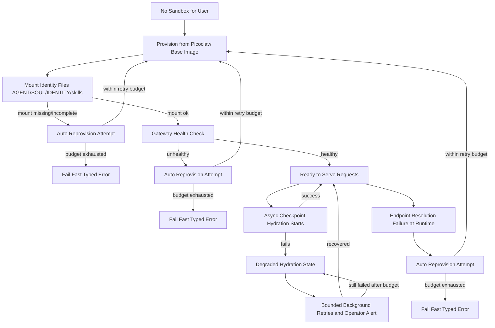
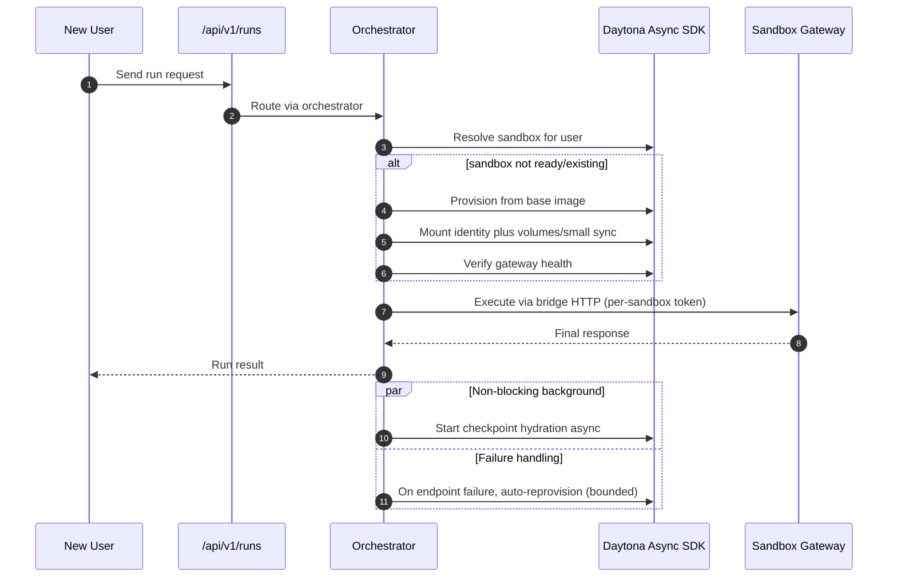
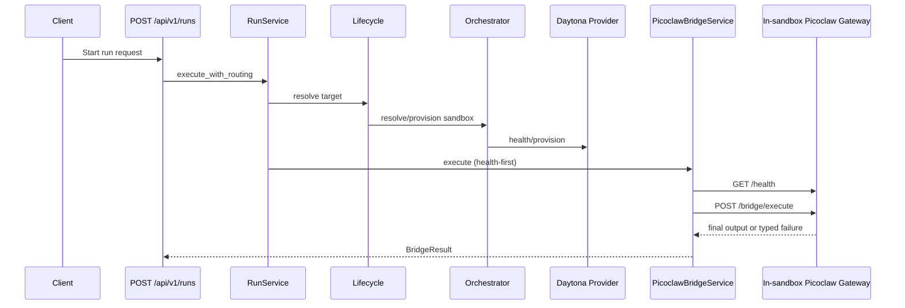

# Phase 3.1: Make Daytona Production-Ready for Picoclaw Gateway Execution - Context

**Gathered:** 2026-02-26
**Status:** Ready for planning

<domain>
## Phase Boundary

Harden Daytona-backed Picoclaw gateway execution for production reliability, security, and operational consistency.

This phase clarifies how existing gateway execution should run safely at scale using Daytona-native capabilities, without expanding scope into new runtime features.

</domain>

<decisions>
## Implementation Decisions

### Platform strategy (locked)
- Prefer Daytona-native primitives first and avoid bespoke infrastructure when equivalent platform features exist.
- Use Daytona Docker registry image support as the default in early 3.1 rollout; adopt snapshots after image-based gateway flow is stable.
- Use Daytona volumes where they remove repeated large sync/copy work, while keeping 3.1 scope focused on gateway production-readiness.
- Primary direction: spin sandboxes from a Picoclaw-ready base image, then mount or materialize only additional filesystem structure needed for immediate execution.
- Default additional-FS strategy: Daytona volume mounts for reusable/shared content plus minimal per-workspace/per-pack sync at provision or startup.

### Sandbox startup and readiness (locked)
- Sandbox starts from a base image that already includes Picoclaw runtime setup.
- Agent identity files are mounted automatically into the workspace at sandbox creation (`AGENT.md`, `SOUL.md`, `IDENTITY.md`, `skills/`).
- Sandbox is considered request-ready as soon as gateway health is good; request serving must not wait for memory/session checkpoint mounting.
- Memory/session checkpoint hydration is triggered asynchronously right after sandbox reaches health-ready state.
- Runs are allowed even when checkpoint hydration is not complete; agent can recover needed context from available workspace state during execution.
- If checkpoint hydration fails, sandbox continues serving requests while hydration retries run in background and status is marked degraded until recovery.
- Hydration retries are bounded; after retry budget is exhausted the sandbox remains degraded and emits operator-visible alerting for intervention.
- Write model is split: static addon content is mounted/read-only by default, while memory/session checkpoint storage remains writable.
- Identity mount is a hard readiness gate: if required identity files are missing/incomplete, sandbox fails closed and must not accept user requests.
- On identity mount failure, system attempts automatic sandbox reprovision first; if reprovision still cannot satisfy identity readiness, surface hard failure.
- Automatic reprovision attempts for identity readiness failures are bounded (no infinite reprovision loops).

### Current gateway mode baseline (as-is)
- `POST /api/v1/runs` executes through `RunService.execute_with_routing`, then bridge-calls in-sandbox Picoclaw gateway over synchronous HTTP.
- Routing path is workspace lifecycle -> sandbox orchestrator -> provider health/provision -> bridge health check -> `/bridge/execute`.
- Response path currently returns final output (non-streaming) with typed error mapping already integrated in API routes.

### Gaps this phase must close
- Daytona gateway endpoint source is not yet authoritative (`gateway_url` generation/path is incomplete for Daytona flows).
- Bridge token handling is inconsistent (per-sandbox token generation vs global token fallback in bridge client).
- Daytona provisioning still has placeholder behavior for pack/config materialization in critical paths.
- Sandbox identity/lookup semantics may drift between create/get paths unless canonical identity rules are locked.

### Bridge authentication scope (locked)
- Bridge authentication defaults to per-sandbox bearer tokens (not global/shared tokens).
- On sandbox reprovision, bridge tokens rotate with graceful cutover: new token becomes primary immediately, old token remains valid for 30 seconds, then is invalidated.

### Gateway routing model (locked)
- Client requests never call Daytona sandbox endpoints directly; all run execution enters through orchestrator `/runs` APIs.
- Orchestrator is the control-plane authority and uses Daytona Async SDK for sandbox resolve/provision/health/lifecycle operations.
- After control-plane resolution, orchestrator performs data-plane bridge execution to the in-sandbox gateway endpoint using orchestrator-managed auth/tokens.
- If gateway endpoint resolution fails at runtime, orchestrator attempts automatic reprovision before returning failure.
- If reprovision/endpoint recovery retry budget is exhausted, requests fail fast with typed remediation errors (no deferred queue fallback in this phase).

### Orchestrator role (locked)
- `/runs` behaves as a smart proxy with policy/control-plane responsibilities (not a dumb pass-through).
- Orchestrator centrally enforces routing, readiness gating, auth token usage, and typed error/remediation contracts.
- User/client traffic is never routed directly to Daytona endpoints.

### OpenCode's Discretion
- Exact rollout sequence for migrating from placeholder materialization to snapshot/volume-backed flows.
- Exact observability field names/shape, as long as readiness and failure diagnostics remain explicit and actionable.
- Exact numeric cap for bounded auto-reprovision attempts on identity-mount readiness failures.

</decisions>

<specifics>
## Specific Ideas

- User priority: built-in Picoclaw setup inside sandbox, then attach only incremental FS content for fast start and immediate use.
- User priority: this is the most critical part of the project and should favor thorough, platform-native decisions over custom reinvention.
- User-expected sequence: base image with Picoclaw -> identity mounted immediately -> memory/session checkpoint mounted later if available.

Target state behavior after Phase 3.1:

New-user interaction model:

Reference docs considered:
- https://www.daytona.io/docs/en/python-sdk/async/async-daytona/
- https://www.daytona.io/docs/en/snapshots/
- https://www.daytona.io/docs/en/volumes/
- https://www.daytona.io/docs/en/sandboxes/

</specifics>

<deferred>
## Deferred Ideas

- None yet. New capabilities outside gateway production-readiness will be captured here as they appear.

</deferred>

---

*Phase: 03.1-make-daytona-production-ready-for-picoclaw-gateway-execution*
*Context gathered: 2026-02-26*
