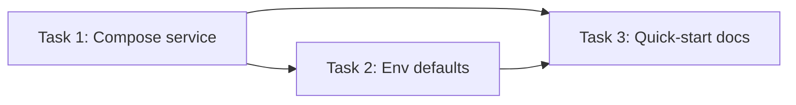

<objective>
Create a fast local Postgres bootstrap using Docker Compose.

Purpose: remove local setup friction and make database startup repeatable for every developer session.
Output: a one-command Postgres service, environment defaults, and documented usage.
</objective>

<execution_context>
./.opencode/get-shit-done/workflows/execute-plan.md
./.opencode/get-shit-done/templates/summary.md
</execution_context>

<context>
@.planning/STATE.md
</context>

<dependency_graph>

</dependency_graph>

<tasks>

<task type="auto">
  <name>Task 1: Create Postgres Docker Compose service</name>
  <files>docker-compose.yml</files>
  <action>Create a `postgres` service using `postgres:16-alpine` with container name, restart policy, port mapping `${POSTGRES_PORT:-5432}:5432`, named volume mount for `/var/lib/postgresql/data`, and healthcheck using `pg_isready`. Use environment variables for `POSTGRES_DB`, `POSTGRES_USER`, and `POSTGRES_PASSWORD` with sensible local defaults. Keep this file focused on local development (single DB service only, no extra infrastructure).</action>
  <verify>Run `docker compose config` and ensure the `postgres` service and `postgres_data` volume are present with no validation errors.</verify>
  <done>`docker-compose.yml` exists and can be parsed by Compose, with a healthy-ready Postgres service definition.</done>
</task>

<task type="auto">
  <name>Task 2: Add local environment defaults for Compose and app connection</name>
  <files>.env.example</files>
  <action>Add `POSTGRES_DB`, `POSTGRES_USER`, `POSTGRES_PASSWORD`, and `POSTGRES_PORT` defaults aligned with the compose file. Add `DATABASE_URL` that references the same values and points to localhost. Do not put secrets in tracked files; use non-sensitive development defaults only.</action>
  <verify>Check that `.env.example` values match compose interpolation names and that `DATABASE_URL` is syntactically valid for SQLAlchemy/Postgres clients.</verify>
  <done>Developers can copy `.env.example` to `.env` and boot Postgres without guessing variable names or connection format.</done>
</task>

<task type="auto">
  <name>Task 3: Document one-command local Postgres workflow</name>
  <files>README.md</files>
  <action>Add a concise "Local Postgres" section with commands for start (`docker compose up -d postgres`), status/logs, stop, and reset (`docker compose down -v`). Include the expected connection host/port/database and point readers to `.env.example` for overrides.</action>
  <verify>Follow the documented commands in order and confirm they are executable as written without missing flags or file references.</verify>
  <done>README has an end-to-end local DB workflow that a new contributor can run in under 2 minutes.</done>
</task>

</tasks>

<verification>
- `docker compose config` validates successfully.
- `docker compose up -d postgres` starts container and healthcheck reaches healthy state.
- `docker compose down -v` fully resets local DB volume when requested.
</verification>

<success_criteria>
- A fresh clone can run a local Postgres instance with one command and known credentials.
- Connection details are explicitly documented and consistent across compose/env/docs.
- Local DB lifecycle (start/inspect/stop/reset) is reproducible without extra setup steps.
</success_criteria>

<output>
After completion, create `.planning/quick/001-create-a-docker-compose-to-spin-up-postg/001-SUMMARY.md`
</output>
