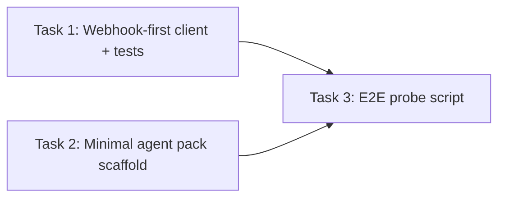

<objective>
Make /webhook the default Zeroclaw execute route everywhere, keep a safe compatibility fallback for legacy /execute-only runtimes, and add an end-to-end probe that validates multi-user requests produce multi-sandbox behavior.

Purpose: remove endpoint contract drift and create a repeatable operator workflow for validating the Zeroclaw end-to-end run path (infra -> base image/snapshot -> agent pack -> sandbox spawn -> gateway call).
Output: updated gateway client + tests, a minimal test agent pack scaffold, and a runnable e2e probe script.
</objective>

<execution_context>
./.opencode/get-shit-done/workflows/execute-plan.md
./.opencode/get-shit-done/templates/summary.md
</execution_context>

<context>
@.planning/STATE.md
@AGENTS.md
@src/integrations/zeroclaw/spec.json
@src/services/zeroclaw_gateway_service.py
@src/api/oss/routes/runs.py
</context>

<dependency_graph>

</dependency_graph>

<tasks>

<task type="auto">
  <name>Task 1: Make gateway execution webhook-first with bidirectional fallback</name>
  <files>src/services/zeroclaw_gateway_service.py, src/tests/services/test_zeroclaw_gateway_service.py</files>
  <action>
Update `ZeroclawGatewayService._get_execute_candidate_urls()` so that it always tries the spec-defined route first (spec default is `/webhook`), and includes a compatibility fallback for the other well-known route (`/execute`) when the primary returns HTTP 404.

Implementation constraints:
- Keep the behavior spec-driven (do not hardcode a single route without reading `spec.gateway.execute_path`).
- Fallback MUST be conditional and bounded: only try the secondary route when the primary returns 404 (missing route), not on other non-2xx.
- Preserve existing fail-closed semantics: health/auth failures must still block execution.

Update tests in `src/tests/services/test_zeroclaw_gateway_service.py`:
- Change `create_test_spec()` defaults to match current spec defaults (`execute_path="/webhook"`, `stream_mode="none"`).
- Keep the existing test that validates `/execute` -> `/webhook` fallback on 404 by explicitly setting `spec.gateway.execute_path = "/execute"` in that test.
- Add a symmetric test for `/webhook` -> `/execute` fallback on 404 (explicitly set `spec.gateway.execute_path = "/webhook"`), asserting two POST attempts and that the second URL ends with `/execute`.
  </action>
  <verify>uv run pytest src/tests/services/test_zeroclaw_gateway_service.py -q</verify>
  <done>
`ZeroclawGatewayService.execute()` is webhook-first by default, and unit tests cover both `/execute`-primary and `/webhook`-primary 404 fallback behaviors.
  </done>
</task>

<task type="auto">
  <name>Task 2: Add a minimal Zeroclaw agent pack scaffold for registration</name>
  <files>src/agent_packs/zeroclaw/AGENT.md, src/agent_packs/zeroclaw/SOUL.md, src/agent_packs/zeroclaw/IDENTITY.md, src/agent_packs/zeroclaw/skills/.gitkeep</files>
  <action>
Create a minimal agent pack at `src/agent_packs/zeroclaw/` that passes `AgentPackValidationService` requirements:
- Required files: `AGENT.md`, `SOUL.md`, `IDENTITY.md` (non-empty, ASCII)
- Required directory: `skills/` (can be empty; keep with `.gitkeep`)

Keep the content intentionally minimal and safe for OSS use (no secrets, no external URLs that imply privileged access). The goal is a reliable pack path for `minerva register src/agent_packs/zeroclaw` during end-to-end evaluation.
  </action>
  <verify>uv run python -c "from src.services.agent_pack_validation import AgentPackValidationService; r=AgentPackValidationService().validate('src/agent_packs/zeroclaw'); assert r.is_valid, r.to_json()"</verify>
  <done>
`src/agent_packs/zeroclaw` exists and validates as a registerable agent pack scaffold.
  </done>
</task>

<task type="auto">
  <name>Task 3: Add an end-to-end multi-user probe for /runs -> sandbox spawn -> gateway execute</name>
  <files>src/scripts/zeroclaw_webhook_e2e.py</files>
  <action>
Add `src/scripts/zeroclaw_webhook_e2e.py` as a runnable operator probe.

Behavior:
- Provide a `--dry-run` mode (default) that validates local prerequisites without needing Daytona credentials (imports succeed, prints required env vars and commands).
- Provide a `--run` mode that:
  1) Sends two POST requests to `{base_url}/runs` with distinct `X-User-ID` values and fixed `X-Session-ID` values, using a small message payload.
  2) Reads the SSE stream until completion/failure for each request with a bounded timeout.
  3) Connects to the DB (use `get_database_url()` like other CLI code) and asserts that two `sandbox_instances` exist for the current workspace with `external_user_id` equal to each `X-User-ID` and that their `provider_ref` values differ.

Implementation constraints:
- Use `httpx` for HTTP calls (already used in repo).
- Always run via `uv run python ...` conventions; do not introduce new dependencies.
- Keep the script fail-fast and exit non-zero on any assertion failure; print actionable remediation.

Note: The script should assume the server is already running (e.g., `uv run minerva serve`) and should probe `/ready` before attempting runs.
  </action>
  <verify>uv run python src/scripts/zeroclaw_webhook_e2e.py --dry-run</verify>
  <done>
The probe script exists, runs in dry-run mode without credentials, and provides a concrete, repeatable /runs multi-user verification path for configured environments.
  </done>
</task>

</tasks>

<verification>
- Unit tests: `uv run pytest src/tests/services/test_zeroclaw_gateway_service.py -q`
- Pack scaffold validation: `uv run python -c "...AgentPackValidationService..."`
- Probe wiring (dry-run): `uv run python src/scripts/zeroclaw_webhook_e2e.py --dry-run`
</verification>

<success_criteria>
- Default execute route is `/webhook` per spec and client behavior.
- Compatibility fallback exists so endpoint drift fails as 404-then-retry, not a hard failure.
- There is a single commandable probe that can validate multi-user -> multi-sandbox behavior when infra is configured.
</success_criteria>

<output>
After completion, create `.planning/quick/3-replace-execute-with-webhook-and-evaluat/3-SUMMARY.md`
</output>
