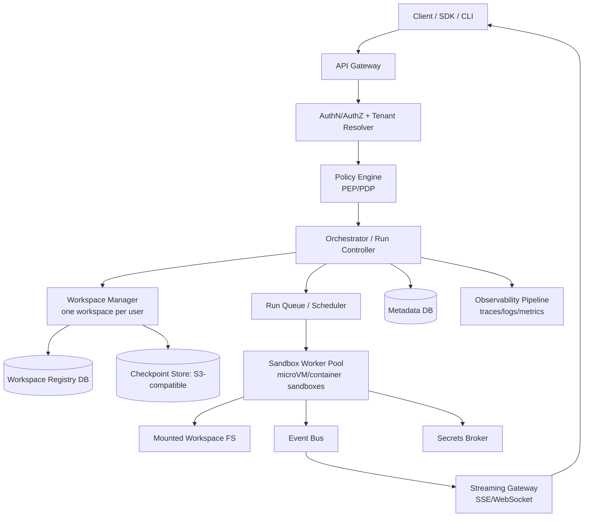
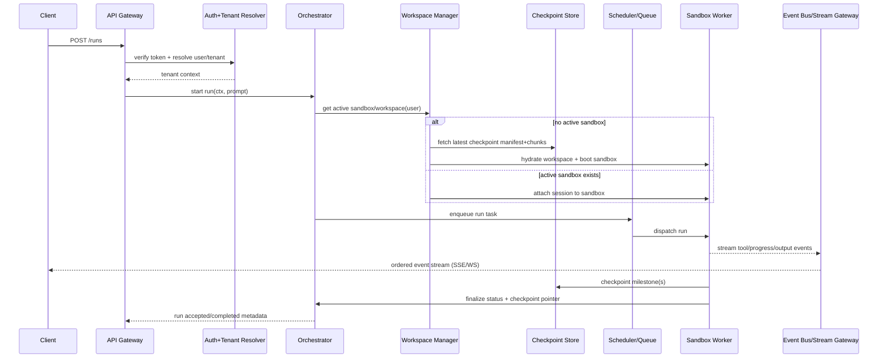
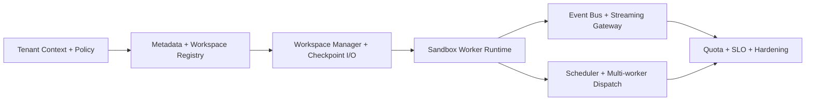

# Architecture Research

**Domain:** Multi-tenant agent runtime with strict tenant isolation and filesystem-backed workspaces
**Researched:** 2026-02-23
**Confidence:** MEDIUM-HIGH

## Executive Read (Progressive Disclosure)

For Picoclaw's target flow (`API request -> identify user -> check active sandbox -> hydrate from checkpoint -> run agent -> stream events -> checkpoint milestones`), the strongest default architecture is:

1. **Control plane + data plane split** (control plane decides, data plane executes)
2. **One workspace per user** (stable identity + resumable state across sessions)
3. **Tenant isolation enforced at every boundary** (auth context, policy engine, sandbox, storage paths, event channels)
4. **Checkpoint-driven lifecycle** (cold start hydrates from object storage; milestones checkpoint back)

This model maps well to established multi-tenant guidance from Kubernetes (namespace/policy/quotas isolation), durable workflow patterns from Temporal, and agent runtime memory/checkpoint patterns from OpenAI Agents SDK + LangGraph + E2B persistence.

---

## Standard Architecture

### System Overview



### Component Responsibilities

| Component | Responsibility | Typical Implementation |
|-----------|----------------|------------------------|
| API Gateway | Ingress, rate limit, request normalization | HTTP API + auth middleware |
| AuthN/AuthZ + Tenant Resolver | Resolve `user_id`, `tenant_id`, session principals | OIDC/JWT + tenant mapping table |
| Policy Engine (PEP/PDP) | Enforce tenant-scoped actions before run starts | OPA/Cedar-style policies |
| Orchestrator / Run Controller | Own run lifecycle state machine | Service + durable workflow adapter |
| Workspace Manager | Find/create user workspace, attach/hydrate, lock ownership | Workspace service + lease logic |
| Checkpoint Store | Persist milestone snapshots and manifests | S3-compatible object storage |
| Scheduler / Queue | Fair dispatch, retries, backpressure | Queue + worker leasing |
| Sandbox Worker Pool | Execute agent/tools in isolated runtime | microVM or hardened container workers |
| Event Bus + Streaming Gateway | Fanout run events to clients in order | Pub/sub + SSE/WebSocket bridge |
| Metadata DB | Durable run/workspace/session metadata | Postgres |
| Workspace Registry DB | Workspace ownership, version, lease, active sandbox refs | Postgres table set |
| Observability Pipeline | Correlated telemetry with tenant-safe dimensions | OpenTelemetry + backend |

## Recommended Project Structure

```text
src/
├── api/                      # HTTP endpoints, streaming endpoints
│   ├── middleware/           # auth, tenant context, idempotency
│   └── routes/               # run start/resume/cancel, stream subscribe
├── control_plane/            # orchestration and policy decisions
│   ├── orchestrator/         # run state machine
│   ├── workspace_manager/    # workspace lease/hydrate/checkpoint ops
│   └── policy/               # authorization + tenant policy evaluation
├── data_plane/               # execution runtime
│   ├── scheduler/            # queue dispatch, fairness, retries
│   ├── workers/              # sandbox lifecycle + tool execution
│   └── sandbox/              # provider adapters (microVM/container)
├── storage/
│   ├── metadata/             # postgres repos for run/workspace/session
│   ├── checkpoint/           # object-store checkpoint manifests/chunks
│   └── workspace_fs/         # mount/overlay/sync abstraction
├── streaming/
│   ├── events/               # canonical event schema
│   └── gateway/              # SSE/WebSocket fanout + replay window
├── observability/            # tracing, metrics, log correlation
└── shared/
    ├── tenancy/              # tenant context types + propagation
    └── errors/               # typed error taxonomy
```

### Structure Rationale

- **`control_plane/`:** centralizes trust-sensitive decisions so execution workers remain policy-thin.
- **`data_plane/`:** isolates high-churn runtime concerns (scheduling, sandboxing, retries) from API code.
- **`storage/`:** keeps checkpoint semantics and metadata semantics separate for easier scaling.
- **`streaming/`:** avoids coupling client event contracts to internal worker internals.

## Architectural Patterns

### Pattern 1: Control Plane / Data Plane Separation

**What:** Decisions (identity, policy, lifecycle) happen in control plane; code execution happens in data plane.
**When to use:** Always for multi-tenant runtime with untrusted or semi-trusted tenant workloads.
**Trade-offs:** Extra service boundaries, but much better blast-radius control and auditability.

**Example:**
```typescript
// control plane pseudo
const ctx = resolveTenantContext(req);
assertPolicy(ctx, "run:start");
const run = await orchestrator.startRun(ctx, input);
await queue.enqueue({ runId: run.id, workspaceId: run.workspaceId });
```

### Pattern 2: Workspace-as-Identity (One Workspace Per User)

**What:** Workspace lifecycle is keyed by stable `user_id`; sessions attach to the same workspace.
**When to use:** You need long-lived memory/filesystem state and predictable resumability.
**Trade-offs:** Better continuity, but requires robust workspace lease/locking to avoid concurrent corruption.

**Example:**
```typescript
const ws = await workspaceManager.getOrCreate({ userId });
await workspaceManager.ensureHydrated(ws.id, ws.latestCheckpointId);
await workspaceManager.acquireLease(ws.id, runId);
```

### Pattern 3: Incremental Checkpointing with Durable Manifests

**What:** Store checkpoints as immutable objects + manifest pointer (`latest`), not mutable in-place state.
**When to use:** Any runtime that needs crash recovery and cold-start hydration.
**Trade-offs:** More object churn, but deterministic recovery and easy rollback to prior checkpoints.

## Data Flow

### Request Flow (Canonical Picoclaw Path)



### State Management Flow

```text
Tenant context (request-scoped)
  -> propagated to orchestration commands
  -> propagated to worker execution envelope
  -> tagged onto all events + logs + traces

Workspace state (user-scoped)
  -> active lease in registry DB
  -> hydrated filesystem in sandbox
  -> immutable checkpoints in object store
  -> latest checkpoint pointer in metadata DB
```

### Key Data Flows

1. **Admission flow:** token -> tenant context -> policy decision -> run creation.
2. **Workspace flow:** workspace lookup -> active attach or checkpoint hydration -> lease acquisition.
3. **Execution flow:** queued task -> sandbox run -> event emission -> completion metadata.
4. **Durability flow:** milestone snapshot -> object store write -> metadata pointer update.

## Component Boundaries (Explicit)

| Boundary | Owns | Must NOT own |
|----------|------|--------------|
| API Layer | transport concerns, request auth handoff | run scheduling, sandbox lifecycle |
| Orchestrator | lifecycle state machine, retries, idempotency | direct filesystem mutation |
| Workspace Manager | workspace identity, lease, hydrate/checkpoint plumbing | policy decisions for endpoint auth |
| Worker Runtime | tool execution, event production, checkpoint trigger | tenant authorization logic |
| Policy Engine | allow/deny decisions from tenant context | run business logic |

## Build Order and Dependency Map

### Suggested Build Order

1. **Tenant identity + policy envelope**
   - Why first: every downstream service must trust tenant context shape.
   - Depends on: auth provider integration, metadata schema.

2. **Metadata model + workspace registry**
   - Why second: orchestrator and workspace manager need durable ownership/lease data.
   - Depends on: step 1 context model.

3. **Workspace manager + checkpoint abstraction**
   - Why third: canonical flow is blocked without hydrate/attach behavior.
   - Depends on: step 2 registry and object-store contracts.

4. **Sandbox worker runtime (single-node first)**
   - Why fourth: execute run end-to-end with one worker before distributed scheduling.
   - Depends on: step 3 hydration + lease checks.

5. **Event bus + streaming gateway**
   - Why fifth: required for UX and observability of long-running runs.
   - Depends on: worker event schema from step 4.

6. **Scheduler fairness + retries + multi-worker scaling**
   - Why sixth: optimize throughput after correctness path works.
   - Depends on: stable run state machine and worker contract.

7. **Hardening: quotas, noisy-neighbor controls, SLO observability**
   - Why last: capacity controls need real traffic and telemetry baselines.
   - Depends on: all earlier layers.

### Dependency Graph



## Scaling Considerations

| Scale | Architecture Adjustments |
|-------|--------------------------|
| 0-1k users | Single control-plane service, small worker pool, Postgres + S3, strict leases |
| 1k-100k users | Separate scheduler service, partitioned run queues, per-tenant quotas, event fanout tier |
| 100k+ users | Multi-region control plane, sharded metadata, workspace placement strategy, tiered checkpoint storage |

### Scaling Priorities

1. **First bottleneck:** cold-start hydrate latency from checkpoint store; mitigate via warm pools + incremental checkpoints.
2. **Second bottleneck:** noisy neighbors in workers/queues; mitigate via tenant-aware quotas, fair scheduling, and isolation tiers.

## Anti-Patterns

### Anti-Pattern 1: Shared mutable workspace across multiple users/tenants

**What people do:** reuse one filesystem tree for many users to simplify storage.
**Why it's wrong:** cross-tenant leakage risk and non-deterministic run outcomes.
**Do this instead:** one workspace per user identity, immutable checkpoint history, explicit lease.

### Anti-Pattern 2: Authorization only at API edge

**What people do:** validate tenant only at ingress and trust all internal calls.
**Why it's wrong:** internal bugs or queue replay can run tasks under wrong tenant.
**Do this instead:** propagate tenant context end-to-end and re-check at orchestrator + worker boundaries.

### Anti-Pattern 3: In-place checkpoint overwrite

**What people do:** overwrite a single checkpoint blob each run.
**Why it's wrong:** partial writes corrupt recovery path; no rollback lineage.
**Do this instead:** immutable checkpoint objects + atomic pointer update.

## Integration Points

### External Services

| Service | Integration Pattern | Notes |
|---------|---------------------|-------|
| S3-compatible object storage | Checkpoint blobs + manifest pointers | Keep checkpoint metadata and data separate; use object versioning if available |
| Identity provider (OIDC/JWT) | Bearer token -> tenant context | Tenant context should include immutable subject + tenant claims |
| Sandbox provider (microVM/container) | Worker adapter layer | Favor strong isolation tiers for untrusted code |

### Internal Boundaries

| Boundary | Communication | Notes |
|----------|---------------|-------|
| API -> Orchestrator | Sync API call | Idempotency key required for retry-safe run creation |
| Orchestrator -> Scheduler | Async command/event | Carry tenant + run + workspace IDs in envelope |
| Worker -> Streaming | Event pub/sub | Preserve event ordering per run sequence number |
| Worker -> Checkpoint Store | Object write + metadata commit | Two-phase commit style pointer update avoids ghost checkpoints |

## Sources

- Kubernetes multi-tenancy concepts and isolation tradeoffs (official docs): https://raw.githubusercontent.com/kubernetes/website/main/content/en/docs/concepts/security/multi-tenancy.md (**HIGH**)
- AWS Prescriptive Guidance on multi-tenant SaaS authorization and PDP/PEP model (May 2024): https://docs.aws.amazon.com/prescriptive-guidance/latest/saas-multitenant-api-access-authorization/introduction.html (**HIGH**)
- Temporal docs on workflows, child workflows, and continue-as-new for long-running durable execution: https://docs.temporal.io/workflows , https://docs.temporal.io/child-workflows , https://docs.temporal.io/develop/typescript/continue-as-new (**HIGH**)
- OpenAI Agents SDK docs for run loop, streaming events, and sessions: https://openai.github.io/openai-agents-python/running_agents/ , https://openai.github.io/openai-agents-python/streaming/ , https://openai.github.io/openai-agents-python/sessions/ (**HIGH**)
- LangGraph persistence/checkpoint/thread model: https://docs.langchain.com/oss/python/langgraph/persistence (**MEDIUM-HIGH**)
- E2B sandbox persistence (pause/resume state, beta limitations): https://e2b.dev/docs/sandbox/persistence (**MEDIUM-HIGH**)
- Firecracker microVM isolation model and performance characteristics: https://firecracker-microvm.github.io/ (**HIGH**)
- Azure multitenant storage/data approaches and anti-patterns (2025-07-17): https://learn.microsoft.com/en-us/azure/architecture/guide/multitenant/approaches/storage-data (**HIGH**)

---
*Architecture research for: Multi-tenant agent runtime systems*
*Researched: 2026-02-23*
