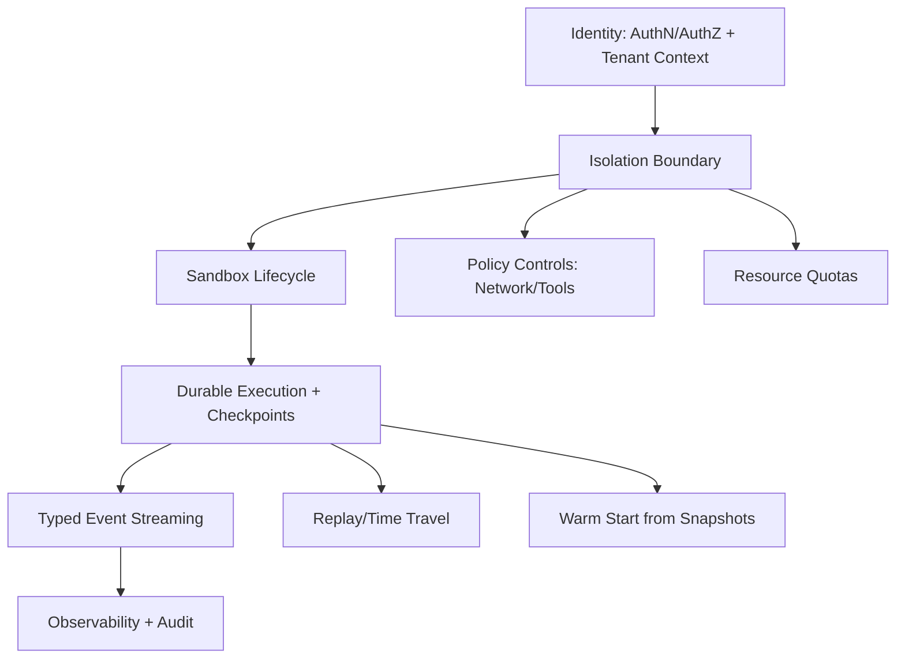

# Feature Landscape

**Domain:** Production-grade multi-tenant agent runtimes (self-hosted OSS first)
**Researched:** 2026-02-23

## Quick Take

For multi-tenant agent runtimes, the market baseline is now: strong tenant isolation, durable/resumable execution, strict authz boundaries, and deep observability/auditability. Without these, teams treat the runtime as unsafe for pilot production.

The strongest differentiators are not "more tools"; they are better isolation ergonomics (network + identity + storage boundaries), faster warm-start/recovery, and debuggability (time-travel/replay + tenant-scoped traces).

## Table Stakes

Features users expect. Missing these makes the runtime non-viable for production pilots.

| Feature | Why Expected | Complexity | Notes |
|---------|--------------|------------|-------|
| Tenant/workspace isolation boundaries | Core trust requirement for multi-user runtime; prevents cross-user data leakage | High | Include FS isolation, process isolation, namespace separation, and per-tenant storage boundaries |
| AuthN + AuthZ (RBAC/ReBAC) with tenant scoping | Operators must enforce least privilege for users, agents, and service accounts | High | Prefer policy model that supports resource-level filters and ownership metadata |
| Sandbox lifecycle controls | Teams need deterministic create/start/stop/archive/recover flows | Medium | Include auto-stop, auto-archive, auto-delete, and recoverability states |
| Durable execution + checkpointing | Long-running agents and HITL require resume/retry without losing state | High | Thread/session checkpoints and replay should be first-class |
| Typed event streaming for runtime activity | Product teams need real-time UX and tool transparency | Medium | Stream messages, tool calls/results, errors, and state deltas with stable schema |
| Policy controls for network/tool access | Untrusted code/tool execution needs guardrails by default | High | Egress allow/block policies, tool allowlists, and default-deny controls |
| Observability + audit logs | Incident response, debugging, and compliance require traceable activity | Medium | Tenant-filterable traces/logs/metrics plus audit log export APIs |
| Resource quotas and noisy-neighbor controls | Shared infrastructure needs fairness and predictable SLOs | High | CPU/memory/disk/concurrency quotas at tenant/workspace level |

## Differentiators

Features that create competitive advantage after baseline table stakes are in place.

| Feature | Value Proposition | Complexity | Notes |
|---------|-------------------|------------|-------|
| Time-travel debugging and deterministic replay | Greatly reduces MTTR for agent failures and non-deterministic bugs | High | Replay from checkpoint/fork execution paths for root-cause analysis |
| Snapshot-driven warm starts | Faster cold-start and migration between nodes/regions | High | Snapshot hydration cuts pilot latency and improves operator UX |
| Tenant-aware policy-as-code (runtime + network + data) | Enables enterprise controls without custom forks | High | One policy surface for who can run what, where, and with which tools |
| Multi-backend isolation abstraction | Lets operators choose sandbox backend without app rewrites | High | Pluggable backend interface (e.g., Daytona now, others later) |
| Native cross-thread memory governance | Better agent continuity while preserving tenancy boundaries | Medium | Namespace memory by user/workspace and enforce TTL/retention |
| Built-in cost/usage telemetry by tenant | Makes pilots operationally sustainable and easier to justify | Medium | Token/tool/runtime seconds by tenant/workspace/session |

## Anti-Features

Deliberate non-goals for v1 to avoid common failure modes.

| Anti-Feature | Why Avoid | What to Do Instead |
|--------------|-----------|-------------------|
| Unrestricted outbound network by default | Increases exfiltration and abuse risk for untrusted execution | Default-deny or constrained allowlist, with explicit per-tenant exceptions |
| Shared global workspace/memory across tenants | Creates hidden cross-tenant leakage paths | Strictly tenant-scoped workspace + explicit controlled sharing primitives |
| Flat "one big tenant" RBAC model | Fails least-privilege in multi-user environments | Tenant/workspace-level roles plus resource ownership filters |
| Infinite sandbox lifetime defaults | Causes cost drift and stale, risky runtime state | Auto-stop/auto-archive defaults with explicit overrides |
| No immutable event/audit history | Blocks incident reconstruction and compliance checks | Append-only event log + queryable audit trail |
| Premature enterprise billing/org hierarchy in OSS v1 | Distracts from core runtime safety and pilot velocity | Keep v1 user-centric tenancy; layer org/billing later |

## Feature Dependencies

Dependency implications:
- Isolation depends on identity context; without correct tenant identity, all downstream safety controls are porous.
- Durable execution should be built before advanced debugging/replay; replay quality is bounded by checkpoint fidelity.
- Policy controls and quotas should be enforced at the same boundary where sandboxes are provisioned.

## MVP Recommendation

For the OSS v1 (90-day pilot target), prioritize:
1. Tenant/workspace isolation boundaries
2. AuthN/AuthZ with tenant-scoped access control
3. Sandbox lifecycle + durable checkpoint/restore
4. Typed event streaming (single differentiator to improve pilot UX and debuggability)

Defer to post-MVP:
- Full policy-as-code language: start with guardrail primitives first, expand after pilots.
- Multi-backend isolation abstraction: keep interface seams, but ship one proven backend first.
- Advanced cost governance dashboards: emit usage signals now, build BI-grade dashboards later.

## Confidence and Evidence Notes

- **HIGH confidence** (official docs): namespace/RBAC/network/quotas multi-tenancy controls, durable runtime/checkpoint patterns, sandbox lifecycle controls, audit logging expectations.
- **MEDIUM confidence** (official docs + ecosystem synthesis): which capabilities are considered "table stakes" vs "differentiator" in current buyer/operator expectations.
- **LOW confidence**: specific market adoption rankings across vendor products (not relied on for recommendations).

## Sources

Primary (official docs):
- Kubernetes multi-tenancy: https://kubernetes.io/docs/concepts/security/multi-tenancy/
- Temporal namespaces and isolation: https://docs.temporal.io/namespaces
- LangSmith/LangGraph deployment and durability: https://docs.langchain.com/langgraph-platform
- LangGraph persistence/checkpointing: https://docs.langchain.com/oss/python/langgraph/persistence
- LangSmith authz/authn model: https://docs.langchain.com/langsmith/auth
- LangSmith TTL/state lifecycle: https://docs.langchain.com/langsmith/configure-ttl
- Microsoft Foundry Agent Service (enterprise runtime capabilities): https://learn.microsoft.com/en-us/azure/ai-foundry/agents/overview
- Daytona sandboxes: https://www.daytona.io/docs/en/sandboxes
- Daytona snapshots: https://www.daytona.io/docs/en/snapshots
- Daytona network limits: https://www.daytona.io/docs/en/network-limits
- Daytona audit logs: https://www.daytona.io/docs/en/audit-logs
- OpenTelemetry traces concept: https://opentelemetry.io/docs/concepts/signals/traces/
- OpenFGA modeling (resource-level authorization patterns): https://openfga.dev/docs/modeling/getting-started

Secondary (ecosystem discovery, lower authority):
- Google Search synthesis for 2026 landscape signals (used only to guide what to verify in official docs)
