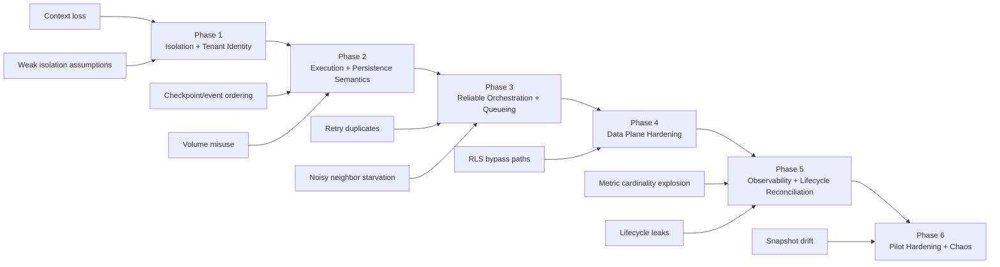

# Pitfalls Research

**Domain:** Multi-tenant agent runtime with sandboxed execution and persistent workspaces
**Researched:** 2026-02-23
**Confidence:** MEDIUM-HIGH

## Critical Pitfalls

### Pitfall 1: Losing tenant identity across async boundaries

**What goes wrong:**
API-level tenant identity is correct, but queue workers, background retries, and event processors execute with missing or stale tenant context, causing cross-tenant reads/writes.

**Why it happens:**
Teams rely on request-scoped auth only and do not enforce tenant identity as a required field in every internal message and storage key.

**How to avoid:**
Adopt a required `tenant_id` + `workspace_id` envelope for every command/event; reject processing if either is missing. Add invariant checks at API ingress, queue publish, worker consume, DB write, and checkpoint write.

**Warning signs:**
"Impossible" cross-tenant lookups in logs, null tenant fields in queue payloads, workers using default workspace IDs, or support tickets about seeing another user's state.

**Phase to address:**
Phase 1 - Isolation and Tenant Identity Baseline.

---

### Pitfall 2: Assuming containerization alone is sufficient isolation

**What goes wrong:**
Untrusted code can still exfiltrate data, pivot to internal services, or abuse host-level capabilities even if running in a sandbox.

**Why it happens:**
"Runs in a container" is treated as security completion. Egress policy, capability drops, image trust, and runtime hardening are deferred.

**How to avoid:**
Use defense in depth: strict network egress policy, least privilege runtime profile, immutable images, per-tenant secrets scope, and explicit allowlists. Treat sandboxing as one control, not the architecture.

**Warning signs:**
Sandboxes with broad outbound access by default, long-lived credentials inside runtime, privileged flags in runtime config, and no policy tests for blocked destinations.

**Phase to address:**
Phase 1 - Isolation and Tenant Identity Baseline.

---

### Pitfall 3: Non-deterministic checkpoint and event ordering

**What goes wrong:**
Event log says a run succeeded, but restored workspace state is older or missing files; replay diverges from what users saw.

**Why it happens:**
Event emission, checkpoint writes, and metadata updates are treated as separate best-effort operations without commit ordering guarantees.

**How to avoid:**
Define one source of truth and ordering contract: append authoritative run events first, checkpoint with monotonic revision IDs, then atomically publish "checkpoint committed" metadata. Reject stale checkpoint writes.

**Warning signs:**
Restore occasionally "goes back in time", duplicate revision numbers, and frequent manual state repair after worker restarts.

**Phase to address:**
Phase 2 - Execution and Persistence Semantics.

---

### Pitfall 4: Building around exactly-once delivery assumptions

**What goes wrong:**
Retries cause duplicate tool calls, duplicate billing side effects, repeated file writes, or duplicate milestone events.

**Why it happens:**
Distributed queues are treated as exactly-once in practice, and handlers are not idempotent.

**How to avoid:**
Design for at-least-once delivery: idempotency keys per user action, dedupe table with unique constraints, bounded retries with jitter, DLQ policy, and side-effect guards.

**Warning signs:**
Duplicate external API calls after transient failures, repeated "run completed" notifications, and inconsistent retry behavior by worker type.

**Phase to address:**
Phase 3 - Reliable Orchestration and Queueing.

---

### Pitfall 5: Noisy-neighbor starvation in shared queues and workers

**What goes wrong:**
One heavy tenant monopolizes worker slots, causing latency spikes and timeout cascades for everyone else.

**Why it happens:**
Single global queue and global concurrency without tenant-aware quotas, fairness, or backpressure.

**How to avoid:**
Implement per-tenant concurrency caps, weighted fair scheduling, queue partitioning or priority lanes, and hard runtime ceilings per sandbox.

**Warning signs:**
P95 latency for small tenants tracks one enterprise tenant's batch jobs; queue depth remains high while a few tenants dominate active workers.

**Phase to address:**
Phase 3 - Reliable Orchestration and Queueing.

---

### Pitfall 6: Misusing Daytona volume semantics for database-like workloads

**What goes wrong:**
Teams mount shared volumes for state that needs low-latency random writes and transactional behavior; performance and correctness degrade.

**Why it happens:**
"Persistent" is interpreted as "suitable for all state." Volume behavior and limits are not aligned to database access patterns.

**How to avoid:**
Use volumes for shared artifacts and workspace files only. Keep transactional metadata in Postgres and checkpoints in object storage with revision control.

**Warning signs:**
Slow or flaky metadata reads/writes in mounted volume paths, ad-hoc locking files, and frequent corruption/recovery scripts.

**Phase to address:**
Phase 2 - Execution and Persistence Semantics.

---

### Pitfall 7: RLS configured but still bypassed in privileged paths

**What goes wrong:**
Some code paths bypass row-level policies (owner/superuser/bypass roles), causing silent cross-tenant access under background jobs or admin tasks.

**Why it happens:**
RLS is enabled but role model is inconsistent; privileged roles are reused for normal operations.

**How to avoid:**
Use least-privilege app roles, enforce `FORCE ROW LEVEL SECURITY` where needed, and test all read/write paths with tenant-bound integration tests.

**Warning signs:**
Queries succeed in worker context but fail in tenant test harness; inconsistent row counts by execution role; privileged DB roles used in production workers.

**Phase to address:**
Phase 4 - Data Plane Hardening.

---

### Pitfall 8: Cardinality explosion in tenant-level observability

**What goes wrong:**
Metrics cost and query latency explode; incident dashboards fail exactly when needed.

**Why it happens:**
High-cardinality labels (user IDs, workspace IDs, run IDs) are emitted as metrics dimensions instead of traces/log attributes.

**How to avoid:**
Keep metric labels low-cardinality (tenant tier, queue class, runtime type), push high-cardinality context into logs/traces, and predefine SLO-oriented metrics.

**Warning signs:**
Rapid time-series growth, OOM or throttling in metrics backend, and dashboards timing out during incidents.

**Phase to address:**
Phase 5 - Observability and SLOs.

---

### Pitfall 9: Incomplete sandbox lifecycle cleanup

**What goes wrong:**
Stopped/archived/deleted lifecycle gets out of sync with runtime metadata; orphaned sandboxes and leaked storage costs accumulate.

**Why it happens:**
Lifecycle transitions are not modeled as explicit state machine transitions with reconciliation.

**How to avoid:**
Use a reconciler loop that compares desired vs actual state, enforce transition invariants, and add periodic garbage collection by tenant/workspace ownership.

**Warning signs:**
Growing count of "unknown" or stale runtime states, billing drift, and manual cleanup scripts run every sprint.

**Phase to address:**
Phase 5 - Observability and SLOs.

---

### Pitfall 10: Snapshot/image drift breaks reproducibility

**What goes wrong:**
Runs are non-reproducible across days because base images, package sets, or runtime toolchains drift unexpectedly.

**Why it happens:**
Floating tags and mutable dependencies are used for snapshots; no reproducibility contract is enforced.

**How to avoid:**
Pin image tags/digests, maintain snapshot version manifests, and gate promotion of new snapshots with compatibility tests against known workloads.

**Warning signs:**
"Worked yesterday" failures after no code change, divergent dependency trees between tenants, and snapshot reactivation incidents.

**Phase to address:**
Phase 6 - Pilot Hardening and Chaos Validation.

---

## Technical Debt Patterns

| Shortcut | Immediate Benefit | Long-term Cost | When Acceptable |
|----------|-------------------|----------------|-----------------|
| Single global worker queue | Fast implementation | Noisy-neighbor incidents and unfair latency | MVP only, with strict short-term cap |
| Shared DB role for all services | Fewer secrets and grants | RLS bypass risk and weak auditability | Never in pilot |
| Checkpoint writes without revisioning | Simpler persistence path | Restore inconsistency and hard-to-debug data races | Never |
| Floating snapshot tags | Easy updates | Irreproducible runtime behavior | Never |
| Metric labels include run/user IDs | Quick per-run visibility | Observability cost explosion | Never |

## Integration Gotchas

| Integration | Common Mistake | Correct Approach |
|-------------|----------------|------------------|
| Daytona Sandboxes | Assuming background tasks prevent auto-stop | Treat auto-stop semantics explicitly; send activity heartbeats or set policy intentionally |
| Daytona Network Limits | Relying on defaults for untrusted code | Set explicit `networkBlockAll`/allowlist policy per workload risk level |
| Postgres RLS | Enabling RLS but using privileged roles in workers | Enforce least-privilege roles and test RLS behavior per role |
| Queue Broker | Assuming no duplicate delivery | Build idempotent consumers and dedupe keys |
| S3/Object Storage checkpoints | Assuming metadata and object writes are atomic together | Use versioned checkpoints and commit markers |

## Performance Traps

| Trap | Symptoms | Prevention | When It Breaks |
|------|----------|------------|----------------|
| Cold-start storms during traffic bursts | Spiky startup latency, queue backlog | Warm pool sizing + admission control + staged retries | Pilot load with concurrent tenant spikes |
| Over-serialized control plane | One slow DB op stalls many runs | Async pipeline, bounded worker pools, backpressure | ~100+ concurrent active runs |
| Full workspace rehydrate on every run | High p95 startup and bandwidth waste | Incremental/milestone restore strategy | As workspace size grows beyond small prototypes |
| Shared queue without tenant quotas | Small tenants see unpredictable latency | Fair scheduling and per-tenant concurrency limits | First heavy tenant onboarding |

## Security Mistakes

| Mistake | Risk | Prevention |
|---------|------|------------|
| Broad egress from untrusted sandboxes | Data exfiltration and lateral movement | Default-deny egress with explicit allowlists |
| Secrets injected globally in runtime | Cross-tenant credential leakage | Per-tenant scoped secrets with short TTL |
| Missing audit trail for lifecycle actions | Weak incident forensics | Capture immutable audit events for create/start/stop/archive/delete |
| Assuming sandbox == complete security | Host or control-plane exposure remains | Defense-in-depth controls beyond sandbox boundary |

## "Looks Done But Isn't" Checklist

- [ ] **Isolation:** Tenant/workspace identity is enforced at API, queue, worker, DB, and checkpoint boundaries.
- [ ] **Retries:** Every externally-visible side effect has an idempotency key and duplicate-safe handler.
- [ ] **Persistence:** Checkpoints are versioned and restore path is tested under mid-run failure.
- [ ] **Fairness:** Per-tenant quotas and queue fairness are in place and validated under load.
- [ ] **Observability:** Metrics use bounded cardinality and include tenant-safe SLOs.
- [ ] **Lifecycle:** Reconciler/GC removes orphaned sandboxes, snapshots, and storage artifacts.

## Recovery Strategies

| Pitfall | Recovery Cost | Recovery Steps |
|---------|---------------|----------------|
| Cross-tenant context leak | HIGH | Freeze affected workers, rotate credentials, reconstruct access from audit logs, run tenant data integrity checks |
| Duplicate side effects from retries | MEDIUM | Replay dedupe ledger, compensate external actions, patch idempotency gaps, reprocess DLQ safely |
| Checkpoint/event divergence | HIGH | Declare last-good revision, rehydrate from authoritative event sequence, backfill missing checkpoint metadata |
| Queue starvation event | MEDIUM | Enable emergency per-tenant caps, drain heavy tenant lane, re-prioritize backlog, tune scheduling weights |
| Snapshot drift incident | MEDIUM | Roll back to last pinned snapshot digest, invalidate affected run windows, re-run compatibility suite |

## Pitfall-to-Phase Mapping

| Pitfall | Prevention Phase | Verification |
|---------|------------------|--------------|
| Context loss across async boundaries | Phase 1 | Contract tests fail when `tenant_id`/`workspace_id` missing at any hop |
| Weak isolation assumptions | Phase 1 | Security tests prove blocked egress and denied privileged operations |
| Checkpoint/event divergence | Phase 2 | Crash-injection replay preserves monotonic revision and deterministic restore |
| Retry duplicates | Phase 3 | Duplicate delivery tests produce single externally-visible side effect |
| Noisy-neighbor starvation | Phase 3 | Load test with heavy tenant keeps other tenant p95 within SLO |
| RLS bypass in privileged paths | Phase 4 | Per-role integration tests confirm policy enforcement and deny cross-tenant rows |
| Observability cardinality explosion | Phase 5 | Cardinality budget alarms stay below threshold under pilot traffic |
| Lifecycle cleanup leaks | Phase 5 | Reconciler converges desired vs actual state with zero orphan drift |
| Snapshot/image drift | Phase 6 | Golden workload suite passes on new snapshot before promotion |

## Sources

- PostgreSQL row-level security docs (table owner/superuser/BYPASSRLS behavior): https://www.postgresql.org/docs/current/ddl-rowsecurity.html (HIGH)
- RabbitMQ reliability guide (at-least-once, duplicates, idempotent consumers): https://www.rabbitmq.com/docs/reliability (HIGH)
- AWS Builders Library on retries/backoff/jitter and retry amplification: https://aws.amazon.com/builders-library/timeouts-retries-and-backoff-with-jitter/ (HIGH)
- Stripe idempotent requests reference: https://docs.stripe.com/api/idempotent_requests (HIGH)
- Daytona sandbox lifecycle, auto-stop/archive/delete semantics: https://www.daytona.io/docs/en/sandboxes (HIGH)
- Daytona network limits and egress controls: https://www.daytona.io/docs/en/network-limits (HIGH)
- Daytona snapshots and image-tag constraints: https://www.daytona.io/docs/en/snapshots (HIGH)
- Daytona volumes behavior and limitations (FUSE, not block storage): https://www.daytona.io/docs/en/volumes (HIGH)
- Daytona audit logs capabilities: https://www.daytona.io/docs/en/audit-logs (HIGH)
- gVisor security model (sandbox is defense layer, not complete architecture): https://gvisor.dev/docs/architecture_guide/security/ (HIGH)
- Prometheus instrumentation and label-cardinality cautions: https://prometheus.io/docs/practices/instrumentation/ and https://prometheus.io/docs/practices/naming/ (HIGH)
- Amazon S3 consistency model (strong read-after-write/list semantics): https://aws.amazon.com/s3/consistency/ (MEDIUM-HIGH)

---
*Pitfalls research for: Picoclaw Multi-Tenant OSS Runtime*
*Researched: 2026-02-23*
