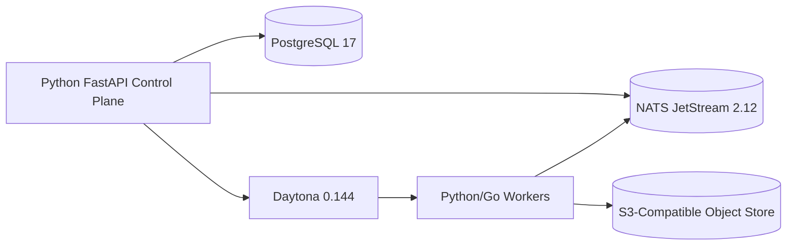

# Stack Research

**Domain:** Self-hosted multi-tenant agent runtime (Picoclaw-compatible)
**Researched:** 2026-02-23
**Confidence:** MEDIUM-HIGH

## Recommended Stack

### Core Technologies

| Technology | Version | Purpose | Why Recommended |
|------------|---------|---------|-----------------|
| Python | 3.13.x (pin minor, patch float) | Control plane services and orchestration API | Best ecosystem fit for agent/runtime control planes, strong async tooling, and matches your fixed Python decision. |
| FastAPI | 0.131.x | Typed HTTP control plane API | FastAPI is still the standard for Python API control planes; pairs cleanly with Pydantic for your typed event contracts. |
| Pydantic | 2.12.x | Schema validation for event stream and APIs | Mature typed validation with explicit JSON schema support, aligns with contract-first event/API design. |
| PostgreSQL | 17.x (preferred) or 18.x (after soak) | Tenant/workspace metadata, state, scheduling facts | Most operationally boring and reliable source of truth for multi-tenant metadata and transactional correctness. |
| NATS Server + JetStream | 2.12.x | Queueing, work dispatch, event fan-out | Single binary, durable streams, work-queue semantics, and first-class Python+Go client support make it ideal for Python control plane + Go harness. |
| Daytona | 0.144.x | Sandbox lifecycle + isolated execution substrate | Directly matches your sandboxing requirement; active OSS release cadence and SDK coverage are strong. |
| S3-compatible object storage | Ceph RGW (Squid 19.2.x / Tentacle 20.2.x) | Checkpoints, milestone snapshots, artifacts | Self-hosted, actively maintained object storage with S3 API for long-term durability and portability. |

### Supporting Libraries

| Library | Version | Purpose | When to Use |
|---------|---------|---------|-------------|
| SQLAlchemy | 2.0.x | ORM/query layer for Postgres | Use for all control-plane persistence; keep models and migrations in lockstep. |
| Alembic | 1.18.x | Migration/versioning for DB schema | Use from day 1; every tenant-visible state change should be migratable and reversible. |
| psycopg | 3.3.x | Postgres driver | Use as default DB driver (sync/async support), especially for connection reliability and modern PG features. |
| nats-py | 2.13.x | Python client for NATS/JetStream | Use for job enqueue/dequeue, control events, and backpressure-aware consumers. |
| boto3 | 1.42.x | S3 checkpoint/object operations | Use for checkpoints regardless of backend (Ceph RGW, AWS S3, or other S3-compatible target). |
| structlog | 25.x | Structured logs with tenant/workspace correlation | Use for every control-plane and worker process log path. |
| OpenTelemetry SDK | 1.x | Traces/metrics/log correlation | Use once you cross one service boundary (API + workers + sandbox callbacks). |

### Development Tools

| Tool | Purpose | Notes |
|------|---------|-------|
| uv | Python dependency/env management | Use `uv add`, `uv sync`, `uv run` everywhere for reproducible local+CI workflows. |
| Ruff | Lint + format | Fast feedback loop for Python monorepo style consistency. |
| mypy | Static typing checks | Enforce strict typing at API boundaries and event contracts. |
| pytest | Test runner | Combine with integration tests for NATS, Postgres, and checkpoint storage flows. |
| Docker Compose | Local dependency orchestration | Run Postgres + NATS + Ceph RGW/Daytona locally for deterministic integration testing. |

## Installation

```bash
# Core runtime deps
uv add fastapi==0.131.* pydantic==2.12.* sqlalchemy==2.0.* alembic==1.18.* psycopg==3.3.*

# Queueing + storage
uv add nats-py==2.13.* boto3==1.42.*

# Observability + app infrastructure
uv add structlog opentelemetry-sdk opentelemetry-exporter-otlp

# Dev dependencies
uv add --dev ruff mypy pytest pytest-asyncio
```

## Alternatives Considered

| Recommended | Alternative | When to Use Alternative |
|-------------|-------------|-------------------------|
| NATS JetStream | RabbitMQ | Choose RabbitMQ if your team already has deep AMQP ops skill and wants broker-level routing semantics over stream semantics. |
| NATS JetStream | Redis Streams | Choose Redis Streams only for small deployments where persistence guarantees and replay/retention are less strict. |
| Ceph RGW S3 | MinIO OSS (`RELEASE.2025-10-15T17-29-55Z`) | Use only if you need fastest v1 bootstrap and accept migration risk (see note below). |
| Postgres 17.x | Postgres 18.x | Choose 18.x after soak testing if you want latest features and have upgrade/rollback discipline. |

## What NOT to Use

| Avoid | Why | Use Instead |
|-------|-----|-------------|
| Celery as primary queue/work scheduler | Good for classic task queues, but weaker fit for cross-language event streaming and JetStream-style replay/backpressure. | NATS JetStream + explicit worker protocol. |
| Kafka in v1 | Powerful but higher ops and schema-governance overhead than needed for time-to-market v1. | NATS JetStream now; reassess Kafka only at much larger scale. |
| Tight coupling to MinIO OSS long-term | Upstream `minio/minio` repo is archived (read-only), creating lifecycle/support uncertainty. | Ceph RGW primary for self-hosted longevity (or managed S3). |
| Homegrown queue on Postgres tables | Creates lock/contention hotspots and brittle retry semantics at scale. | Dedicated message layer (NATS JetStream). |

## Stack Patterns by Variant

**If you optimize for fastest v1 shipping (3-6 months):**
- Use Postgres 17 + NATS 2.12 + Daytona 0.144 + S3-compatible checkpoints.
- Keep architecture as a modular monolith control plane with separate workers.

**If you optimize for strict enterprise compliance from day 1:**
- Use Ceph RGW + KMS-backed encryption + OTel traces + tenant-scoped audit logs.
- Split control plane into API service + scheduler service + execution coordinator earlier.



## Version Compatibility

| Package A | Compatible With | Notes |
|-----------|-----------------|-------|
| FastAPI 0.131.x | Pydantic 2.12.x | Current FastAPI line is Pydantic v2-first; aligns with typed contract goals. |
| SQLAlchemy 2.0.x | Alembic 1.18.x | Official migration path and metadata APIs are aligned. |
| nats-py 2.13.x | NATS Server 2.12.x | JetStream features used in modern queueing patterns are supported. |
| psycopg 3.3.x | PostgreSQL 17/18 | Use with pooled connections and migration-tested SQL features. |

## Sources

- Daytona docs (`v0.144`) — https://www.daytona.io/docs/ (HIGH)
- Daytona releases (`v0.144.0`) — https://github.com/daytonaio/daytona/releases (HIGH)
- FastAPI releases (`0.131.0`) — https://github.com/fastapi/fastapi/releases (HIGH)
- Python release lifecycle/downloads — https://www.python.org/downloads/ (HIGH)
- Go stable releases (`go1.26.0`) — https://go.dev/dl/ (HIGH)
- PostgreSQL version policy + current minors — https://www.postgresql.org/support/versioning/ (HIGH)
- NATS docs + JetStream capabilities — https://docs.nats.io/ (HIGH)
- NATS server releases (`v2.12.4` latest stable) — https://github.com/nats-io/nats-server/releases (HIGH)
- Ceph active release tracks (Squid/Tentacle/Reef) — https://docs.ceph.com/en/latest/releases/ (HIGH)
- MinIO release page (archived repo signal) — https://github.com/minio/minio/releases (HIGH)
- PyPI: SQLAlchemy (`2.0.46`) — https://pypi.org/project/SQLAlchemy/ (MEDIUM)
- PyPI: Alembic (`1.18.4`) — https://pypi.org/project/alembic/ (MEDIUM)
- PyPI: psycopg (`3.3.3`) — https://pypi.org/project/psycopg/ (MEDIUM)
- PyPI: nats-py (`2.13.1`) — https://pypi.org/project/nats-py/ (MEDIUM)
- PyPI: boto3 (`1.42.54`) — https://pypi.org/project/boto3/ (MEDIUM)

---
*Stack research for: multi-tenant Picoclaw OSS runtime*
*Researched: 2026-02-23*
