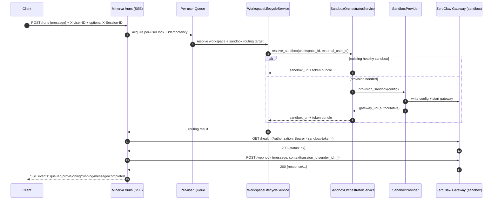

# ZeroClaw Gateway <-> Minerva Orchestrator Integration Plan

This document describes how to integrate the ZeroClaw Gateway HTTP API into Minerva's FastAPI orchestrator so Minerva can route end-user requests into isolated per-user sandboxes, execute the agent runtime, and stream typed runtime events back to clients.

Primary goal: preserve ZeroClaw's filesystem-centric workspace semantics (identity files + skills + memory/session state) while adding multi-tenant isolation, routing, checkpoint/hydration, and a stable event streaming envelope.

---

## 1) Architecture Overview

Minerva is the control-plane API. The ZeroClaw Gateway runs *inside each user sandbox* as the in-sandbox ingress into the agent runtime.

Key idea: 1 user -> 1 sandbox. Multi-user -> multi-sandbox. Multiple sessions for the same user reuse the same sandbox.

### High-level topology

```mermaid
flowchart LR
  C[Client / Product] -->|HTTP: POST /runs (SSE)| M[Minerva Orchestrator (FastAPI)]
  M -->|resolve user identity| I[Identity Resolver]
  M -->|resolve or provision| SO[Sandbox Orchestrator Service]
  SO --> P{Sandbox Provider}
  P -->|Daytona| D[Daytona Workspace]
  P -->|Local Compose| LC[Local Docker Compose]
  D --> G[ZeroClaw Gateway (in-sandbox)]
  LC --> G
  G --> Z[ZeroClaw Runtime Core]
  Z --> G
  G -->|HTTP response / SSE| M
  M -->|typed SSE events| C
```

### Control-plane vs data-plane

- Control-plane (Minerva): routing, sandbox lifecycle, policy enforcement, persistence, checkpoint/hydration orchestration.
- Data-plane (ZeroClaw Gateway in sandbox): runtime ingress, tool execution, local workspace/memory semantics.

---

## 2) Integration Points (Minerva <-> ZeroClaw)

Concrete touchpoints you implement/wire in Minerva:

### A. Sandbox provisioning creates a runnable gateway

- Provider provisions sandbox with:
  - Pack mount (read-only) + workspace mount (read-write)
  - Identity files available in workspace (typically via symlinks)
  - A gateway config file written under workspace (NOT under pack mount)
  - ZeroClaw Gateway process started and checked (health/listener)

Provider-level responsibilities typically live under:

- `src/infrastructure/sandbox/providers/daytona.py`
- `src/infrastructure/sandbox/providers/local_compose.py` (if present)

### B. Routing chooses the correct sandbox and gateway endpoint

- Resolve existing active sandbox for (workspace_id, external_user_id) or provision a new one.
- Store authoritative `gateway_url` for the sandbox in the DB (do not derive ad-hoc once stored).
- Rotate a sandbox-scoped gateway auth token during provisioning (grace period supported).

Routing responsibilities typically live under:

- `src/services/sandbox_orchestrator_service.py`
- `src/db/repositories/sandbox_instance_repository.py`

### C. Execution: Minerva calls in-sandbox gateway

- Use an HTTP client (async) to:
  - Poll `/health` (fail-closed)
  - POST to `/webhook` (or `/execute` as compatibility fallback)
  - Optionally consume streaming (SSE/WS) for typed runtime events

Execution responsibilities typically live under:

- `src/services/zeroclaw_gateway_service.py`
- `src/services/run_service.py`

### D. Event streaming bridge

- Minerva streams a stable envelope to clients (SSE is a pragmatic baseline).
- ZeroClaw runtime events (message/tool/ui/state/error) must be mapped into Minerva event types.

Minerva-side event envelope lives under:

- `src/services/oss_sse_events.py`
- `src/api/oss/routes/runs.py`

### E. Persistence + checkpoint milestones

- Persist run/session metadata and event logs (non-guest only).
- Create milestone-based workspace snapshots (non-guest only).
- On cold start, hydrate sandbox from latest checkpoint (async where possible).

Persistence/checkpoint responsibilities typically live under:

- `src/services/runtime_persistence_service.py` (if present)
- `src/services/checkpoint_restore_service.py` (if present)
- `src/services/workspace_lifecycle_service.py`

---

## 3) Data Flow (request/response, end-to-end)

### A. End-user run request -> sandbox -> gateway -> response



### B. Streaming variant (ZeroClaw stream -> Minerva SSE)

If the gateway supports SSE or WS streaming for runtime events, Minerva should consume that stream and re-emit it as Minerva's typed SSE envelope.

Mapping principle:

- Preserve Minerva event types (stable client contract).
- Treat ZeroClaw stream as an *upstream event source* and translate.

Example mapping table (adjust to real upstream schema):

| ZeroClaw event (upstream) | Minerva `OssEventType` | Notes |
|---|---|---|
| `message.delta` / `message` | `message` | Accumulate deltas if needed |
| `tool.call` | `tool_call` | Include tool id/name/args |
| `tool.result` | `tool_result` | Include tool id/result |
| `ui.patch` | `ui_patch` | Pass patch object |
| `state.update` | `state_update` | Pass state object |
| `error` | `error` | Non-terminal unless upstream ends |
| `completed` | `completed` | Terminal |
| `failed` | `failed` | Terminal |

---

## 4) Authentication Strategy

ZeroClaw Gateway docs describe a pairing-code flow (`POST /pair`) to obtain a bearer token for subsequent calls. That UX is a poor fit for automated, per-sandbox orchestration.

### Recommended approach: sandbox-scoped bearer token (orchestrator-managed)

Use a token generated by Minerva during sandbox provisioning and injected into the in-sandbox gateway config.

- Token scope: per-sandbox (and therefore per-user for v1 tenancy).
- Storage: persisted in Minerva DB with rotation support (current + previous with grace period).
- Transport: `Authorization: Bearer <token>` on `/health` and `/webhook`.
- Rotation:
  - Rotate token when provisioning a new sandbox instance or when rehydrating/restarting.
  - Accept previous token for a short grace window to avoid in-flight failures.

This aligns with strong isolation:

- Network boundary: gateway URL is only reachable via sandbox networking path Minerva uses.
- Auth boundary: even if gateway URL leaks, the token is required.

### When pairing-code flow is still useful

Use pairing-code only for human/operator debugging (e.g., curl into a sandbox gateway) when you cannot or do not want to access Minerva-managed tokens.

If you keep pairing enabled in the gateway build, document a "debug-only" pairing mode and ensure production orchestration does not depend on scraping the pairing code from logs.

### Defensive measures

- Never place gateway tokens in client-visible error messages.
- Sanitize logs and SSE errors (redact `Bearer ...`, UUIDs, internal URLs).
- Enforce request size limits at Minerva ingress (and rely on gateway limits in sandbox as a second layer).

---

## 5) Sandbox Lifecycle (how ZeroClaw runs within Minerva sandboxes)

### Lifecycle states (conceptual)

```text
PENDING -> CREATING -> ACTIVE -> (STOPPING -> STOPPED)
                     -> UNHEALTHY/FAILED
```

### Readiness gates (fail-closed)

Minerva should only route a run request into a sandbox when:

1. Identity is ready (AGENT.md, SOUL.md, IDENTITY.md, skills/ accessible under workspace path)
2. Gateway is healthy (gateway `/health` returns OK)
3. Hydration status is acceptable (hydration may be async, but failures must be tracked)

### Workspace layout (isolation contract)

Recommended paths:

- Read-only pack mount: `/workspace/pack` (immutable agent pack contents)
- Read-write runtime workspace: `/workspace` (session/memory, runtime config, logs)

Identity files should be accessible at `/workspace/{AGENT.md,SOUL.md,IDENTITY.md,skills/}`
either via direct materialization or via symlinks from the pack mount.

### Guest mode lifecycle

Guest requests:

- Use an ephemeral identity and sandbox routing that does not persist long-term.
- Do not persist run/session/checkpoints.
- Prefer aggressive TTL and/or immediate cleanup.

---

## 6) Event Streaming (bridging ZeroClaw events into Minerva)

Minerva already exposes typed SSE events to clients. The integration work is to ensure ZeroClaw runtime activity can be surfaced as those event types.

### Current baseline (non-streaming upstream)

If the gateway only returns a single JSON response:

- Emit lifecycle events (`queued`, `provisioning`, `running`)
- Emit one `message` event with the final agent output (best-effort extraction)
- Emit `completed` (or `failed`)

### Target state (streaming upstream)

Enable one of:

1. `stream_mode = "sse"` in `src/integrations/zeroclaw/spec.json`
2. `stream_mode = "ws"` in `src/integrations/zeroclaw/spec.json`

Then implement an upstream stream consumer inside `ZeroclawGatewayService`:

- `stream_execute(...) -> AsyncIterator[UpstreamEvent]`
- Translate to Minerva `OssSseEventBuilder` events in the `/runs` event generator

### Suggested interface shape (Minerva-side)

```python
# pseudo-code (shape, not exact implementation)

async def execute_and_stream(
    sandbox_url: str,
    token_bundle: GatewayTokenBundle,
    request: dict,
) -> AsyncIterator[dict]:
    """Yield upstream runtime events as dicts."""
    ...

async def minerva_run_event_stream(...):
    yield event_builder.running(step="bridge_stream").to_sse_lines()
    async for upstream in gateway.execute_and_stream(...):
        mapped = map_upstream_to_oss_event(upstream)
        if mapped:
            yield mapped.to_sse_lines()
    yield event_builder.completed().to_sse_lines()
```

### Backpressure + timeouts

- Ensure gateway stream consumption has bounded timeouts.
- Ensure Minerva SSE generator yields regularly (avoid buffering giant outputs).
- Add cancellation handling: if client disconnects, stop reading the upstream stream.

---

## 7) Implementation Phases (phased rollout)

This rollout is designed to ship value early and keep integration risk contained.

### Phase 0: Spec + minimal execution (foundation)

Deliverables:

- A validated spec file describing gateway paths, port, auth mode, and stream mode.
- A gateway client that can:
  - Poll `/health` (fail-closed)
  - POST execute (`/webhook` primary, `/execute` fallback)
  - Return typed errors with remediation

Acceptance criteria:

- Single-user run executes end-to-end and returns a completed SSE stream.
- Health/auth failures never attempt execution.

### Phase 1: Sandbox provisioning + routing correctness

Deliverables:

- Provider provisioning writes gateway config under workspace and starts gateway.
- Routing resolves existing sandbox or provisions new, per user.
- Authoritative `gateway_url` is stored.
- Per-sandbox auth token generation + rotation stored in DB.

Acceptance criteria:

- Two distinct users create two distinct sandboxes.
- Same user across sessions reuses sandbox.
- Idle TTL stop does not break subsequent routing (re-provision if needed).

### Phase 2: Stream bridging (typed runtime events)

Deliverables:

- Enable and validate gateway streaming mode (`sse` preferred initially).
- Implement upstream stream consumer and event mapping.
- Expand OSS SSE output:
  - `tool_call`, `tool_result`, `ui_patch`, `state_update`, `error`

Acceptance criteria:

- Client sees incremental agent output (not only final message).
- Tool activity is observable as typed events.

### Phase 3: Checkpoint/hydration alignment

Deliverables:

- Define checkpoint milestones (what triggers snapshot).
- Implement restore flow on cold start without blocking request routing longer than necessary.
- Persist event logs + session metadata for non-guests.

Acceptance criteria:

- After restart, a user session continues with restored memory/session state.
- Guests do not persist anything.

### Phase 4: Channel integrations (optional, later)

Two options:

1. Terminate channel webhooks at Minerva and forward normalized messages to `/runs`.
2. Terminate channel webhooks inside each sandbox gateway (higher complexity for multi-tenant routing).

Recommended for v1: option 1 (Minerva terminates) to keep tenant routing explicit and auditable.

---

## 8) Configuration

### Minerva configuration

Settings to standardize:

- `ZEROCLAW_GATEWAY.HEALTH_TIMEOUT` (seconds)
- `ZEROCLAW_GATEWAY.HEALTH_RETRIES`
- `ZEROCLAW_GATEWAY.HEALTH_BACKOFF` (seconds)
- `ZEROCLAW_GATEWAY.EXECUTE_TIMEOUT` (seconds)
- `ZEROCLAW_GATEWAY.EXECUTE_RETRIES` (usually 0 for non-idempotent execution)

### Spec-driven configuration

`src/integrations/zeroclaw/spec.json` should define:

- `gateway.port`
- `gateway.health_path`
- `gateway.execute_path`
- `gateway.stream_mode` (`none` | `sse` | `ws`)
- `auth.mode` (`bearer` | `none`)
- `runtime.config_path`
- `runtime.start_command`

### In-sandbox gateway config (generated at provision time)

The provider should write a runtime config under workspace, e.g.:

```json
{
  "version": "1.0.0",
  "gateway": {
    "host": "0.0.0.0",
    "port": 18790,
    "health_path": "/health",
    "execute_path": "/webhook",
    "stream_mode": "none"
  },
  "auth": {
    "mode": "bearer",
    "token": "<sandbox-scoped-token>"
  },
  "workspace": {
    "path": "/workspace",
    "pack_mount_path": "/workspace/pack"
  }
}
```

Notes:

- Keep config under `/workspace/.zeroclaw/` (or equivalent). Never write under `/workspace/pack`.
- Token is provisioned by Minerva (not end-user supplied).

### Network + ports

- For Daytona: ensure preview URLs (or equivalent) expose the gateway port for Minerva to reach.
- For Local Compose: ensure a deterministic host:port mapping for the gateway.

---

## 9) Testing Strategy

### Unit tests

- Spec validation:
  - paths start with `/`
  - stream_mode only in {none,sse,ws}
  - config_path not under pack mount

- Gateway client:
  - health-first, fail-closed semantics
  - auth failures map to typed errors
  - compatibility fallback between `/webhook` and `/execute`
  - token rotation grace fallback logic

### Integration tests

- Provider provisioning:
  - config is written to workspace
  - gateway process is started
  - gateway URL is resolved and stored authoritatively

- Routing:
  - same (workspace_id, external_user_id) routes to same active sandbox
  - different external_user_id routes to different sandbox
  - unhealthy sandbox excluded and replaced with bounded retry

### End-to-end tests (recommended)

- Multi-user probe:
  - Run two `/runs` requests with distinct `X-User-ID`
  - Consume SSE to completion
  - Assert DB has distinct sandbox instances/provider refs

Example runner exists pattern-wise as a script:

- `src/scripts/zeroclaw_webhook_e2e.py`

### Load/soak tests (pre-pilot)

- 24h soak: >= 100 runs, < 1% error rate, zero auth failures.
- Validate TTL cleanup and reprovision behavior under intermittent provider failures.

---

## 10) Open Questions

These need resolution to finalize the stream + checkpoint parts of the integration.

1. Upstream streaming schema: what are the exact SSE/WS event names and payload shapes from ZeroClaw Gateway?
2. Streaming contract: is upstream stream tied to `/webhook`, a separate `/stream` endpoint, or a websocket route?
3. Session continuity: which identifiers does the runtime treat as the canonical thread key (`session_id`, `sender_id`, both)?
4. Memory persistence semantics: what files/paths constitute "memory/session state" for checkpointing?
5. Checkpoint triggers: what defines a "milestone" (completed run, tool milestone, time-based, manual)?
6. Token lifecycle: should sandbox token rotate only on reprovision, or periodically (and how to coordinate with long-running streams)?
7. Rate limiting: do we enforce at Minerva ingress, in-sandbox gateway, or both (and how to expose 429 signals as typed events)?
8. Channel integrations: should WhatsApp/Linq/Nextcloud endpoints be terminated at Minerva or inside sandbox gateways?
9. Observability: do we scrape `/metrics` from each sandbox gateway (hard) or export aggregated metrics from Minerva (preferred)?
10. Security posture: is the gateway endpoint reachable only from Minerva (ideal) or also from external networks (requires stronger auth + network policy)?

---

## Appendix: Reference Endpoints (ZeroClaw Gateway)

- `GET /health` (public per docs; in orchestrator mode may require bearer)
- `POST /pair` (pairing code -> token; recommended debug-only)
- `POST /webhook` (main execution)
- `GET /metrics` (prometheus)

---

## Appendix: Minimal call examples

### Minerva -> in-sandbox gateway (bearer)

```bash
curl -X POST "${GATEWAY_URL}/webhook" \
  -H "Content-Type: application/json" \
  -H "Authorization: Bearer ${SANDBOX_TOKEN}" \
  -d '{"message":"Hello","context":{"session_id":"s1","sender_id":"u1"}}'
```

### Operator debug: pairing flow (if enabled)

```bash
TOKEN=$(curl -sS -X POST "${GATEWAY_URL}/pair" -H "X-Pairing-Code: 732047" | jq -r .token)
curl -sS -X POST "${GATEWAY_URL}/webhook" \
  -H "Authorization: Bearer ${TOKEN}" \
  -H "Content-Type: application/json" \
  -d '{"message":"Hello"}'
```
