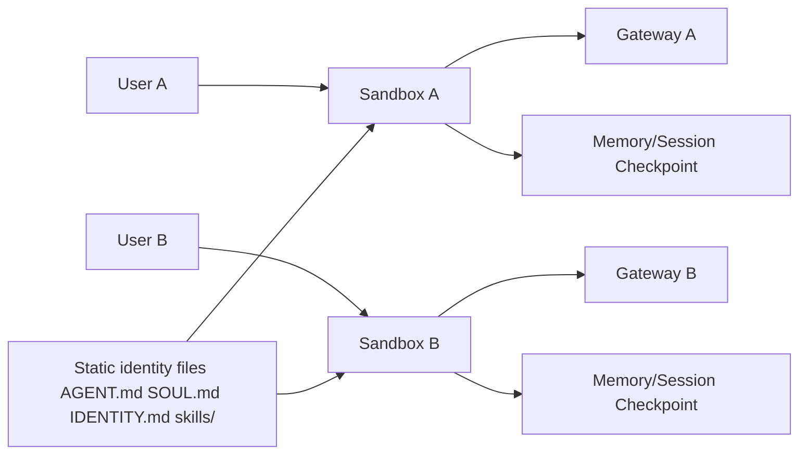

# Rules that you must always follow

- Always run Python command, install Python packages or create Python project using uv
- `references` folder is only for reference. Always implement new things at the root level folder
- All new implementations must be inside src/.
- Database migration must be done via ORM instead of raw SQL command.
- For Daytona integration, always use the Python Async SDK here https://www.daytona.io/docs/en/python-sdk/async/async-daytona/
- Always avoid reinventing the wheel: prefer proven platform/native capabilities (for example Daytona registry images, volumes, snapshots) before building custom equivalents.
- For discuss-phase workflows, explain brief context first, then ask exactly one question at a time; wait for the answer before asking the next question.

## Picoclaw Runtime Invariants

- 1 user maps to 1 sandbox.
- Multi-user means multi-sandbox.
- 1 user with multiple sessions stays in the same sandbox.
- Checkpoint data includes only memory/session state.
- Static identity files are mounted during sandbox creation: `AGENT.md`, `SOUL.md`, `IDENTITY.md`, `skills/`.
- OSS runtime prioritizes fast deployment of a specific agent from packed static identity files mounted at sandbox creation.
- Loading a checkpoint means loading existing memory/session state only.
- Each sandbox exposes a gateway endpoint for sending messages to the agent runtime.
- The orchestrator owns checkpointing.

