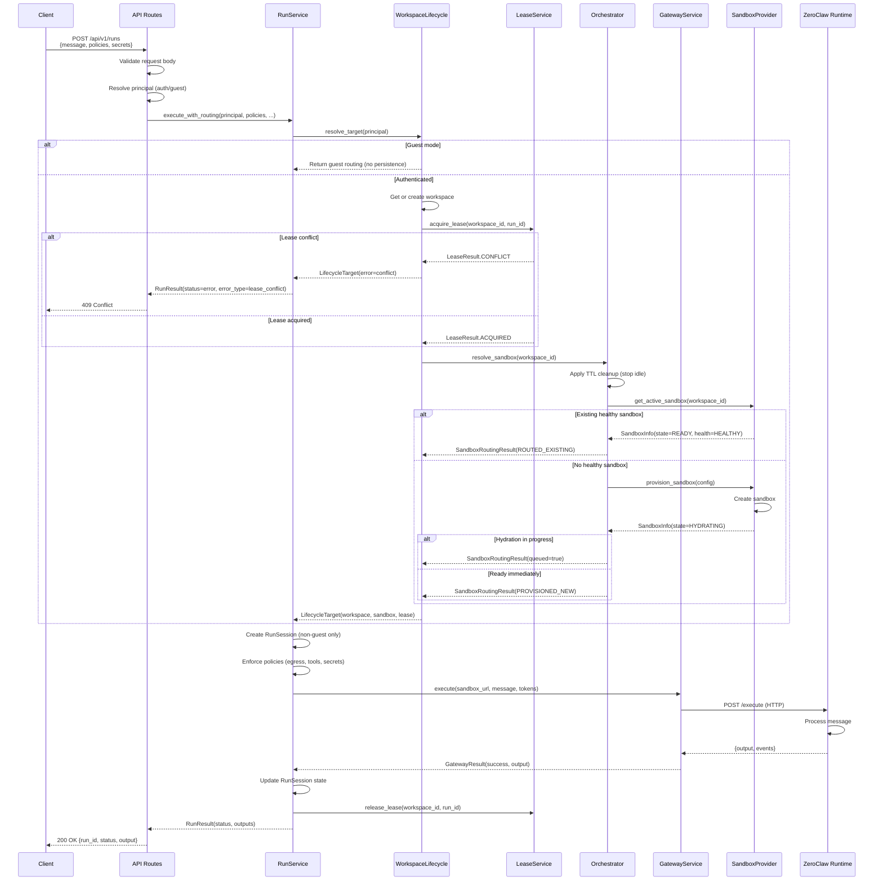
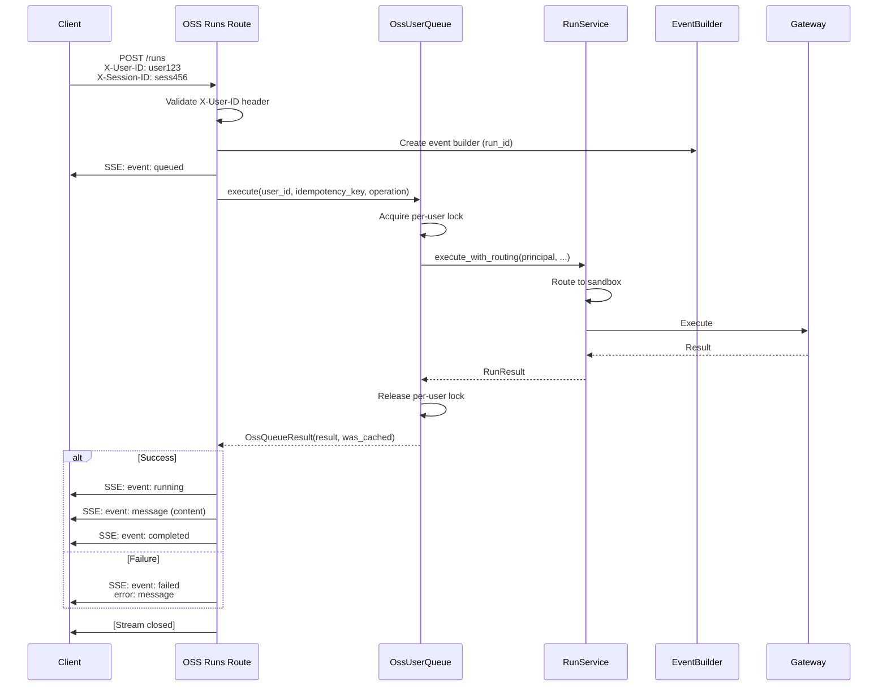
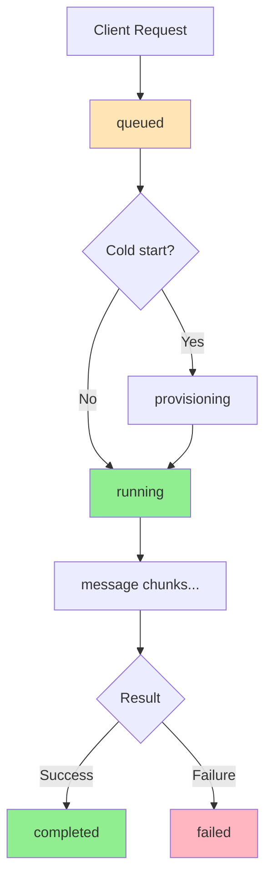
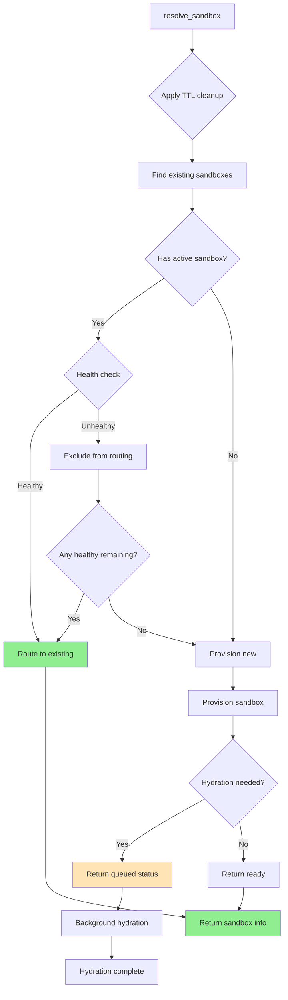
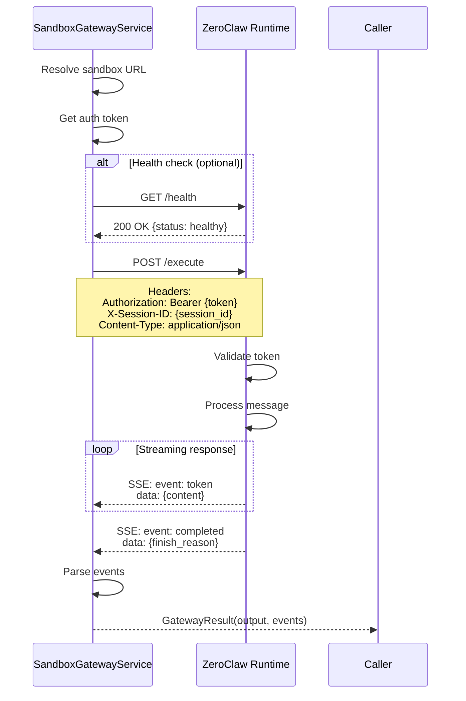
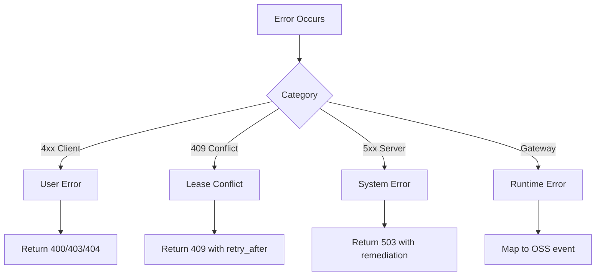

# Execution Flow

**Complete request flow from API to sandbox execution.**

---

## Table of Contents

1. [Overview](#overview)
2. [Standard Run Execution](#standard-run-execution)
3. [OSS Run Execution](#oss-run-execution)
4. [Sandbox Routing Flow](#sandbox-routing-flow)
5. [Gateway Execution Flow](#gateway-execution-flow)
6. [Error Handling](#error-handling)

---

## Overview

Minerva supports two execution paths:

| Path | Endpoint | Use Case |
|------|----------|----------|
| **Standard** | `POST /api/v1/runs` | Developer API with full policy control |
| **OSS** | `POST /runs` | End-user API with SSE streaming |

Both paths share core services but differ in:
- Authentication (API key vs external identity)
- Policy enforcement (explicit vs implicit)
- Response format (JSON vs SSE)
- Queue behavior (per-workspace vs per-user)

---

## Standard Run Execution

### Sequence Diagram



### Detailed Flow

#### Step 1: API Request (`runs.py:start_run`)

```python
# Extract policies from request
egress_policy = EgressPolicy(allowed_hosts=request.allowed_hosts)
tool_policy = ToolPolicy(allowed_tools=request.allowed_tools)
secret_policy = SecretScope(allowed_secrets=request.allowed_secrets)

# Execute with routing
result = await service.execute_with_routing(
    principal=principal,
    session=db,
    egress_policy=egress_policy,
    tool_policy=tool_policy,
    secret_policy=secret_policy,
    secrets=request.secrets,
    input_message=input_message,
)
```

#### Step 2: Routing Resolution (`run_service.py:resolve_routing_target`)

```python
async def resolve_routing_target(self, principal, session, ...):
    # Guest mode: ephemeral routing
    if is_guest_principal(principal):
        return RunRoutingResult(success=True, sandbox_state="guest")
    
    # Authenticated: full lifecycle resolution
    lifecycle = WorkspaceLifecycleService(session)
    target = await lifecycle.resolve_target(
        principal=principal,
        auto_create=True,
        acquire_lease=True,
    )
    return self._process_routing_target(target, run_id, lifecycle)
```

#### Step 3: Workspace Lifecycle (`workspace_lifecycle_service.py:resolve_target`)

**Key operations:**
1. Resolve or create workspace for principal
2. Acquire lease (single-writer enforcement)
3. Resolve sandbox via orchestrator
4. Return complete target with workspace, lease, and sandbox

#### Step 4: Sandbox Orchestration (`sandbox_orchestrator_service.py:resolve_sandbox`)

**Algorithm:**
```
1. Apply TTL cleanup (stop idle sandboxes)
2. Find existing healthy sandbox → route to it
3. No healthy sandbox → provision exactly one new sandbox
4. If provisioning fails, fail fast (no retry loop)
```

#### Step 5: Policy Enforcement (`run_service.py:execute_run`)

```python
def execute_run(self, context, egress_policy, tool_policy, ...):
    # Check each requested egress URL
    for url in requested_egress_urls:
        self.enforcer.authorize_egress(url, egress_policy)
    
    # Check each requested tool
    for tool_id in requested_tools:
        self.enforcer.authorize_tool(tool_id, tool_policy)
    
    # Filter secrets by policy
    injected_secrets = self.enforcer.get_allowed_secrets(secrets, secret_policy)
```

#### Step 6: Gateway Execution (`run_service.py:_execute_via_gateway`)

```python
async def _execute_via_gateway(self, routing, message, ...):
    # Single-attempt execution (no nested retries)
    sandbox_url = self._get_authoritative_sandbox_url(routing)
    token_bundle = self._resolve_gateway_tokens(routing, session)
    
    gateway_service = SandboxGatewayService()
    return await gateway_service.execute(
        sandbox_url=sandbox_url,
        message=message,
        auth_token=token_bundle.current,
        session_id=session_id,
    )
```

---

## OSS Run Execution

### Key Differences from Standard Flow

| Aspect | Standard | OSS |
|--------|----------|-----|
| **Auth** | API key | External identity (X-User-ID) |
| **Endpoint** | `/api/v1/runs` | `/runs` |
| **Response** | JSON | SSE (Server-Sent Events) |
| **Queue** | Per-workspace | Per-user (OssUserQueue) |
| **Policy** | Explicit in request | Implicit (allow all) |
| **Sandbox** | Shared per workspace | Per-user isolation |

### Sequence Diagram



### SSE Event Flow



### Event Types

| Event | Description | Payload |
|-------|-------------|---------|
| `queued` | Request queued | `{position, estimated_wait}` |
| `provisioning` | Sandbox being created | `{step, message}` |
| `running` | Execution started | `{step}` |
| `message` | Agent output chunk | `{role, content}` |
| `completed` | Execution succeeded | `{finish_reason}` |
| `failed` | Execution failed | `{error, error_category}` |

---

## Sandbox Routing Flow

### Routing Decision Tree



### TTL Cleanup

Before routing, idle sandboxes are stopped:

```python
async def apply_ttl_cleanup(self, workspace_id):
    """Stop sandboxes that exceeded idle TTL."""
    idle_sandboxes = self._find_idle_sandboxes(workspace_id)
    
    for sandbox in idle_sandboxes:
        if self._is_stop_eligible(sandbox):
            await self._stop_sandbox(sandbox)
```

### Health-Aware Routing

```python
async def _route_to_existing(self, workspace_id):
    """Find healthy sandbox or return None."""
    candidates = self._repository.list_by_workspace(workspace_id)
    
    for sandbox in candidates:
        if sandbox.state != SandboxState.ACTIVE:
            continue
            
        health = await self._provider.get_health(sandbox.provider_ref)
        
        if health.health == SandboxHealth.HEALTHY:
            return sandbox
        else:
            # Mark unhealthy, will be excluded
            await self._mark_unhealthy(sandbox)
    
    return None
```

---

## Gateway Execution Flow

### ZeroClaw Gateway Protocol



### Gateway Result Types

| Type | Description | Handler |
|------|-------------|---------|
| `SUCCESS` | Execution completed | Return output |
| `AUTH_ERROR` | Token invalid/expired | Retry with refreshed token |
| `TRANSPORT_ERROR` | Network failure | Fail (no retry) |
| `UPSTREAM_ERROR` | Runtime error | Return error |
| `TIMEOUT` | Execution timeout | Return timeout error |

---

## Error Handling

### Error Categories



### Lease Conflict Handling

```python
# When lease acquisition fails
if lease_result.result == LeaseResult.CONFLICT:
    return RunRoutingResult(
        success=False,
        error_type=RoutingErrorType.LEASE_CONFLICT,
        error=f"Workspace {workspace_id} has active lease",
        remediation="Retry after current operation completes",
    )
```

HTTP Response:
```json
{
  "detail": {
    "error": "Workspace has active lease",
    "error_type": "lease_conflict",
    "remediation": "Retry after current operation completes",
    "lease_holder": "run_abc123"
  }
}
```

### Routing Failure Handling

| Error Type | HTTP Status | Retryable |
|------------|-------------|-----------|
| `PACK_NOT_FOUND` | 404 | No |
| `PACK_WORKSPACE_MISMATCH` | 403 | No |
| `LEASE_CONFLICT` | 409 | Yes (after delay) |
| `PROVIDER_UNAVAILABLE` | 503 | Yes |
| `SANDBOX_PROVISION_FAILED` | 503 | Yes |
| `GATEWAY_TIMEOUT` | 504 | Yes |
| `GATEWAY_AUTH_FAILED` | 502 | No |

### Deterministic Cleanup

All paths must release leases:

```python
try:
    target = await lifecycle.resolve_target(...)
    # ... execute run ...
finally:
    if target.lease_acquired:
        lifecycle.release_lease(workspace_id, run_id)
```

---

## Key Implementation Details

### 1. Single-Attempt Design

No nested retry loops that could spawn multiple sandboxes:

```python
# Correct: Single attempt
async def _execute_via_gateway(self, ...):
    result = await gateway.execute(...)  # One try
    return result  # Fail if it fails

# Wrong: Nested retries
async def _execute_via_gateway(self, ...):
    for attempt in range(3):  # Don't do this
        result = await gateway.execute(...)
```

### 2. Lease Scope

Leases are held only during routing and execution:

```
Acquire lease
→ Route to sandbox
→ Execute via gateway
→ Release lease
```

### 3. Guest Mode Isolation

Guest runs are completely ephemeral:
- No workspace persistence
- No run session record
- No lease acquisition
- Sandbox destroyed after execution

### 4. Idempotency

OSS endpoint supports idempotent requests:

```python
# Same idempotency key = same result
queue_result = await user_queue.execute(
    user_id=principal.external_user_id,
    idempotency_key=idempotency_key,  # Cached if seen before
    operation=execute_operation,
)
```
