# State Machines

**Visual reference for all state transitions in Minerva.**

---

## Table of Contents

1. [Sandbox Lifecycle](#sandbox-lifecycle)
2. [Run Session Lifecycle](#run-session-lifecycle)
3. [Workspace Lease Lifecycle](#workspace-lease-lifecycle)
4. [Checkpoint Lifecycle](#checkpoint-lifecycle)
5. [Hydration Lifecycle](#hydration-lifecycle)
6. [State Reference Tables](#state-reference-tables)

---

## Sandbox Lifecycle

The sandbox lifecycle tracks the state of execution environments from provisioning through termination.

### State Diagram

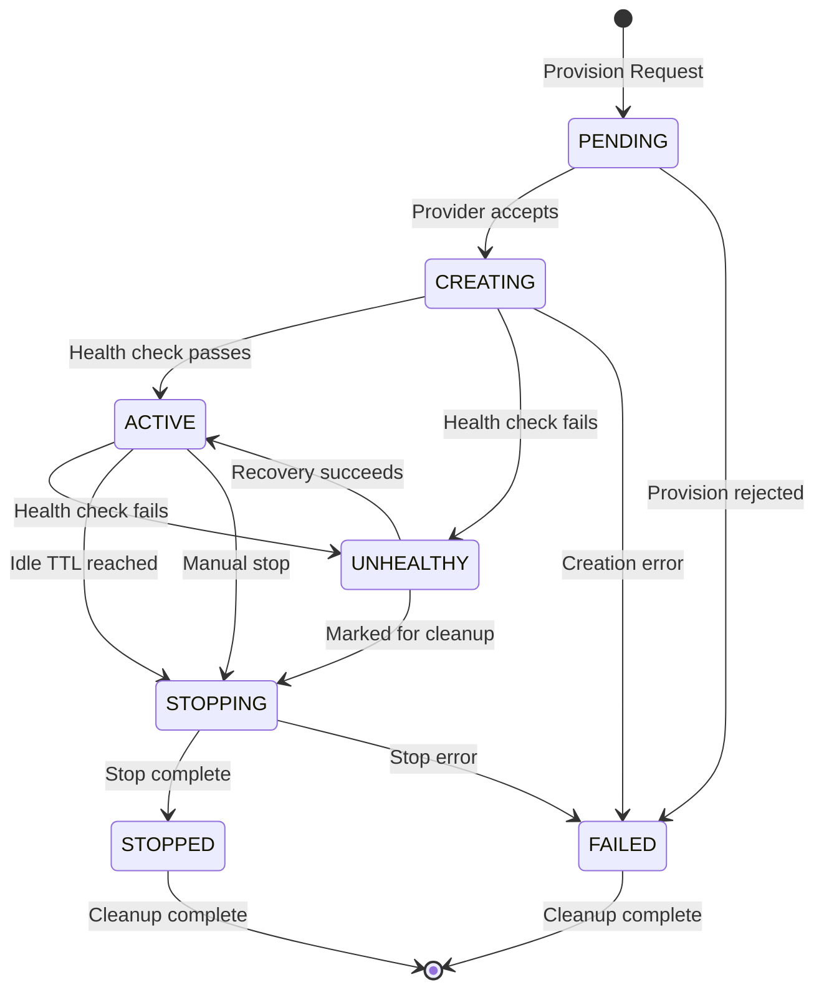

### Health Status (Orthogonal)

Health is tracked separately from state:

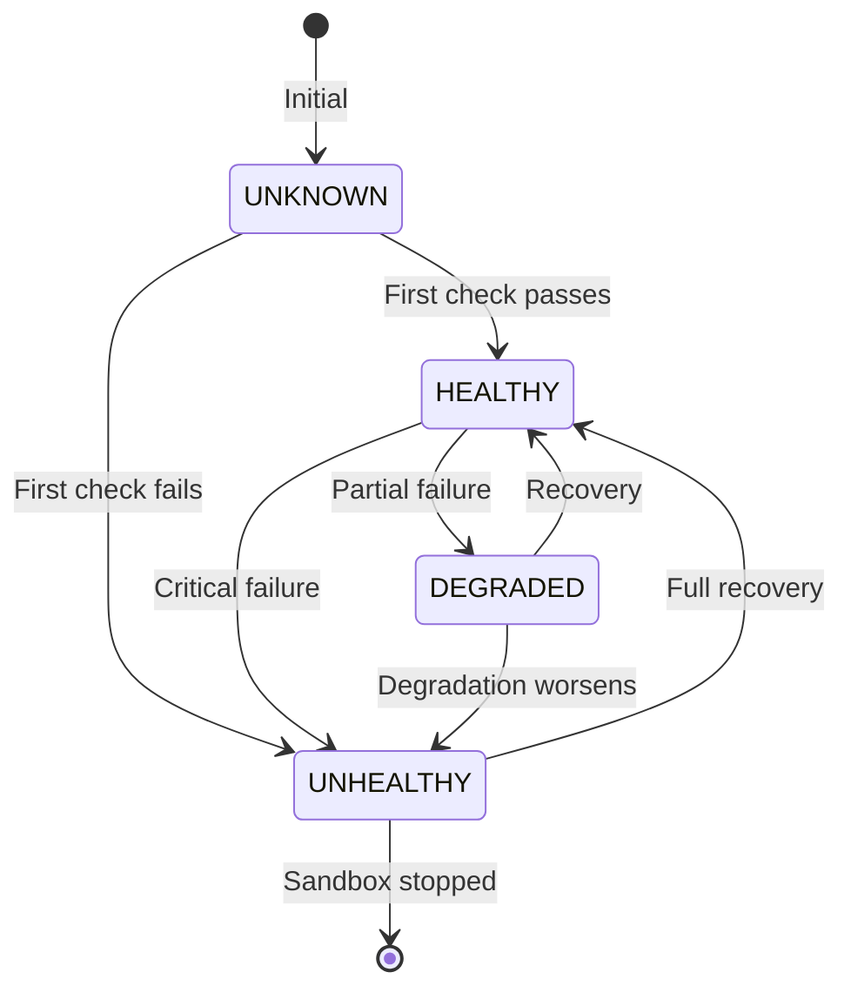

### Key Transitions

| From | To | Trigger | Handler |
|------|-----|---------|---------|
| `PENDING` | `CREATING` | Provider accepts provision request | `daytona.py:provision_sandbox()` |
| `CREATING` | `ACTIVE` | Health check returns 200 OK | `sandbox_orchestrator_service.py:_check_layered_readiness()` |
| `ACTIVE` | `STOPPING` | `last_activity_at + idle_ttl < now()` | `sandbox_orchestrator_service.py:apply_ttl_cleanup()` |
| `UNHEALTHY` | `STOPPING` | Excluded from routing | `sandbox_orchestrator_service.py:resolve_sandbox()` |

---

## Run Session Lifecycle

Run sessions track the execution lifecycle from queue through completion.

### State Diagram

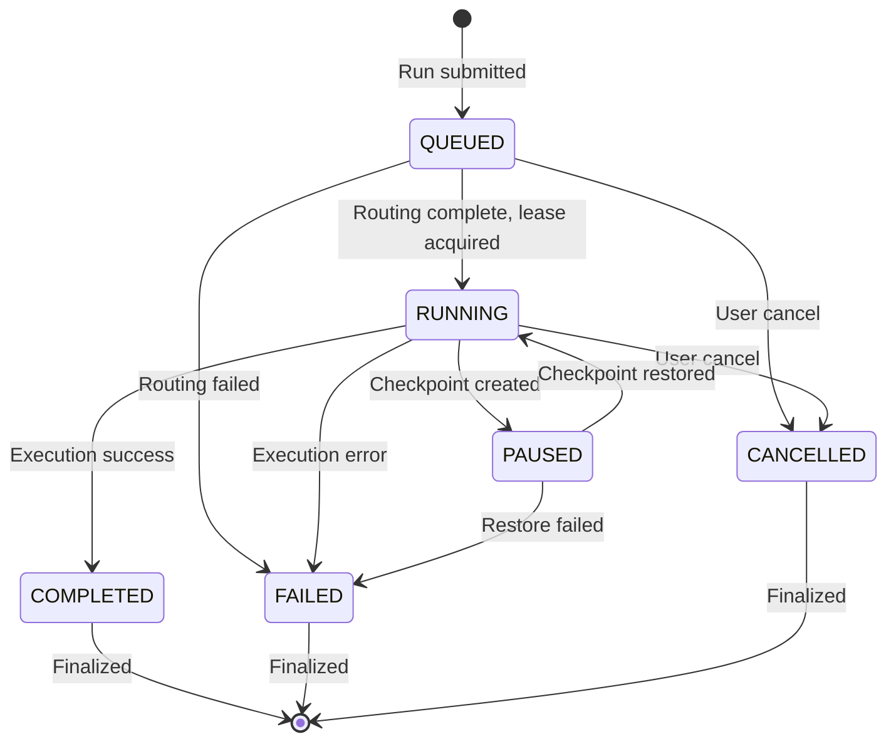

### OSS Mode with Queue

For OSS endpoints, runs go through an additional queuing layer:

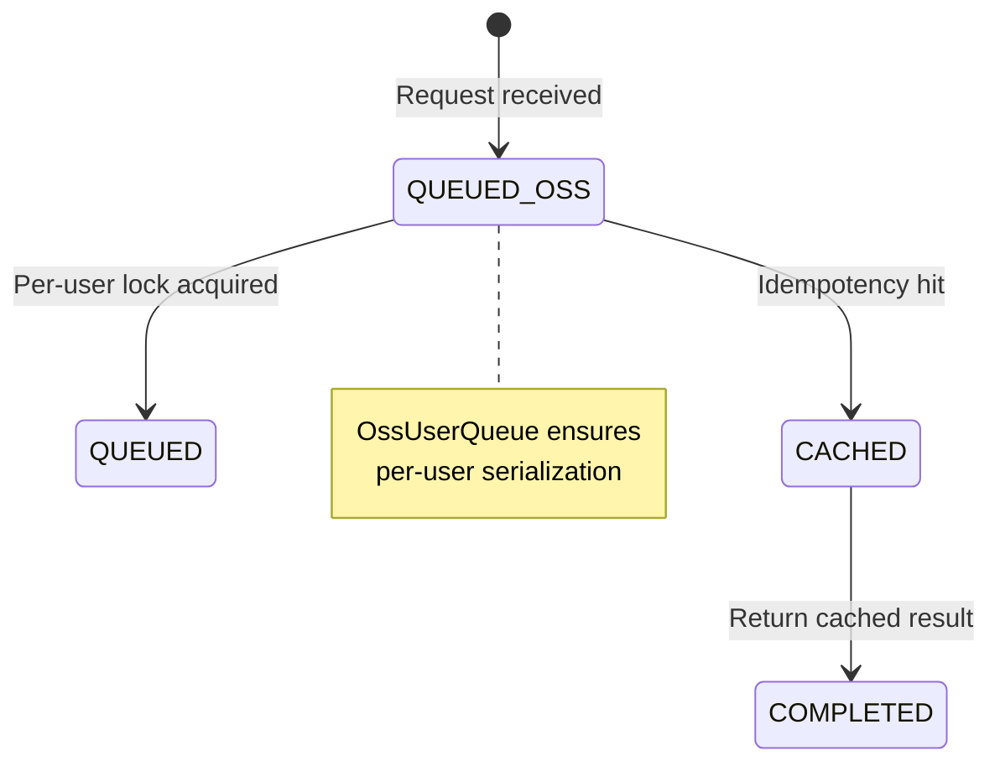

### Key Transitions

| From | To | Trigger | Service |
|------|-----|---------|---------|
| `QUEUED` | `RUNNING` | Sandbox routed, lease acquired | `run_service.py:execute_with_routing()` |
| `RUNNING` | `COMPLETED` | Gateway returns success | `run_service.py:_finalize_run_session()` |
| `RUNNING` | `PAUSED` | Checkpoint operation initiated | `checkpoint_restore_service.py` |
| `RUNNING` | `FAILED` | Gateway error or exception | `run_service.py:_finalize_run_session()` |

---

## Workspace Lease Lifecycle

Leases enforce single-writer semantics per workspace.

### State Diagram

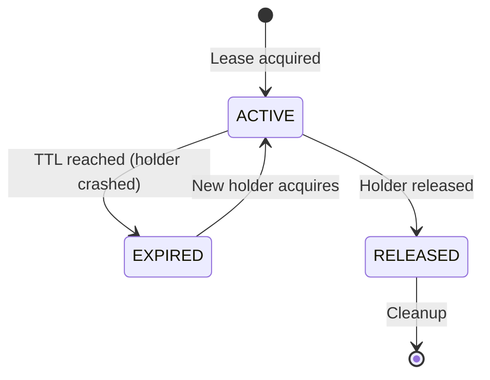

### Lease Acquisition Flow

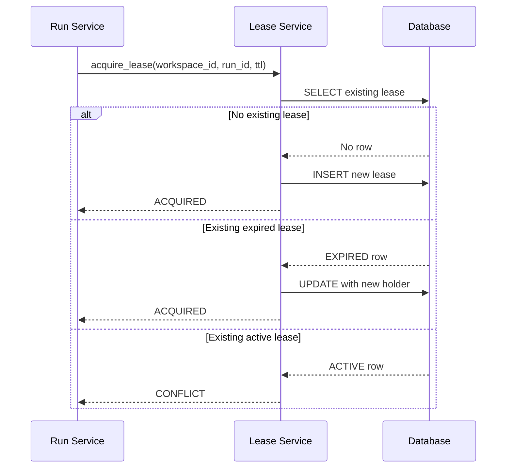

### Key Properties

- **Holder identification**: `holder_run_id` + `holder_identity`
- **TTL expiration**: Prevents deadlock from crashed holders
- **Optimistic locking**: `version` column for concurrent updates
- **Automatic cleanup**: Expired leases ignored by new acquires

---

## Checkpoint Lifecycle

Checkpoints capture workspace state for recovery and migration.

### State Diagram

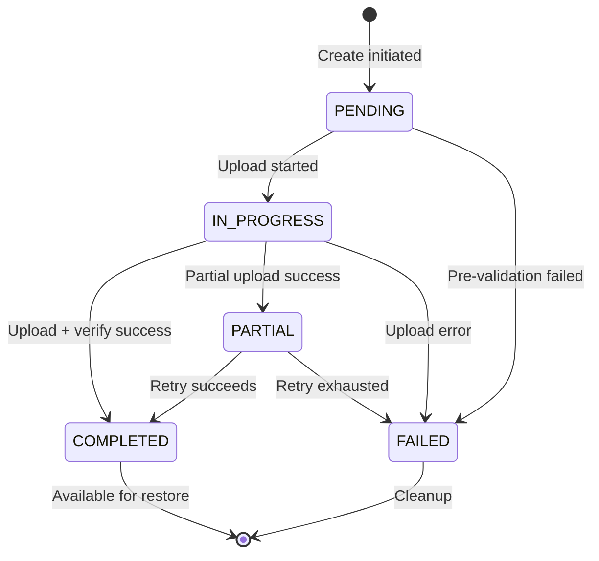

### Restore Process

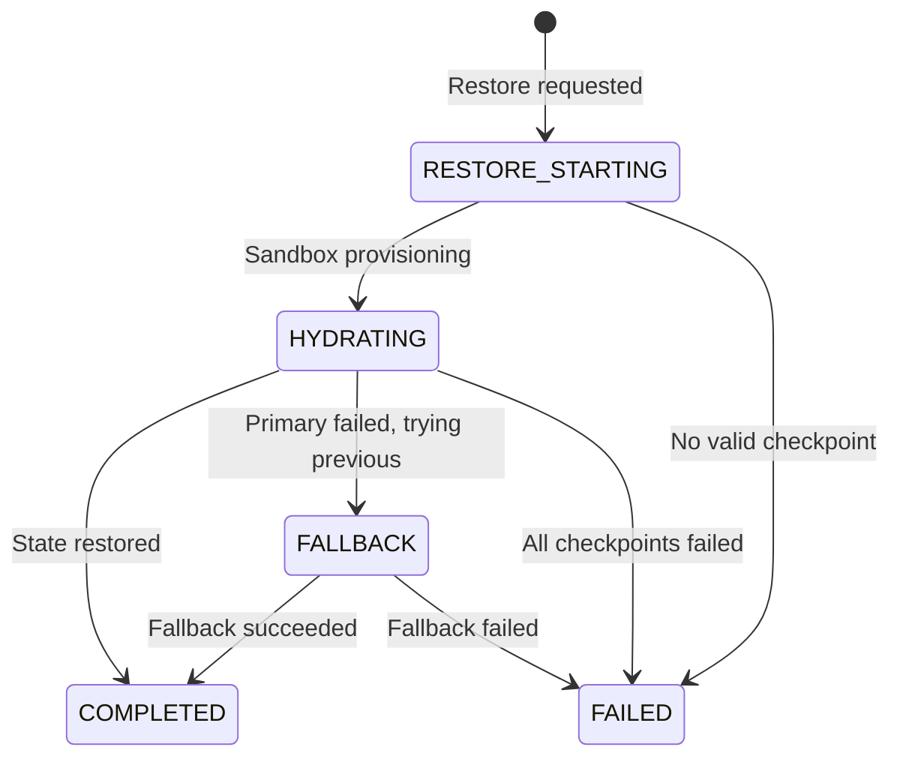

### Fallback Chain

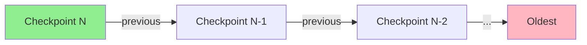

---

## Hydration Lifecycle

Hydration restores checkpoint state into a newly provisioned sandbox.

### State Diagram

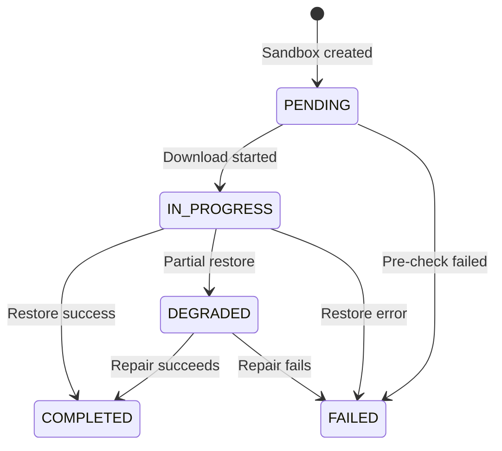

### Hydration during Routing

When a run is routed to a sandbox being hydrated:

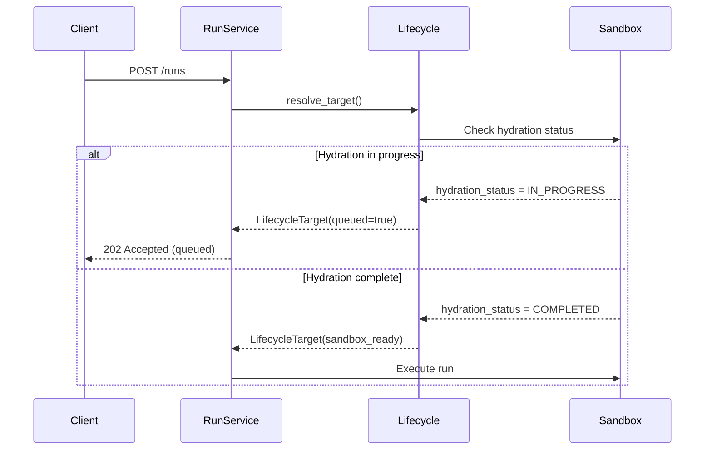

---

## State Reference Tables

### Sandbox States

| State | Code | Description |
|-------|------|-------------|
| `PENDING` | `pending` | Request submitted, awaiting provider |
| `CREATING` | `creating` | Provider actively provisioning |
| `ACTIVE` | `active` | Ready for execution |
| `UNHEALTHY` | `unhealthy` | Active but failing health checks |
| `STOPPING` | `stopping` | In process of stopping |
| `STOPPED` | `stopped` | Terminated, awaiting cleanup |
| `FAILED` | `failed` | Provisioning or operation failed |

### Sandbox Health Status

| Status | Code | Routing Behavior |
|--------|------|------------------|
| `HEALTHY` | `healthy` | Include in routing |
| `UNHEALTHY` | `unhealthy` | Exclude from routing |
| `UNKNOWN` | `unknown` | Exclude until first check |

### Run Session States

| State | Code | Description |
|-------|------|-------------|
| `QUEUED` | `queued` | Waiting for sandbox/routing |
| `RUNNING` | `running` | Active execution |
| `PAUSED` | `paused` | Checkpoint created, awaiting restore |
| `COMPLETED` | `completed` | Execution finished successfully |
| `FAILED` | `failed` | Execution failed |
| `CANCELLED` | `cancelled` | User cancelled |

### Workspace Lease States

| State | Code | Description |
|-------|------|-------------|
| `ACTIVE` | `active` | Lease held, writes allowed |
| `EXPIRED` | `expired` | TTL exceeded, available for reclaim |
| `RELEASED` | `released` | Holder released, lease ended |

### Checkpoint States

| State | Code | Description |
|-------|------|-------------|
| `PENDING` | `pending` | Creation initiated |
| `IN_PROGRESS` | `in_progress` | Upload in progress |
| `COMPLETED` | `completed` | Available for restore |
| `FAILED` | `failed` | Creation failed |
| `PARTIAL` | `partial` | Partial upload (retry candidate) |

### Hydration States

| State | Code | Description |
|-------|------|-------------|
| `PENDING` | `pending` | Hydration not started |
| `IN_PROGRESS` | `in_progress` | Actively restoring |
| `COMPLETED` | `completed` | Ready for use |
| `DEGRADED` | `degraded` | Partial restore (usable) |
| `FAILED` | `failed` | Restore failed |

---

## Event Types

Runtime events are emitted during state transitions:

### Lifecycle Events

| Event | Emitted When |
|-------|--------------|
| `SESSION_STARTED` | Run transitions QUEUED → RUNNING |
| `SESSION_PAUSED` | Run transitions RUNNING → PAUSED |
| `SESSION_RESUMED` | Run transitions PAUSED → RUNNING |
| `SESSION_COMPLETED` | Run reaches COMPLETED |
| `SESSION_FAILED` | Run reaches FAILED |
| `SESSION_CANCELLED` | Run reaches CANCELLED |

### Checkpoint Events

| Event | Emitted When |
|-------|--------------|
| `CHECKPOINT_CREATED` | Checkpoint reaches COMPLETED |
| `CHECKPOINT_RESTORE_STARTED` | Restore initiated |
| `CHECKPOINT_RESTORE_COMPLETED` | Restore successful |
| `CHECKPOINT_RESTORE_FAILED` | Restore failed |
| `CHECKPOINT_FALLBACK_USED` | Fallback checkpoint used |

---

## Implementation Notes

1. **State changes are atomic** - Use database transactions
2. **Events are append-only** - Never modify or delete
3. **States have timeouts** - Ex: lease TTL, hydration timeout (300s)
4. **Transitions are idempotent** - Safe to retry on failure
5. **Failed states are terminal** - Require explicit recovery action
