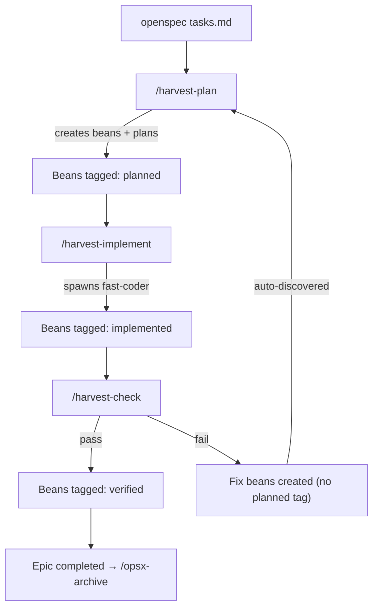

# Harvest Workflow System

The harvest system bridges [OpenSpec](../../openspec/) change planning with [beans](../../.beans.yml) issue tracking and multi-agent execution. It replaces the monolithic `opsx-apply` approach with granular, tracked, and verifiable task execution.

## Pipeline



## Tag-Based State Machine

Each command adds a tag when it finishes processing a bean. The next command discovers work by querying tag presence/absence.

### Tag Schema

| Tag | Added by | Meaning |
|-----|----------|---------|
| `harvest` | `/harvest-plan` | Part of the harvest workflow |
| `<change-name>` | `/harvest-plan` | Which openspec change this belongs to |
| `planned` | `/harvest-plan` | Plan doc exists, ready for implementation |
| `implemented` | `/harvest-implement` | Code written, ready for verification |
| `verified` | `/harvest-check` | Verification passed |
| `fix` | `/harvest-check` | Bug bean created from a verification failure |

### State Transitions

```
Bean created (tags: harvest, <change>)
  │
  ▼  /harvest-plan
  +planned  →  status: todo
  │
  ▼  /harvest-implement
  +implemented  →  status: completed
  │
  ▼  /harvest-check
  +verified  (pass)
      — or —
  new fix bean created (tags: harvest, <change>, fix — NO planned tag)
```

Fix beans feed back into `/harvest-plan` automatically because they lack the `planned` tag.

### Query Cheat Sheet

```bash
# What needs planning?
beans list --json --tag harvest --tag "<change>" --no-tag planned

# What needs implementing?
beans list --json --tag harvest --tag "<change>" --tag planned --no-tag implemented

# What needs verification?
beans list --json --tag harvest --tag "<change>" --tag implemented --no-tag verified

# What's fully done?
beans list --json --tag harvest --tag "<change>" --tag verified

# Fix beans needing attention?
beans list --json --tag harvest --tag "<change>" --tag fix --no-tag planned

# All beans for a change?
beans list --json --tag harvest --tag "<change>"
```

### Tag Contracts

| Command | Input query | Output action |
|---------|------------|---------------|
| `/harvest-plan` | `--no-tag planned` | `beans update <id> --tag planned -s todo` |
| `/harvest-implement` | `--tag planned --no-tag implemented` | `beans update <id> --tag implemented -s completed` |
| `/harvest-check` | `--tag implemented --no-tag verified` | Pass: `beans update <id> --tag verified` |
| `/harvest-check` | _(on failure)_ | `beans create ... --tag harvest --tag <change> --tag fix` (no `planned`) |

## Commands

| Command | Agent | What it does |
|---------|-------|-------------|
| `/harvest-plan` | `smart-planner` | Find unplanned beans → plan them. If none, parse `tasks.md` → create beans → plan |
| `/harvest-implement` | `fast-coder` | Find planned beans → implement by priority tier |
| `/harvest-check` | `smart-coder` | Find implemented beans → verify. Pass → tag verified. Fail → create fix beans |

## How It Works

### 1. Plan (`/harvest-plan`)

Checks for unplanned beans first (covers fix beans from previous check failures). If none, reads `tasks.md` to create new beans. Spawns `smart-planner` to produce a plan doc for each bean.

- **Command entry**: `.opencode/command/harvest/plan.md`
- **Skill entry**: `.opencode/skills/harvest/harvest-plan/SKILL.md`
- **Windmill refs**: `.opencode/windmill/harvest/planning/`

### 2. Implement (`/harvest-implement`)

Groups planned beans by priority tier and spawns `fast-coder` for each:
- **Tier 1** (high): foundational work, runs first
- **Tier 2** (normal): core features, after Tier 1
- **Tier 3** (low): polish/docs, after Tier 2

- **Command entry**: `.opencode/command/harvest/implement.md`
- **Skill entry**: `.opencode/skills/harvest/harvest-implement/SKILL.md`
- **Windmill refs**: `.opencode/windmill/harvest/implementation/`

### 3. Check (`/harvest-check`)

Spawns `smart-coder` to verify each implemented bean. Failures create `bug` beans without the `planned` tag, which automatically feed back into `/harvest-plan`.

- **Command entry**: `.opencode/command/harvest/check.md`
- **Skill entry**: `.opencode/skills/harvest/harvest-check/SKILL.md`
- **Windmill refs**: `.opencode/windmill/harvest/verification/`

### 4. Archive

After all verifications pass, follow the standard openspec procedure:
- `/opsx-verify` for final openspec-level check
- `/opsx-archive` to archive and sync specs

## The Fix Loop

When verification fails, fix beans are created **without the `planned` tag**. This means `/harvest-plan` automatically discovers them — no special commands or flags needed.

1. `/harvest-check` finds failure → creates fix bean (tags: `harvest`, `<change>`, `fix`)
2. `/harvest-plan` detects unplanned beans → plans the fix
3. `/harvest-implement` picks up planned-not-implemented → implements
4. `/harvest-check` verifies again
5. Same issue fails twice → escalate to user (no infinite loops)

## File Structure

```
.opencode/
├── command/harvest/
│   ├── plan.md              # Thin orchestration entry point
│   ├── implement.md         # Thin orchestration entry point
│   └── check.md             # Thin orchestration entry point
├── skills/harvest/
│   ├── harvest-plan/SKILL.md       # Thin planning skill entry point
│   ├── harvest-implement/SKILL.md  # Thin implementation skill entry point
│   └── harvest-check/SKILL.md      # Thin verification skill entry point
├── windmill/harvest/
│   ├── workflow/            # Shared state-machine references
│   ├── planning/            # Parsing rules and planner prompts
│   ├── implementation/      # Execution rules and coder prompts
│   └── verification/        # Verification checks and fix-bean rules
wind-harvester/
├── bin/install.js           # Interactive OpenCode installer
└── src/                     # Packaged source for command, skill, and windmill assets
```

## Packaging

The canonical packaged harvest assets live under `wind-harvester/src/`. The repository keeps a matching `.opencode/` copy so local development and packaged installs follow the same progressive-disclosure layout.

## Agents

Defined in `opencode.json`:

| Agent | Model | Role |
|-------|-------|------|
| `smart-planner` | gpt-5.2 | Creates detailed TDD/execution plans |
| `fast-coder` | kimi k2p5 | Implements code following plans |
| `smart-coder` | gpt-5.3-codex | Verifies implementations |
