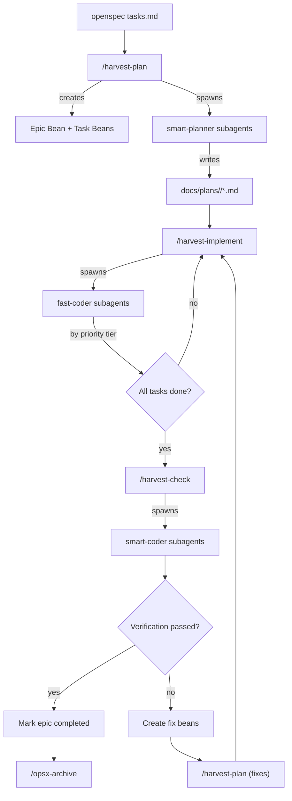

# Harvest Workflow System

The harvest system bridges [OpenSpec](../../openspec/) change planning with [beans](../../.beans.yml) issue tracking and multi-agent execution. It replaces the monolithic `opsx-apply` approach with granular, tracked, and verifiable task execution.

## Pipeline

```
openspec/tasks.md → /harvest-plan → /harvest-implement → /harvest-check → /opsx-archive
```



## Commands

| Command | Agent | What it does |
|---------|-------|-------------|
| `/harvest-plan` | `smart-planner` | Parse `tasks.md` → create beans → produce TDD per bean |
| `/harvest-implement` | `fast-coder` | Implement beans by priority tier |
| `/harvest-check` | `smart-coder` | Verify implementations, create fix beans for failures |

## How It Works

### 1. Plan (`/harvest-plan`)

Reads the active openspec change's `tasks.md` and creates:
- One **epic bean** for the change (links to proposal, design, tasks)
- One **task bean** per `## N.` section (requirements as checklists)
- One **plan doc** per bean in `docs/plans/<change-name>/`

Each bean is self-contained — anyone reading it can understand the task, find the plan, and reference source docs.

### 2. Implement (`/harvest-implement`)

Groups beans by priority and spawns `fast-coder` for each:
- **Tier 1** (high): foundational work, runs first
- **Tier 2** (normal): core features, after Tier 1
- **Tier 3** (low): polish/docs, after Tier 2

Same-priority beans can run in parallel (no mutual dependencies).

### 3. Check (`/harvest-check`)

Spawns `smart-coder` to verify each completed bean against:
- **Completeness**: all requirements met, all files exist
- **Correctness**: tests pass, implementation matches intent
- **Coherence**: follows design patterns, no dead code

Failures create `bug` beans tagged `fix` that re-enter the pipeline.

### 4. Archive

After all verifications pass, follow the standard openspec procedure:
- `/opsx-verify` for final openspec-level check
- `/opsx-archive` to archive and sync specs

## The Fix Loop

When verification fails:

1. `smart-coder` creates a fix bean (type: `bug`, tag: `fix`)
2. Fix bean enters `/harvest-plan` → `/harvest-implement` → `/harvest-check`
3. If the same issue fails twice, escalate to user (no infinite loops)

## File Structure

```
.opencode/
├── command/
│   └── harvest/
│       ├── plan.md            # Command definition
│       ├── implement.md
│       └── check.md
├── skills/
│   └── harvest/
│       ├── harvest-plan/SKILL.md      # Detailed skill instructions
│       ├── harvest-implement/SKILL.md
│       └── harvest-check/SKILL.md
docs/
├── workflows/
│   └── harvest-system.md      # This file
├── plans/
│   └── <change-name>/         # Created by smart-planner
│       ├── project-setup.md
│       ├── run-model.md
│       └── ...
```

## Agents

Defined in `opencode.json`:

| Agent | Model | Role |
|-------|-------|------|
| `smart-planner` | gpt-5.2 | Creates detailed TDD/execution plans |
| `fast-coder` | kimi k2p5 | Implements code following plans |
| `smart-coder` | gpt-5.3-codex | Verifies implementations |
