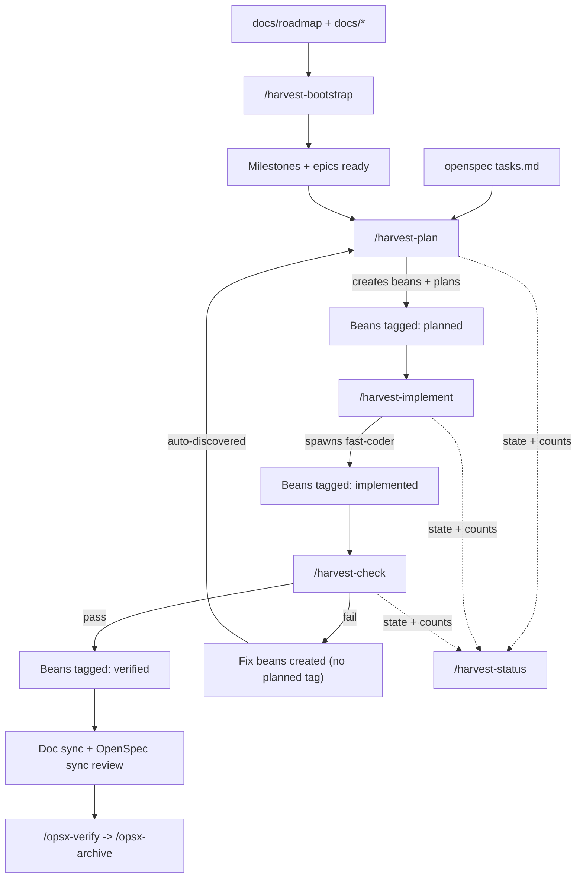

# Harvest Workflow System

The harvest system bridges [OpenSpec](../../openspec/) change planning with [beans](../../.beans.yml) issue tracking and multi-agent execution. The current loop adds bootstrap setup, per-bean commit guidance, lightweight session state, and a read-only status dashboard around the core plan -> implement -> check flow.

## Pipeline



## Tag-Based State Machine

Each command adds a tag when it finishes processing a bean. The next command discovers work by querying tag presence or absence.

`/harvest-bootstrap` prepares docs, OpenSpec, and Beans but does not mutate harvest tags. `/harvest-status` is read-only and only reports the current state.

### Tag Schema

| Tag | Added by | Meaning |
|-----|----------|---------|
| `harvest` | `/harvest-plan` | Part of the harvest workflow |
| `<change-name>` | `/harvest-plan` | Which openspec change this belongs to |
| `planned` | `/harvest-plan` | Plan doc exists, ready for implementation |
| `implemented` | `/harvest-implement` | Code written, ready for verification |
| `verified` | `/harvest-check` | Verification passed |
| `fix` | `/harvest-check` | Bug bean created from a verification failure |

### State Transitions

```text
Bean created (tags: harvest, <change>)
  |
  v  /harvest-plan
  +planned  ->  status: todo
  |
  v  /harvest-implement
  +implemented  ->  status: completed
  |
  v  /harvest-check
  +verified  (pass)
      - or -
  new fix bean created (tags: harvest, <change>, fix - no planned tag)
```

Fix beans feed back into `/harvest-plan` automatically because they lack the `planned` tag.

## Session State

Harvest commands share lightweight context through `openspec/changes/<change-name>/.harvest-state.json`.

- `/harvest-plan` records the active change, epic bean, and last command metadata.
- `/harvest-implement` records the latest implementation handoff.
- `/harvest-check` records fix iteration counts and loop-boundary decisions.
- `/harvest-status` reads the file to render a dashboard, but never mutates it.

### Query Cheat Sheet

```bash
# What needs planning?
beans list --json --tag harvest --tag "<change>" --no-tag planned

# What needs implementing?
beans list --json --tag harvest --tag "<change>" --tag planned --no-tag implemented

# What needs verification?
beans list --json --tag harvest --tag "<change>" --tag implemented --no-tag verified

# What's fully done?
beans list --json --tag harvest --tag "<change>" --tag verified

# Fix beans needing attention?
beans list --json --tag harvest --tag "<change>" --tag fix --no-tag planned

# All beans for a change?
beans list --json --tag harvest --tag "<change>"
```

### Tag Contracts

| Command | Input query | Output action |
|---------|-------------|---------------|
| `/harvest-plan` | `--no-tag planned` | `beans update <id> --tag planned -s todo` |
| `/harvest-implement` | `--tag planned --no-tag implemented` | `beans update <id> --tag implemented -s completed` |
| `/harvest-check` | `--tag implemented --no-tag verified` | Pass: `beans update <id> --tag verified` |
| `/harvest-check` | _(on failure)_ | `beans create ... --tag harvest --tag <change> --tag fix` (no `planned`) |

## Commands

| Command | Agent | What it does |
|---------|-------|--------------|
| `/harvest-bootstrap` | none | Seed docs, initialize OpenSpec and Beans, and create roadmap milestones or epics |
| `/harvest-plan` | `smart-planner` | Find unplanned beans -> plan them. If none, parse `tasks.md` -> create beans -> plan |
| `/harvest-implement` | `fast-coder` | Find planned beans -> implement by priority tier and prepare per-bean commits |
| `/harvest-check` | `smart-coder` | Find implemented beans -> verify. Pass -> tag verified. Fail -> create fix beans |
| `/harvest-status` | none | Render the current dashboard from bean tags, plan references, and session state |

## How It Works

### 0. Bootstrap (`/harvest-bootstrap`)

Seeds the repo for harvest work by filling in missing docs from templates, initializing OpenSpec or Beans when needed, and creating milestone or epic structure from `docs/roadmap/README.md`.

- **Command entry**: `.opencode/command/harvest/bootstrap.md`
- **Skill entry**: `.opencode/skills/harvest/harvest-bootstrap/SKILL.md`
- **Windmill refs**: `.opencode/windmill/harvest/bootstrap/`

### 1. Plan (`/harvest-plan`)

Checks for unplanned beans first, including fix beans from previous verification failures. If none, reads `tasks.md` to create new beans. Spawns `smart-planner` to produce a plan doc for each bean, then records the current harvest session state.

- **Commit guidance**: `.opencode/skills/harvest/harvest-commit/SKILL.md`
- **Command entry**: `.opencode/command/harvest/plan.md`
- **Skill entry**: `.opencode/skills/harvest/harvest-plan/SKILL.md`
- **Windmill refs**: `.opencode/windmill/harvest/planning/`

### 2. Implement (`/harvest-implement`)

Groups planned beans by priority tier and spawns `fast-coder` for each:

- **Tier 1** (high): foundational work, runs first
- **Tier 2** (normal): core features, after Tier 1
- **Tier 3** (low): polish or docs, after Tier 2
- **Commit guidance**: `.opencode/skills/harvest/harvest-commit/SKILL.md`
- **Command entry**: `.opencode/command/harvest/implement.md`
- **Skill entry**: `.opencode/skills/harvest/harvest-implement/SKILL.md`
- **Windmill refs**: `.opencode/windmill/harvest/implementation/`

### 3. Check (`/harvest-check`)

Spawns `smart-coder` to verify each implemented bean. Failures create `bug` beans without the `planned` tag, which automatically feed back into `/harvest-plan`. Repeated failures use loop-boundary guidance, and successful verification leads into doc drift plus Beans/OpenSpec sync review.

- **Commit guidance**: `.opencode/skills/harvest/harvest-commit/SKILL.md`
- **Command entry**: `.opencode/command/harvest/check.md`
- **Skill entry**: `.opencode/skills/harvest/harvest-check/SKILL.md`
- **Windmill refs**: `.opencode/windmill/harvest/verification/`

### 4. Status (`/harvest-status`)

Renders a read-only dashboard for the active change by combining bean tags, plan references, and `.harvest-state.json`.

- **Command entry**: `.opencode/command/harvest/status.md`
- **Skill entry**: `.opencode/skills/harvest/harvest-status/SKILL.md`
- **Windmill refs**: `.opencode/windmill/harvest/workflow/session-state.md`, `.opencode/windmill/harvest/workflow/status-format.md`

### 5. Archive

After all verifications pass, follow the standard OpenSpec procedure:

- review doc drift and `tasks.md` sync guidance first
- `/opsx-verify` for final OpenSpec-level checking
- `/opsx-archive` to archive and sync specs

## The Fix Loop

When verification fails, fix beans are created without the `planned` tag. This means `/harvest-plan` automatically discovers them with no special commands or flags.

1. `/harvest-check` finds failure -> creates fix bean (tags: `harvest`, `<change>`, `fix`)
2. `/harvest-plan` detects unplanned beans -> plans the fix
3. `/harvest-implement` picks up planned-not-implemented -> implements
4. `/harvest-check` verifies again
5. Same issue fails twice -> escalate to the user instead of looping forever

## File Structure

```text
.opencode/
|- command/harvest/
|  |- bootstrap.md         # Setup and milestone seeding entry point
|  |- plan.md              # Thin orchestration entry point
|  |- implement.md         # Thin orchestration entry point
|  |- check.md             # Thin orchestration entry point
|  `- status.md            # Read-only dashboard entry point
|- skills/harvest/
|  |- harvest-bootstrap/SKILL.md   # Thin bootstrap skill entry point
|  |- harvest-plan/SKILL.md        # Thin planning skill entry point
|  |- harvest-implement/SKILL.md   # Thin implementation skill entry point
|  |- harvest-check/SKILL.md       # Thin verification skill entry point
|  |- harvest-commit/SKILL.md      # Shared per-bean commit guidance
|  `- harvest-status/SKILL.md      # Thin status skill entry point
`- windmill/harvest/
   |- bootstrap/           # Setup flow and doc template rules
   |- commit/              # Commit timing and message rules
   |- workflow/            # Shared state-machine and session references
   |- planning/            # Parsing rules and planner prompts
   |- implementation/      # Execution rules and coder prompts
   `- verification/        # Verification checks and fix-bean rules

wind-harvester/
|- bin/install.js          # Interactive OpenCode installer
`- src/                    # Packaged source for command, skill, and windmill assets
```

## Packaging

The canonical packaged harvest assets live under `wind-harvester/src/`. The repository keeps a matching `.opencode/` copy so local development and packaged installs follow the same progressive-disclosure layout, including the bootstrap, commit, session-state, and status helpers.

## Agents

Defined in `opencode.json`:

| Agent | Model | Role |
|-------|-------|------|
| `smart-planner` | gpt-5.2 | Creates detailed TDD and execution plans |
| `fast-coder` | kimi k2p5 | Implements code following plans |
| `smart-coder` | gpt-5.3-codex | Verifies implementations |
