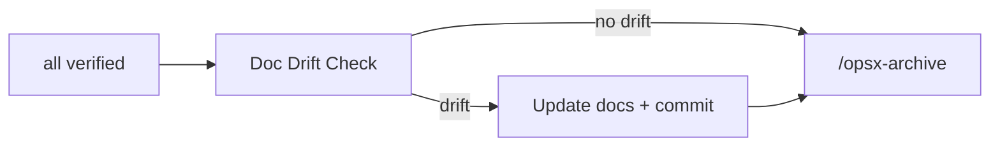
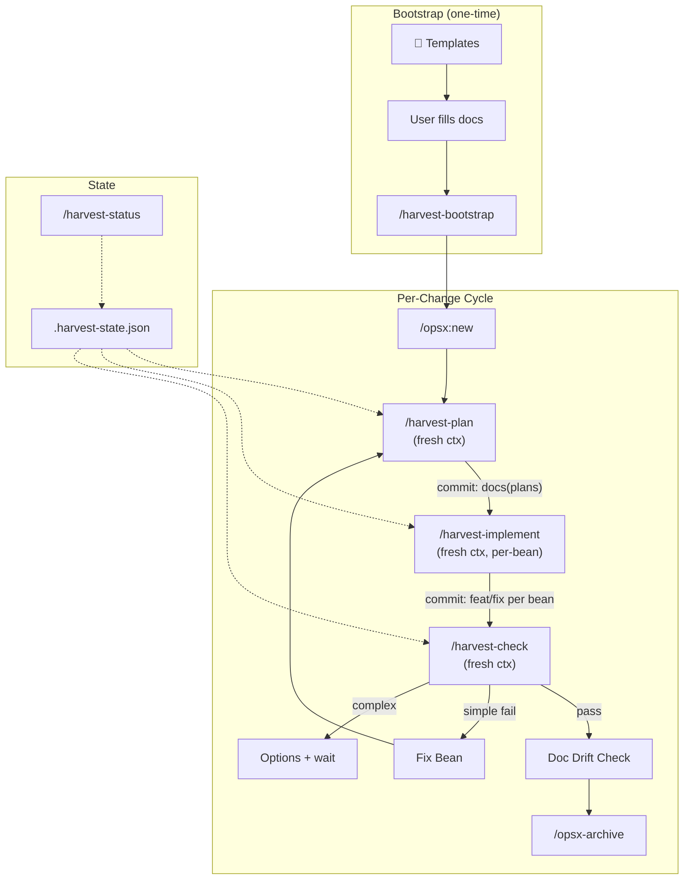

# Wind-Harvester System Analysis (Final)

## 1. Resolved Design Decisions

| Decision | Resolution |
|----------|-----------|
| Commit mechanism | **Skill** (`harvest-commit`), referenced explicitly by each command |
| Commit granularity | **Per-bean** |
| User interaction | **Sequential** — user runs each command, decides when to proceed |
| Escalation | Present options with analysis, wait for user choice |
| `/harvest-run` | **Rejected** — user stays in control |
| Doc templates | Ship in `wind-harvester/src/windmill/bootstrap/templates/` (Option A) |
| Fresh context | Each command: `/new → run` or spawn subagents |
| Hint format | Detailed, with options and file links |

---

## 2. Complete Gap Inventory

| # | Gap | Priority | Proposal |
|---|-----|----------|----------|
| 1 | No commit integration | **P0** | A |
| 2 | Unclear loop boundaries | **P1** | B |
| 3 | No Beans ↔ OpenSpec sync | **P2** | C |
| 4 | No session continuity | **P0** | D |
| 5 | No progress dashboard | **P1** | E |
| 6 | No bootstrapping flow | **P0** | G |
| 7 | Doc growth / breaking down | **P0** | H |
| 8 | Docs ↔ OpenSpec living sync | **P1** | I |

---

## 3. New Design Elements

### 3.1 Document Growth Strategy (Gap 7)

**Problem:** A doc like `ARCHITECTURE.md` starts small but grows beyond what's manageable. Breaking it down changes paths, breaking reference links in openspec, beans, and plans.

**Solution — Index-Anchored Decomposition:**

```
Phase 1 (small):              Phase 2 (grown):
docs/architecture/            docs/architecture/
└── README.md  (all content)  ├── README.md  (index with links)
                              ├── system-overview.md
                              ├── data-flow.md
                              └── deployment.md
```

**Rules:**
1. **Folder-first from day one** — templates create `docs/<topic>/README.md`, never `docs/TOPIC.md`
2. **Stable entry point** — all external refs point to [README.md](file:///Users/phong/Workspace/minerva/README.md) index, never sub-files
3. **Growth trigger** — >300 lines or >5 top-level sections → decompose
4. **Decomposition = commit** — `refactor(docs): decompose architecture into sub-files`
5. **Detection** — `/harvest-check` notes oversized docs and suggests a decomposition bean

**Template layout (shipped in wind-harvester):**
```
templates/
├── project/README.md.tmpl          → docs/project/README.md
├── architecture/README.md.tmpl     → docs/architecture/README.md
├── coding-standards/README.md.tmpl → docs/coding-standards/README.md
├── roadmap/README.md.tmpl          → docs/roadmap/README.md
└── research/README.md.tmpl         → docs/research/README.md
```

> [!IMPORTANT]
> Because we use `docs/<topic>/README.md` from the start, decomposition never changes the entry-point path. No broken links.

---

### 3.2 Docs ↔ OpenSpec Living Sync (Gap 8)

**Problem:** Completed changes alter architecture/conventions/patterns, but this never flows back to update project docs. The next change then reads stale context.

**Solution — Post-Archive Doc Drift Check:**



**Drift categories:**

| Type | Example | Action |
|------|---------|--------|
| Addition | New module, not in architecture docs | Append to index |
| Contradiction | Design says X, doc says Y | Update doc or flag for user |
| Deprecation | Old pattern removed | Mark deprecated |
| Growth | Doc exceeds threshold | Suggest decomposition bean |

**Where:** `workflow/doc-sync.md` + hint in `/harvest-check` post-verification output.

---

### 3.3 Fresh Context & Hint System

**Each command runs in fresh context via two modes:**

| Mode | How |
|------|-----|
| User-driven | `/new` in OpenCode, then run command |
| Orchestrated | Parent spawns subagent (`smart-planner`/`fast-coder`/`smart-coder`) |

**Minimal context per command (progressive disclosure for agents):**

| Command | Reads on entry | Skips |
|---------|---------------|-------|
| `/harvest-plan` | `tasks.md`, `proposal.md`, `design.md`, `.harvest-state.json` | Implementation code |
| `/harvest-implement` | Plan doc (current bean), bean body, `.harvest-state.json` | Other beans' plans, full design |
| `/harvest-check` | Implemented code, plan doc, bean body | Other beans, proposal |

**Standard hint block (end of every command):**

```markdown
---
## ✅ Done

<Summary of what was accomplished>
- <bean-id>: <title> — <action taken>

Committed: `<commit-type>(<scope>): <subject>` (Refs: <bean-ids>)

## 🔜 Next Steps

1. **`/harvest-implement`** — <N> beans ready for coding
   → Run in fresh session: `/new` then `/harvest-implement`
2. **`/harvest-status`** — see full progress dashboard
3. **Review plans** — [plan-1.md](file:///abs/path), [plan-2.md](file:///abs/path)

## 📎 Context Files (read if needed)

- [plan-auth.md](file:///abs/path/docs/plans/change/auth.md)
- [.harvest-state.json](file:///abs/path/.harvest-state.json)
```

---

### 3.4 Commit Skill Pattern

Each command includes near the top:
```markdown
> **After finishing work**: use skill `harvest-commit` to commit changes.
> See `{{WINDMILL_ROOT}}/commit/<type>-commits.md` for format.
```

**Commit windmill docs (progressive disclosure):**
```
windmill/harvest/commit/
├── commit-rules.md              ← overview: when to commit, general format
├── plan-commits.md              ← docs(plans): format for /harvest-plan
├── implementation-commits.md    ← feat/fix/refactor: format for /harvest-implement
└── verification-commits.md      ← docs(verify): format for /harvest-check
```

Each command references **only** its specific sub-doc.

---

## 4. Target Architecture



---

## 5. Implementation Priority

| # | Proposal | What to build | Priority |
|---|----------|--------------|----------|
| G | Bootstrap | Templates + `/harvest-bootstrap` + windmill docs | **P0** |
| H | Doc growth | Folder-first templates + growth detection | **P0** |
| A | Commit skill | `harvest-commit` skill + 4 windmill docs | **P0** |
| D | Session context | `.harvest-state.json` spec + read/write | **P0** |
| B | Loop boundaries | `workflow/loop-boundaries.md` | **P1** |
| E | Status command | `/harvest-status` command | **P1** |
| I | Doc living sync | `workflow/doc-sync.md` | **P1** |
| C | Beans ↔ OpenSpec sync | `/harvest-sync` command | **P2** |
